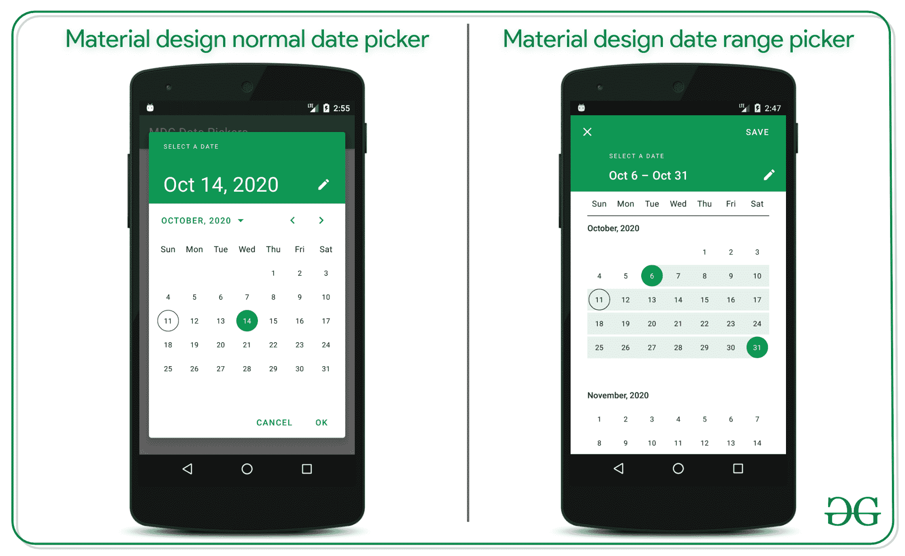
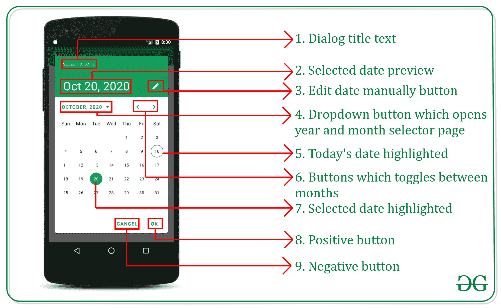
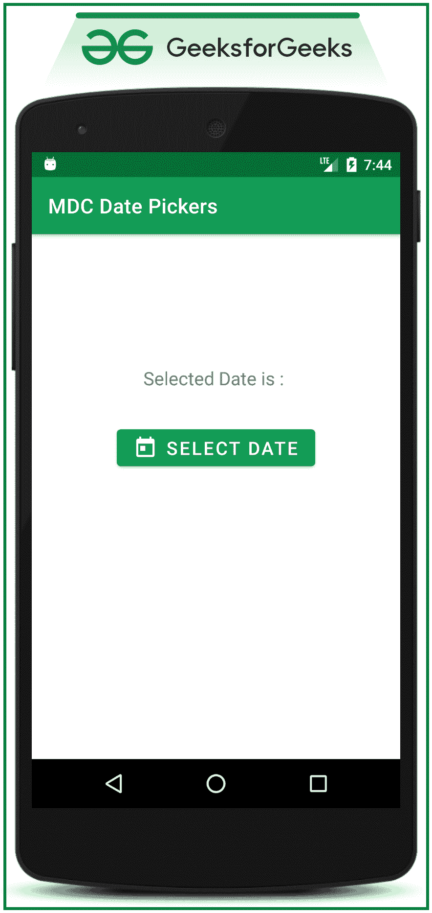

# 安卓系统中的材料设计日期选择器

> 原文:[https://www . geesforgeks . org/material-design-date-picker-in-Android/](https://www.geeksforgeeks.org/material-design-date-picker-in-android/)

**材料设计组件(MDC Android)** 为设计人员和开发人员提供了一种在他们的 Android 应用程序中实现**材料设计**的方法。这些组件由谷歌的工程师和 UX 设计师组成的核心团队开发，支持可靠的开发工作流程来构建美观实用的安卓应用程序。如果你喜欢谷歌为安卓设计的谷歌材料设计组件的用户界面元素非常棒，那么这里有一些需要遵循的步骤来获得它们，其中之一是 **谷歌材料设计组件(MDC)日期选择器**。安卓有很多开源的日期选择器。但是 Material 设计日期选择器为用户提供了更多的功能，并且易于开发人员实现。请看下面的图片，了解本次讨论将讨论哪种类型的材料设计日期选取器。注意，我们要用 **Java** 语言实现这个项目。在本文中，我们将实现两种类型的材料设计日期选择器，如下图所示。

*   材料设计标准日期选择器
*   材料设计日期范围选择器



### 日期选择器对话框的框架

在实现材料设计日期选择器之前，理解对话框的各个部分是必要的，这样在用 java 代码处理对话框的各个部分时会变得更容易。



### **分步**实施

**第一步:创建新项目**

*   要在安卓工作室创建新项目，请参考[如何在安卓工作室创建/启动新项目](https://www.geeksforgeeks.org/android-how-to-create-start-a-new-project-in-android-studio/)。
*   注意选择 **Java** 作为编程语言。

**第二步:添加材料设计组件依赖关系**

*   现在将以下依赖项添加到[应用级渐变](https://www.geeksforgeeks.org/android-build-gradle/)文件中。

> ***实现‘com . Google . Android . material:material:1 . 3 . 0-alpha 02’***

*   调用依赖关系后点击 ***立即同步*** 按钮。确保您已连接到网络，以便安卓工作室下载所有必需的文件。
*   如果找不到应用程序级渐变文件并调用依赖关系，请参考下图。


**第三步:将基础应用主题更改为材质主题如下**

*   转到 **app > src >主> res >值>style . XML**并更改基础应用程序主题。材质组件包含各种动作栏主题样式，可以调用任何**材质组件**动作栏主题样式，除了 **AppCompat** 样式。下面是 styles.xml 文件的代码。由于我们使用的是材料设计组件，这一步是强制性的。

## 可扩展标记语言

```
<resources>  

    <!-- Base application theme. -->
    <style name="AppTheme" parent="Theme.MaterialComponents.DayNight.DarkActionBar">  
        <!-- Customize your theme here -->
        <item name="colorPrimary">@color/colorPrimary</item>  
        <item name="colorPrimaryDark">@color/colorPrimaryDark</item>  
        <item name="colorAccent">@color/colorAccent</item>  
    </style>

</resources>
```

*   如果无法找到 styles.xml 并更改应用程序的基本主题，请参考以下内容。


**第 4 步:使用 activity_main.xml 文件**

*   为应用程序接口调用下面的代码，或者可以根据自己的需要进行设计。
*   这将在整个讨论中保持不变。下面是**activity _ main . XML**文件的代码。

## 可扩展标记语言

```
<?xml version="1.0" encoding="utf-8"?>
<LinearLayout 
    xmlns:android="http://schemas.android.com/apk/res/android"
    xmlns:app="http://schemas.android.com/apk/res-auto"
    xmlns:tools="http://schemas.android.com/tools"
    android:layout_width="match_parent"
    android:layout_height="match_parent"
    android:orientation="vertical"
    tools:context=".MainActivity"
    tools:ignore="HardcodedText">

    <!--make sure to give the appropriate IDs to textView
        and the button to handle them in MainActivity.java-->

    <!--simple text view to show the selected date by the user-->
    <TextView
        android:id="@+id/show_selected_date"
        android:layout_width="wrap_content"
        android:layout_height="wrap_content"
        android:layout_gravity="center"
        android:layout_marginTop="128dp"
        android:text="Selected Date is : "
        android:textSize="18sp" />

    <!--button to open the material design date picker dialog-->
    <Button
        android:id="@+id/pick_date_button"
        android:layout_width="wrap_content"
        android:layout_height="wrap_content"
        android:layout_gravity="center"
        android:layout_marginTop="32dp"
        android:text="Select Date"
        android:textSize="18sp"
        app:icon="@drawable/ic_baseline_add_to_photos_24" />

</LinearLayout>
```

*   该图标已添加到代码上方的“选择日期”按钮中。然而，这是可选的。参考[安卓中的主题化材质设计按钮，并举例](Theming Material Design buttons in android with examples)如何给按钮添加图标或者如何改变按钮的主题。

**输出 UI:**



### 普通日期选择器的实现

**第五步:现在调用下面的代码来实现第一种类型的材料设计日期选择器**

*   转到**文件，参考至以下代码。下面是**MainActivity.java**文件的代码。**
*   **在代码内部添加注释，更详细地理解代码。**

## **Java 语言(一种计算机语言，尤用于创建网站)**

```
import android.annotation.SuppressLint;
import android.os.Bundle;
import android.view.View;
import android.widget.Button;
import android.widget.TextView;
import androidx.appcompat.app.AppCompatActivity;
import com.google.android.material.datepicker.MaterialDatePicker;
import com.google.android.material.datepicker.MaterialPickerOnPositiveButtonClickListener;

public class MainActivity extends AppCompatActivity {

    private Button mPickDateButton;

    private TextView mShowSelectedDateText;

    @Override
    protected void onCreate(Bundle savedInstanceState) {
        super.onCreate(savedInstanceState);
        setContentView(R.layout.activity_main);

        // now register the text view and the button with
        // their appropriate IDs
        mPickDateButton = findViewById(R.id.pick_date_button);
        mShowSelectedDateText = findViewById(R.id.show_selected_date);

        // now create instance of the material date picker
        // builder make sure to add the "datePicker" which
        // is normal material date picker which is the first
        // type of the date picker in material design date
        // picker
        MaterialDatePicker.Builder materialDateBuilder = MaterialDatePicker.Builder.datePicker();

        // now define the properties of the
        // materialDateBuilder that is title text as SELECT A DATE
        materialDateBuilder.setTitleText("SELECT A DATE");

        // now create the instance of the material date
        // picker
        final MaterialDatePicker materialDatePicker = materialDateBuilder.build();

        // handle select date button which opens the
        // material design date picker
        mPickDateButton.setOnClickListener(
                new View.OnClickListener() {
                    @Override
                    public void onClick(View v) {
                        // getSupportFragmentManager() to
                        // interact with the fragments
                        // associated with the material design
                        // date picker tag is to get any error
                        // in logcat
                        materialDatePicker.show(getSupportFragmentManager(), "MATERIAL_DATE_PICKER");
                    }
                });

        // now handle the positive button click from the
        // material design date picker
        materialDatePicker.addOnPositiveButtonClickListener(
                new MaterialPickerOnPositiveButtonClickListener() {
                    @SuppressLint("SetTextI18n")
                    @Override
                    public void onPositiveButtonClick(Object selection) {

                        // if the user clicks on the positive
                        // button that is ok button update the
                        // selected date
                        mShowSelectedDateText.setText("Selected Date is : " + materialDatePicker.getHeaderText());
                        // in the above statement, getHeaderText
                        // is the selected date preview from the
                        // dialog
                    }
                });
    }
}
```

### ****输出:在仿真器上运行****

**<video class="wp-video-shortcode" id="video-500649-1" width="640" height="360" preload="metadata" controls=""><source type="video/mp4" src="https://media.geeksforgeeks.org/wp-content/uploads/20201011142153/Untitled-Project.mp4?_=1">[https://media.geeksforgeeks.org/wp-content/uploads/20201011142153/Untitled-Project.mp4](https://media.geeksforgeeks.org/wp-content/uploads/20201011142153/Untitled-Project.mp4)</video>**

### **日期范围选择器的实现**

****第 6 步:现在调用下面的代码来实现第二种类型的材料设计日期选择器****

*   **在物料设计日期选择器中，还有一种类型的日期选择器可用，称为日期范围选择器。**
*   **下面的代码是日期范围选择器的实现。**
*   **转到**文件，参考至以下代码。下面是**MainActivity.java**文件的代码。****
*   ****在代码内部添加注释，更详细地理解代码。****

## ****Java 语言(一种计算机语言，尤用于创建网站)****

```
**import android.annotation.SuppressLint;
import android.os.Bundle;
import android.view.View;
import android.widget.Button;
import android.widget.TextView;
import androidx.appcompat.app.AppCompatActivity;
import androidx.core.util.Pair;
import com.google.android.material.datepicker.MaterialDatePicker;
import com.google.android.material.datepicker.MaterialPickerOnPositiveButtonClickListener;

public class MainActivity extends AppCompatActivity {

    private Button mPickDateButton;
    private TextView mShowSelectedDateText;

    @Override
    protected void onCreate(Bundle savedInstanceState) {
        super.onCreate(savedInstanceState);
        setContentView(R.layout.activity_main);

        // now register the text view and the button with
        // their appropriate IDs
        mPickDateButton = findViewById(R.id.pick_date_button);
        mShowSelectedDateText = findViewById(R.id.show_selected_date);

        // now create instance of the material date picker
        // builder make sure to add the "dateRangePicker"
        // which is material date range picker which is the
        // second type of the date picker in material design
        // date picker we need to pass the pair of Long
        // Long, because the start date and end date is
        // store as "Long" type value
        MaterialDatePicker.Builder<Pair<Long, Long>> materialDateBuilder = MaterialDatePicker.Builder.dateRangePicker();

        // now define the properties of the
        // materialDateBuilder
        materialDateBuilder.setTitleText("SELECT A DATE");

        // now create the instance of the material date
        // picker
        final MaterialDatePicker materialDatePicker = materialDateBuilder.build();

        // handle select date button which opens the
        // material design date picker
        mPickDateButton.setOnClickListener(
                new View.OnClickListener() {
                    @Override
                    public void onClick(View v) {
                        // getSupportFragmentManager() to
                        // interact with the fragments
                        // associated with the material design
                        // date picker tag is to get any error
                        // in logcat
                        materialDatePicker.show(getSupportFragmentManager(), "MATERIAL_DATE_PICKER");
                    }
                });

        // now handle the positive button click from the
        // material design date picker
        materialDatePicker.addOnPositiveButtonClickListener(
                new MaterialPickerOnPositiveButtonClickListener() {
                    @SuppressLint("SetTextI18n")
                    @Override
                    public void onPositiveButtonClick(Object selection) {

                        // if the user clicks on the positive
                        // button that is ok button update the
                        // selected date
                        mShowSelectedDateText.setText("Selected Date is : " + materialDatePicker.getHeaderText());
                        // in the above statement, getHeaderText
                        // will return selected date preview from the
                        // dialog
                    }
                });
    }
}**
```

### ******输出:在仿真器上运行******

****<video class="wp-video-shortcode" id="video-500649-2" width="640" height="360" preload="metadata" controls=""><source type="video/mp4" src="https://media.geeksforgeeks.org/wp-content/uploads/20201011145100/GFG_nexus_5.mp4?_=2">[https://media.geeksforgeeks.org/wp-content/uploads/20201011145100/GFG_nexus_5.mp4](https://media.geeksforgeeks.org/wp-content/uploads/20201011145100/GFG_nexus_5.mp4)</video>****

****要实现材料设计日期选择器的更多功能，请参考安卓系统中 **[材料设计日期选择器的更多功能](https://www.geeksforgeeks.org/more-functionalities-of-material-design-date-picker-in-android/)**文章。****