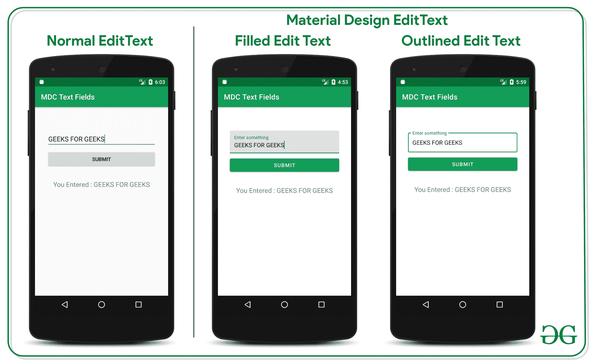
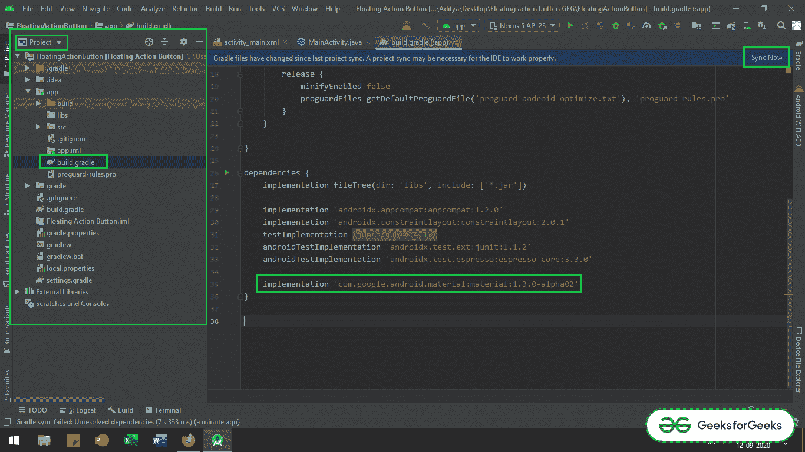
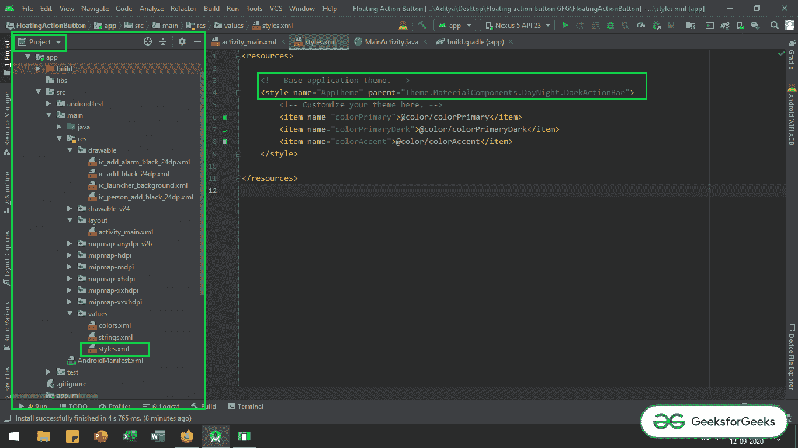

# 安卓材质设计编辑文本，示例

> 原文:[https://www . geesforgeks . org/material-design-edit text-in-Android-with-examples/](https://www.geeksforgeeks.org/material-design-edittext-in-android-with-examples/)

[**编辑文字**](https://www.geeksforgeeks.org/edittext-widget-in-android-using-java-with-examples/) 是重要的 UI 元素之一。**编辑文本**是指显示空文本字段的小部件，用户可以在其中输入所需的文本，该文本将在应用程序中进一步使用。本文讨论了如何实现特殊类型的文本字段，即**材料设计编辑文本**。看看安卓的正常编辑文本和安卓的材质设计文本字段。设计和易于使用的实现使它们不同于普通的编辑文本字段。



## 逐步实施

在本例中，我们将演示两种重要类型的材料设计编辑文本:

1.  **填充编辑文本**
2.  **概述编辑文本**

**第一步:创建新项目**

*   要在安卓工作室创建新项目，请参考[如何在安卓工作室创建/启动新项目](https://www.geeksforgeeks.org/android-how-to-create-start-a-new-project-in-android-studio/)。
*   选择 **Java 或 Kotlin** 作为编程语言。

**第二步:调用对应用级梯度文件**的依赖

*   调用[应用级渐变](https://www.geeksforgeeks.org/android-build-gradle/)文件的材料设计依赖项，如下所示:

> ***实现‘com . Google . Android . material:material:1 . 3 . 0-alpha 03’***

*   前往 ***app > build.gradle** 文件获取 app 级 gradle 文件。并点击 ***立即同步*** 按钮。并确保系统应连接到网络。*
*   请参考下图，找到并调用应用程序级依赖关系渐变文件(在项目层次视图下)。



**第三步:更改应用的基础主题**

*   我们需要更改应用程序的基本主题，因为我们使用的是材料设计组件。否则，应用程序在启动后会立即崩溃。
*   要更改应用程序的基本主题，请打开 ***应用程序> src >主> res >值>style . XML .***

## 可扩展标记语言

```java
<resources>

    <!-- Base application theme. -->
    <style name="AppTheme" parent="Theme.MaterialComponents.Light.DarkActionBar">
        <!-- Customize your theme here. -->
        <item name="colorPrimary">@color/colorPrimary</item>
        <item name="colorPrimaryDark">@color/colorPrimaryDark</item>
        <item name="colorAccent">@color/colorAccent</item>
    </style>

</resources>
```

*   参考下图定位 ***styles.xml*** 文件并更改应用程序的基本主题。



## **实施材料设计填充编辑文本**

**第 4 步:使用 activity_main.xml 文件**

*   调用下面的代码来实现填充的编辑文本。
*   下面是 **activity_main.xml** 文件的代码。
*   代码中添加了注释，以更详细地理解代码。

## 可扩展标记语言

```java
<?xml version="1.0" encoding="utf-8"?>
<LinearLayout
    xmlns:android="http://schemas.android.com/apk/res/android"
    xmlns:tools="http://schemas.android.com/tools"
    android:layout_width="match_parent"
    android:layout_height="match_parent"
    android:orientation="vertical"
    tools:context=".MainActivity"
    tools:ignore="HardcodedText">

    <!--this is the filled layout box for the edit text-->
    <!--this layout must be used to reposition or change
        the height and width of the edit text-->
    <com.google.android.material.textfield.TextInputLayout
        android:id="@+id/filledTextField"
        android:layout_width="match_parent"
        android:layout_height="wrap_content"
        android:layout_marginStart="32dp"
        android:layout_marginTop="64dp"
        android:layout_marginEnd="32dp"
        android:hint="Enter something">

        <!--this is the actual edit text which takes the input-->
        <com.google.android.material.textfield.TextInputEditText
            android:id="@+id/edit_text"
            android:layout_width="match_parent"
            android:layout_height="wrap_content" />

    </com.google.android.material.textfield.TextInputLayout>

    <!--sample button to submit entered data
        inside from edit text-->
    <Button
        android:id="@+id/submit_button"
        android:layout_width="match_parent"
        android:layout_height="wrap_content"
        android:layout_marginStart="32dp"
        android:layout_marginTop="8dp"
        android:layout_marginEnd="32dp"
        android:text="Submit" />

    <!--text view which previews the entered data by user-->
    <TextView
        android:id="@+id/text_preview"
        android:layout_width="wrap_content"
        android:layout_height="wrap_content"
        android:layout_gravity="center"
        android:layout_marginTop="32dp"
        android:text="You Entered : "
        android:textSize="18sp" />

</LinearLayout>
```