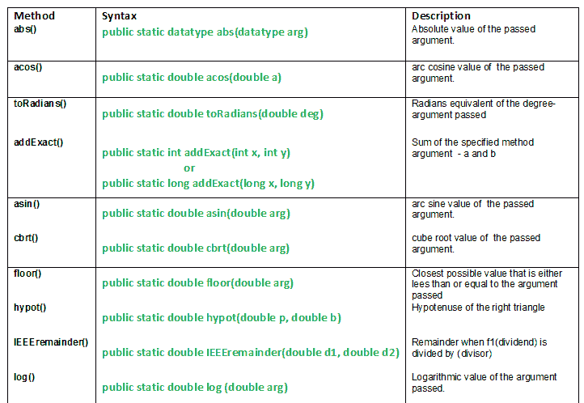

# Java 中的数学类方法，带示例|第 2 集

> 原文:[https://www . geesforgeks . org/math-class-methods-Java-examples-set-2/](https://www.geeksforgeeks.org/math-class-methods-java-examples-set-2/)

[java.math 类及其方法|集 1](https://www.geeksforgeeks.org/java-math-class-methods-set-1/)

[](https://media.geeksforgeeks.org/wp-content/uploads/table_math_class-.png)
**本文讨论的 java.math 类方法:**

1.  **ABS():****Java . math . ABS()**方法返回传递的任何类型参数的绝对值。这个方法可以处理所有的数据类型。
    **Special Case :**

*   如果参数为正零或负零，则结果为正零。*   如果参数为无穷大，则结果为正无穷大。*   Result is NaN, if passed argument is NaN.

    **语法:**

    ```java
    public static datatype abs(datatype arg)
    Parameters:
    arg - the argument whose absolute value we need
    Returns:
    absolute value of the passed argument.

    ```

    *   **acos():****Java . math . acos()**方法返回传递的参数的弧余弦值。
    弧余弦是传递的参数的反余弦。
    acos(arg) = cos <sup>-1</sup> 的 arg
    **特例:**结果为 NaN，如果自变量为 NaN 或其绝对值大于 1。
    **语法:**

```java
public static double acos(double a)
Parameters:
a - the argument whose arc cosine value we need.
    argument is taken as radian    
Returns:
arc cosine value of the argument.

```

*   **toRadians() :** **java.math.toRadians(double deg)** method converts argument (degree) to radians.
    **Special Point :** Math class usually takes radians as an input which is very much different in real life applications since angles is usually represented in degrees.
    **Syntax:**

    ```java
    public static double toRadians(double deg)
    Parameters:
    deg - degree angle needs to be in radian.
    Returns:
    radians equivalent of the degree-argument passed.

    ```

    **什么是 NaN 论证？**
    一个持有双精度型非数字值的常数。它相当于 double . longbittodouble(0x7ff 800000000000001)返回的值。

    **在 Math 类中解释 abs()、acos()、toRadians()方法的 Java 代码。**

    ```java
    // Java program explaining Math class methods
    // abs(), acos(), toRadians()
    import java.math.*;
    public class NewClass
    {

        public static void main(String[] args)
        {
            // Declaring the variables
            int Vali = -1;
            float Valf = .5f;

            // Printing the values
            System.out.println("Initial value of int  : "+Vali);
            System.out.println("Initial value of int  : "+Valf);

            // Use of .abs() method to get the absoluteValue
            int Absi = Math.abs(Vali);
            float Absf = Math.abs(Valf);

            System.out.println("Absolute value of int : "+Absi);
            System.out.println("Absolute value of int : "+Absf);
            System.out.println("");

            // Use of acos() method
            // Value greater than 1, so passing NaN
            double Acosi = Math.acos(60);
            System.out.println("acos value of Acosi : "+Acosi);
            double x = Math.PI;

            // Use of toRadian() method
            x = Math.toRadians(x);
            double Acosj = Math.acos(x);
            System.out.println("acos value of Acosj : "+Acosj);

        }
    }
    ```

    输出:

    ```java
    Initial value of int  : -1
    Initial value of int  : 0.5
    Absolute value of int : 1
    Absolute value of int : 0.5

    acos value of Acosi : NaN
    acos value of Acosj : 1.5159376794536454

    ```

    *   **addExact():****Java . math . addExact(int a，int b)** 方法返回传递的参数之和。
    **特殊点:**如果 Result 溢出一个 int 或 long(根据传递的参数)，则方法抛出 ArithmeticException。
    **语法:**

    ```java
    public static int addExact(int x, int y)
                    or
    public static long addExact(long x, long y)
    Parameters:
    a - first value
    b - second value
    Returns:
    Sum of the specified method arguments - a and b.

    ```

    *   **asin() :** **java.math.asin()** method returns the arc sine value of the method argument passed. Returned angle is in the range -pi/2 to pi/2.
    arc sine is inverse sine of the argument passed.
    asin(arg) = sine<sup>-1</sup> of arg
    **Special Case :**
    *   如果参数为 NaN 或其绝对值大于 1，则结果为 NaN。
    *   如果参数为零，则结果为零。

    **语法:**

    ```java
    public static double asin(double arg)
    Parameters:
    arg - argument passed. 
    Returns:
    arc sine of the argument passed.

    ```

    *   **cbrt():****Java . math . cbrt()**方法返回传递的参数的立方根。
    **特殊点:**

*   结果是 NaN，如果参数是 NaN。
*   如果参数是无限的，则结果是一个与参数符号相同的无穷大。
*   如果参数为零，则结果为零。

**语法:**

```java
public static double cbrt(double arg)
Parameters:
arg - argument passed. 
Returns:
cube root of the argument passed

```

**在 Math 类中解释 addExact()、asin()、cbrt()方法的 Java 代码。**

```java
// Java program explaining Math class methods
// addExact(), asin(), cbrt()
import java.math.*;
public class NewClass
{

    public static void main(String[] args)
    {
        int a = 1, b = 8;

        // get the result of addExact method
        int radd = Math.addExact(a,b);
        System.out.println("Using addExact() : "+radd);
        System.out.println("");

        // Use of acos() method
        // Value greater than 1, so passing NaN
        double Asini = Math.asin(radd);
        System.out.println("asin value of Asini : "+Asini);
        double x = Math.PI;

        // Use of toRadian() method
        x = Math.toRadians(x);
        double Asinj = Math.asin(x);
        System.out.println("asin value of Asinj : "+Asinj);
        System.out.println("");

        // Use of cbrt() method
        double cbrtval = Math.cbrt(216);
        System.out.println("cube root : "+cbrtval);

    }
}
```

输出:

```java
Using addExact() : 9

acos value of Asini : NaN
acos value of Asinj : 0.054858647341251204

cube root : 6.0

```

*   **floor():****Java . math . floor()**方法返回参数的 floor 值，即小于或等于传递的参数的最接近的整数值。
    例如:101.23 的地板值= 101
    **重要一点:**如果通过了安南或无限参数，则会产生相同的参数。

    ```java
    Syntax:
    public static double floor(double arg)
    Parameters:
    arg - the argument whose floor value we need
    Returns:closest possible value that is either less than 
                    or equal to the argument passed

    ```

    *   **hypot() :** **java.math.hypot(double p, double b)** method returns hypotenuse of a right triangle on passing the traingle’s base and perpendicular as arguments.
    **hypotenuse = [perpendicular<sup>2</sup> + base<sup>2</sup>]<sup>1/2</sup>**

    **要点:**

    *   如果任一参数为无穷大，则结果为正无穷大。
    *   如果任一参数为 NaN，且任一参数都不是无穷大，则结果为 NaN。

    ```java
    Syntax:
    public static double hypot(double p, double b)
    Parameters:
    p - perpendicular of the right triangle
    b - base of the right triangle
    Returns:
    hypotenuse of the right triangle

    ```

    *   **ieeereminder():****Java . math . ieeereminder(double D1，double d2)** 方法通过对两个参数应用余数运算返回余数值 w.r.t IEEE 754 标准。
    余数=**D1–D2 * n**
    其中，
    n = D1/D2

    ```java
    Syntax:
    public static double IEEEremainder(double d1,double d2)
    Parameters:
    d1 - dividend 
    d2 - divisor
    Returns:
    remainder when f1(dividend) is divided by(divisor)

    ```

    的最接近精确值*   **log() :** **java.math.log()** method returns the logarithmic value of the passed argument.

    ```java
    Syntax:
    public static double log(double arg)
    Parameters:
    arg - argument passed. 
    Returns:
    logarithmic value of the argument passed.

    ```

    **在 Math 类中解释 floor()，hypot()，IEEEremainder()，log()方法的 Java 代码。**

    ```java
    // Java program explaining MATH class methods
    // floor(), hypot(), IEEEremainder(), log()
    import java.lang.*;
    public class NewClass
    {

        public static void main(String[] args)
        {
            // Use of floor method
            double f1 = 30.56, f2 = -56.34;
            f1 =Math.floor(f1);
            System.out.println("Floor value of f1 : "+f1);

            f2 =Math.floor(f2);
            System.out.println("Floor value of f2 : "+f2);
            System.out.println("");

            // Use of hypot() method
            double p = 12, b = -5;
            double h = Math.hypot(p, b);
            System.out.println("Hypotenuse : "+h);
            System.out.println("");

            // Use of IEEEremainder() method
            double d1 = 105, d2 = 2;
            double r = Math.IEEEremainder(d1,d2);
            System.out.println("Remainder : "+r);
            System.out.println("");

            // Use of log() method
            double l = 10;
            l = Math.log(l);
            System.out.println("Log value of 10 : "+l);

        }
    }
    ```

    输出:

    ```java
    Floor value of f1 : 30.0
    Floor value of f2 : -57.0

    Hypotenuse : 13.0

    Remainder : 1.0

    Log value of 10 : 2.302585092994046

    ```

    [java.math 类及其方法|第 3 集](https://www.geeksforgeeks.org/java-math-class-methods-set-3/)

    本文由 <font color="green">**莫希特·古普塔**</font> 供稿。如果你喜欢 GeeksforGeeks 并想投稿，你也可以使用[contribute.geeksforgeeks.org](http://www.contribute.geeksforgeeks.org)写一篇文章或者把你的文章邮寄到 contribute@geeksforgeeks.org。看到你的文章出现在极客博客主页上，帮助其他极客。

    如果你发现任何不正确的地方，或者你想分享更多关于上面讨论的话题的信息，请写评论。