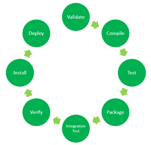

# Maven 生命周期和基本 Maven 命令

> 原文:[https://www . geeksforgeeks . org/maven-life cycle-and-basic-maven-commands/](https://www.geeksforgeeks.org/maven-lifecycle-and-basic-maven-commands/)

Maven 是一个基于 POM(项目对象模型)的强大的项目管理工具，用于项目构建、依赖和文档。它是一个工具，可以用来构建和管理任何基于 Java 的项目。Maven 使 Java 开发人员的日常工作变得更加容易，并帮助构建和运行任何基于 Java 的项目。

有关 Maven 如何工作、如何安装 Maven 及其应用程序的更多详细信息，请访问:[Apache Maven 简介](https://www.geeksforgeeks.org/introduction-apache-maven-build-automation-tool-java-projects/)

**Maven 生命周期:**下面是默认 Maven 生命周期及其 8 个步骤的表示:验证、编译、测试、打包、集成测试、验证、安装和部署。

默认 Maven 生命周期的 8 个阶段

默认的 Maven 生命周期由 8 个主要步骤或阶段组成，用于编译、测试、构建和安装给定的 Java 项目，如下所述:

1.  **验证:**此步骤验证项目结构是否正确。例如–它检查是否所有依赖项都已下载，并且在本地存储库中可用。
2.  **编译:**它编译源代码，转换。java 文件。类并将这些类存储在 target/class 文件夹中。
3.  **测试:**为项目运行单元测试。
4.  **打包:**这一步将编译后的代码打包成可分发的格式，如 JAR 或 WAR。
5.  **集成测试:**为项目运行集成测试。
6.  **验证:**此步骤运行检查，以验证项目是否有效并符合质量标准。
7.  **安装:**此步骤将打包的代码安装到本地 Maven 存储库中。
8.  **Deploy:** 它将打包的代码复制到远程存储库中，以便与其他开发人员共享。

Maven 按照顺序执行命令，如果运行第 *n* 步，则之前的所有步骤(第 1 步至第 *n-1* )也会被执行。例如，如果我们运行安装步骤(步骤 7)，在将构建的包安装到本地存储库之前，它将验证、编译、打包和验证项目以及运行单元和集成测试(步骤 1 到 6)。

**马文命令:**

*   **mvn 清理:**清理项目并移除上一次构建生成的所有文件。
*   **mvn 编译:**编译项目的源代码。
*   **mvn 测试-编译:**编译测试源代码。
*   **mvn 测试:**为项目运行测试。
*   **mvn 包:**为项目创建 JAR 或 WAR 文件，将其转换为可分发的格式。
*   **mvn 安装:**将打包的 JAR/ WAR 文件部署到本地存储库。
*   **mvn deploy:** 在编译、运行测试和构建项目后，将打包的 JAR/ WAR 文件复制到远程存储库中。

通常，当我们运行上述任何命令时，我们会添加 **mvn clean** 步骤，以便在运行较新的构建之前移除从先前构建生成的目标文件夹。这就是命令如何将*清洁*步骤与*安装*相结合: **mvn 清洁安装**

同样，如果我们想在调试模式下运行该步骤以获得更详细的构建信息和日志，我们将在实际命令中添加 **-X** 。因此，在调试模式打开的情况下，*安装*步骤将有以下命令: **mvn -X 安装**

考虑一个场景，我们不想在打包或安装 Java 项目时运行测试。在这种情况下，我们使用**-dskipptests**和实际命令。如果我们需要通过跳过与项目相关的测试来运行*安装*步骤，那么命令将是:**mvn install-dskipt**