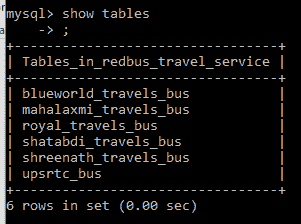
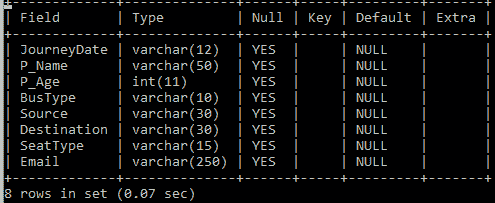

# 菜单驱动程序实现旅行社

> 原文:[https://www . geesforgeks . org/menu-driven-program-to-implement-travel-agency/](https://www.geeksforgeeks.org/menu-driven-program-to-implement-travel-agency/)

**先决条件:**[Java 中的类和对象](https://www.geeksforgeeks.org/classes-objects-java/)[Java 中的切换用例语句](https://www.geeksforgeeks.org/switch-statement-in-java/)

**问题陈述:**
使用 JAVA 8、MYSQL 数据库和 JDBC 编写一个程序，为公交出行服务构建一个简单的应用程序，可以执行以下操作:

1.  通过各种支付方式为给定路线上的用户/乘客预订机票。
2.  使用机票详细信息和用户凭证取消用户/乘客预订的机票
3.  通过票证详细信息和用户凭据打印票证。
4.  通过已注册的机票 ID 或电子邮件 ID 和用户凭据更新已预订机票上的乘客详细信息。

**方法:**最初，我们需要建立一个数据库，以便存储公交车和预订的信息。这里使用的是 MySQL 数据库。首先，我们需要建立数据库。因此，按照以下步骤设置数据库:

1.  最初，使用工作台在 MySQL 数据库中创建一个数据库。
2.  After creating the database, multiple tables are created signifying multiple travel services where each table contains details of the passenger. The tables are created in the following way:

    [](https://media.geeksforgeeks.org/wp-content/uploads/20200524230616/1406-4.png)

3.  Now, since each table must contain the details of the passengers, each table has the following attributes:

    [](https://media.geeksforgeeks.org/wp-content/uploads/20200524231224/223-1.png)

现在，我们需要在上面创建的数据库和 java 程序之间创建一个连接。为此，请遵循以下步骤:

1.  最初，我们需要在开发应用程序的类中收集数据库和驱动程序信息。这样做的语法是:

    > 字符串 driverClassName = " com。MySQL。JDBC。司机”；
    > String URL =“JDBC:MySQL://localhost/JDBC”；
    > 字符串用户= " root
    > 
    > //默认密码是根.
    > //但是我们可以为关系型数据库数据库
    > 设置任意密码
    > //String pwd = " root "；

2.  现在，我们需要加载 JDBC 驱动程序。这是通过以下语句实现的:

    > // Class.forName 方法返回与
    > //类或接口
    > 类。用于名称(驱动程序名称)关联的
    > //类对象 new INSTANCE()；

3.  初始化数据库后，我们需要连接到它。所以，我们需要建立一种联系。连接创建为:

    > 连接 con = Drivermanager。获取连接(网址、用户、pwd)；
    > 系统。出去。println(“con—>”+con)；

4.  连接后，我们应该能够执行 SQL 语句，以便获取数据或更新数据，或者将其发布到数据库中。为了执行这些语句，使用了以下语法:

    > 语句 ST = con . CreateStatement()；
    > 
    > //创建结构化查询语言查询
    > 字符串 SQL = "；
    > 
    > //执行查询
    > ST .执行更新(SQL)；

5.  最后，在完成执行之后，我们需要关闭连接。与数据库的连接关闭为:

    > ST . close()；
    > con . close()；

到目前为止，我们已经初始化了数据库，并在数据库和 Java 程序之间创建了连接。现在，我们需要定义基于功能的所有方法。程序中的方法如下:

1.  **订票:**为了订票，我们首先需要选择路线。该选项允许用户从一组预定义路线中选择一条路线。对于所有路线，用户必须输入他的详细信息，如姓名、年龄、手机号码、电子邮件等。现在，用户获得特定路线上的可用行程列表。根据用户的选择，数据存储在上面创建的数据库的相应表中。为了做到这一点，使用[开关盒](https://www.geeksforgeeks.org/switch-statement-in-java/)，每个盒都是旅行提供商的选择。
2.  **取消购票:**与上述方法类似，我们需要实现取消功能，用户将能够取消预订的车票。为了做到这一点，我们需要首先获取需要取消门票的用户的详细信息，并使用输入过程中给出的用户的手机号码和电子邮件标识进行验证。
3.  **打印票:**现在实现打印功能。为了打印车票，采取了用户详细信息，就像已经预订了车票的公交车一样，并采用电子邮件 ID 作为输入来查找车票详细信息并打印详细信息。
4.  **更新票券:**为了更新票券，用户必须在第一时间已经预订了票券。因此，用户的电子邮件 id 作为输入来验证票证是否存在。在获得电子邮件 id 之后，对数据库执行搜索操作以搜索票据，然后新更新的细节被作为输入，然后在数据库中更新。

下面是上述功能以及数据库连接的完整实现:

```java
// Java program to implement CLI
// based application of travel agency

import java.sql.*;
import java.util.*;
import javax.swing.JOptionPane;

// Travel class
class My_Travels {

    public static void main(String[] args)
        throws Exception
    {
        String driverClassName
            = "com.mysql.jdbc.Driver";

        String URL
            = "jdbc:mysql:// localhost/"
              + "My_Travels_travel_service";

        String user = "root";
        String pwd = "mysql";

        Class.forName(driverClassName)
            .newInstance();

        Connection con
            = DriverManager.getConnection(
                url, user, pwd);

        System.out.println("con---->" + con);

        Statement st = con.createStatement();

        Scanner zz = new Scanner(System.in);
        System.out.println(
            "\n"
            + "\n"
            + "*********************"
            + "********************  ");
        System.out.println(
            "** WELCOME TO My_Travels"
            + " TRAVELS SERVICES **  ");
        System.out.println(
            "*********************"
            + "********************  ");

        System.out.println(
            "Here you have several"
            + " tasks to perform -- "
            + "\n"
            + "\n");

        System.out.println(
            "Press 1 for ticket booking "
            + "\n"
            + "\n"
            + "Press 2 for "
            + "ticket cancellation"
            + "\n"
            + "\n"
            + "Press 3 for updating "
            + "Passenger detail"
            + "\n"
            + "\n"
            + "Press 4 to print "
            + "ticket details");

        int mainCH = zz.nextInt();
        switch (mainCH) {

        case 1:
            System.out.println(
                " Plese choice the route :  ");

            System.out.println(
                "For DEHRADUN <---> KANPUR "
                + "via Haridwar, press 1"
                + "\n"
                + "\n"
                + "For DEHRADUN <---> DELHI "
                + "via Roorkee, press 2");

            int route_ch = zz.nextInt();
            switch (route_ch) {
            case 1:
                System.out.println(
                    " Welcome <--> DEHRADUN"
                    + " - KANPUR route "
                    + "via Haridwar ");

                System.out.println(
                    "Please enter your detail"
                    + " so we can book "
                    + "your ticket");

                String w
                    = JOptionPane
                          .showInputDialog(
                              "Enter the Journey Date:");

                String x
                    = JOptionPane
                          .showInputDialog(
                              "Enter Passenger Name:");

                String y
                    = JOptionPane.showInputDialog(
                        "Enter Passenger Age:");

                String z
                    = JOptionPane.showInputDialog(
                        "Enter Bus Type:");

                String a
                    = JOptionPane.showInputDialog(
                        "Enter Source City:");

                String b
                    = JOptionPane.showInputDialog(
                        "Enter Destination City:");

                String c
                    = JOptionPane.showInputDialog(
                        "Enter Seat Type:");

                String cc
                    = JOptionPane.showInputDialog(
                        "Enter Email address:");

                System.out.println(
                    " In this route, we have "
                    + "type of bushes for you "
                    + "(Both AC and Non-AC "
                    + "buses available "
                    + "in this route ");

                System.out.println(
                    "For Shatbdi Travels  "
                    + "Departure: 5 PM  "
                    + "Arrival: 6:15 AM  "
                    + "Journey time: 13Hr. 15 Min., "
                    + "press 1"
                    + "\n"
                    + "\n"
                    + "For Mahalaxmi Travels, "
                    + "Departure: 6 PM  "
                    + "Arrival: 7:30 AM "
                    + " Journey time: 13Hr. 30 "
                    + "Min.press 2"
                    + "\n"
                    + "\n"
                    + "For Blueworls Travels,  "
                    + "Departure: 8 PM  "
                    + "Arrival: 10:15 AM  "
                    + "Journey time: 14Hr. 15 "
                    + "Min. press 3"
                    + "\n"
                    + "\n"
                    + "For UP Govt. UPSRTC bushes, "
                    + "Departure: 10:15 PM  "
                    + "Arrival: 12:45 AM  "
                    + "Journey time: 14Hr. 30 "
                    + "Min. press 4");
                int Bus_ch_r1 = zz.nextInt();
                switch (Bus_ch_r1) {
                case 1:
                    String sql1
                        = "INSERT INTO "
                          + "shatabdi_travels_bus"
                          + "(JourneyDate, P_Name, "
                          + "P_Age, BusType, Source, "
                          + " Destination, SeatType, "
                          + "Email) VALUE(?, ?, ?, ?, "
                          + "?, ?, ?, ?)";

                    PreparedStatement ps1
                        = con.prepareStatement(sql1);
                    ps1.setString(1, w);
                    ps1.setString(2, x);
                    ps1.setString(3, y);
                    ps1.setString(4, z);
                    ps1.setString(5, a);
                    ps1.setString(6, b);
                    ps1.setString(7, c);
                    ps1.setString(8, cc);
                    ps1.executeUpdate();

                    System.out.println(
                        "\n"
                        + "\n"
                        + "\n"
                        + "Thanks for choosing "
                        + "Shatabdi Travels. "
                        + "Happy and safe Journey"
                        + "\n"
                        + "\n"
                        + "\n"
                        + "\n");
                    break;

                case 2:
                    String sql2
                        = "INSERT INTO "
                          + "mahalaxmi_travels_bus("
                          + "JourneyDate, P_Name, "
                          + "P_Age, BusType, Source, "
                          + " Destination, SeatType, "
                          + "Email) VALUE(?, ?, ?, ?, "
                          + "?, ?, ?, ?)";

                    PreparedStatement ps2
                        = con.prepareStatement(sql2);

                    ps2.setString(1, w);
                    ps2.setString(2, x);
                    ps2.setString(3, y);
                    ps2.setString(4, z);
                    ps2.setString(5, a);
                    ps2.setString(6, b);
                    ps2.setString(7, c);
                    ps2.setString(8, cc);
                    ps2.executeUpdate();

                    System.out.println(
                        "Your ticket "
                        + "is booked successfully "
                        + "in Mahalaxmi Travels. "
                        + "This operator accept "
                        + "m-ticket, please show "
                        + "ticket to bus staff "
                        + "during journey. "
                        + "Have a nice day !");

                    System.out.println(
                        "Thanks for choosing "
                        + "Mahalaxmi Travels. "
                        + "Happy and safe Journey");
                    break;

                case 3:
                    String sql3
                        = "INSERT INTO "
                          + "blueworld_travels_bus("
                          + "JourneyDate, P_Name, "
                          + "P_Age, BusType, Source, "
                          + " Destination, SeatType, "
                          + " Email) VALUE(?, ?, ?, ?, "
                          + " ?, ?, ?, ?)";

                    PreparedStatement ps3
                        = con.prepareStatement(sql3);

                    ps3.setString(1, w);
                    ps3.setString(2, x);
                    ps3.setString(3, y);
                    ps3.setString(4, z);
                    ps3.setString(5, a);
                    ps3.setString(6, b);
                    ps3.setString(7, c);
                    ps3.setString(8, cc);
                    ps3.executeUpdate();

                    System.out.println(
                        "Your ticket "
                        + "is booked successfully "
                        + "in Blueworld Travels. "
                        + "This operator accept "
                        + "m-ticket, please show "
                        + "ticket to bus staff during "
                        + "journey. Have a nice day !");

                    System.out.println(
                        "Thanks for choosing "
                        + "Blueworld Travels. "
                        + "Happy and safe Journey");
                    break;

                case 4:
                    String sql4
                        = "INSERT INTO "
                          + "upsrtc_bus(JourneyDate, "
                          + " P_Name, P_Age, BusType, "
                          + " Source, Destination, "
                          + "SeatType, Email)"
                          + " VALUE(?, ?, "
                          + "?, ?, ?, ?, ?, ?)";

                    PreparedStatement ps4
                        = con.prepareStatement(sql4);
                    ps4.setString(1, w);
                    ps4.setString(2, x);
                    ps4.setString(3, y);
                    ps4.setString(4, z);
                    ps4.setString(5, a);
                    ps4.setString(6, b);
                    ps4.setString(7, c);
                    ps4.setString(8, cc);
                    ps4.executeUpdate();

                    System.out.println(
                        "Your ticket "
                        + "is booked successfully "
                        + "in UP govt. UPSRTC Bus."
                        + " This operator does not "
                        + "accept m-ticket, please "
                        + "take a print of ticket & "
                        + "show bus staff during "
                        + "journey. Have a nice day !");

                    System.out.println(
                        "Thanks for "
                        + "choosing UPSRTC."
                        + " Happy and safe Journey");
                    break;
                default:
                    System.out.println(
                        "Invalid Bus choice."
                        + " Try again Dear !");
                    break;
                }
                break;

            case 2:
                System.out.println(
                    " Welcome to DEHRADUN"
                    + " <---> DELHI route"
                    + " via Roorkee ");

                System.out.println(
                    "Please enter your detail, "
                    + " so we can book"
                    + " your ticket");

                String n
                    = JOptionPane.showInputDialog(
                        "Enter the Journey Date:");

                String s
                    = JOptionPane.showInputDialog(
                        "Enter Passenger Name:");

                String m
                    = JOptionPane.showInputDialog(
                        "Enter Passenger Age:");

                String o
                    = JOptionPane.showInputDialog(
                        "Enter Bus Type:");

                String p
                    = JOptionPane.showInputDialog(
                        "Enter Source City:");

                String q
                    = JOptionPane.showInputDialog(
                        "Enter Destination City:");

                String r
                    = JOptionPane.showInputDialog(
                        "Enter Seat Type:");

                String cd
                    = JOptionPane.showInputDialog(
                        "Enter Email address:");

                System.out.println(
                    " In this route, "
                    + "we have 5 type of "
                    + "bushes for you "
                    + "(Both AC and "
                    + "Non-AC buses available "
                    + "in this route ");

                System.out.println(
                    "For Shreenath Travels, "
                    + " Departure: 5 PM  "
                    + "Arrival: 11:15 PM  "
                    + "Journey time: "
                    + "6 Hr. 15 Min.press 1"
                    + "\n"
                    + "\n"
                    + "For Shatabdi Travels, "
                    + " Departure: 8:5 PM  "
                    + "Arrival: 2:10 AM  "
                    + "Journey time: 6 Hr. 10 "
                    + "Min.press 2"
                    + "\n"
                    + "\n"
                    + "For Mahalaxmi Travels, "
                    + "Departure: 11 PM  "
                    + "Arrival: 6:15 AM  "
                    + "Journey time: 7Hr."
                    + " 15 Min. press 3"
                    + "\n"
                    + "\n"
                    + "For UP Govt. "
                    + "UPSRTC bushes, "
                    + "Departure: 9:30 PM  "
                    + "Arrival: 4 AM  "
                    + "Journey time: 6 Hr. 30 "
                    + "Min. press 4"
                    + "\n"
                    + "\n"
                    + "For Royal Travels Pvt. Ltd."
                    + ", Departure: 12 PM  "
                    + "Arrival: 6:15 PM  "
                    + "Journey time: 6 Hr. 15 "
                    + "Min. press 5");
                int Bus_ch_r2 = zz.nextInt();
                switch (Bus_ch_r2) {

                case 2:
                    String sql5
                        = "INSERT INTO "
                          + "shatabdi_travels_bus"
                          + "(JourneyDate, P_Name, "
                          + " P_Age, BusType, Source, "
                          + "Destination, SeatType, "
                          + "Email) VALUE(?, ?, ?, ?, "
                          + " ?, ?, ?, ?)";
                    PreparedStatement ps5
                        = con.prepareStatement(sql5);
                    ps5.setString(1, n);
                    ps5.setString(2, s);
                    ps5.setString(3, m);
                    ps5.setString(4, o);
                    ps5.setString(5, p);
                    ps5.setString(6, q);
                    ps5.setString(7, r);
                    ps5.setString(8, cd);
                    ps5.executeUpdate();

                    System.out.println(
                        "Your ticket is "
                        + "booked successfully in "
                        + "Statabdi Travels. "
                        + "This operator accept "
                        + "m-ticket, please show "
                        + "ticket to bus staff "
                        + "during the journey. "
                        + "Have a nice day !");
                    System.out.println(
                        "\n"
                        + "\n"
                        + "\n"
                        + "Thanks for choosing "
                        + "Shatabdi Travels."
                        + " Happy and safe Journey"
                        + "\n"
                        + "\n"
                        + "\n"
                        + "\n");
                    break;

                case 3:
                    String sql6
                        = "INSERT INTO "
                          + "mahalaxmi_travels_bus("
                          + "JourneyDate, P_Name, "
                          + "P_Age, BusType, Source, "
                          + " Destination, SeatType, "
                          + "Email) VALUE(?, ?, ?, ?, "
                          + " ?, ?, ?, ?)";

                    PreparedStatement ps6
                        = con.prepareStatement(sql6);

                    ps6.setString(1, n);
                    ps6.setString(2, s);
                    ps6.setString(3, m);
                    ps6.setString(4, o);
                    ps6.setString(5, p);
                    ps6.setString(6, q);
                    ps6.setString(7, r);
                    ps6.setString(8, cd);
                    ps6.executeUpdate();
                    System.out.println(
                        "Your ticket is booked "
                        + "successfully in Mahalaxmi "
                        + "Travels. This operator accept "
                        + "m-ticket, please show ticket "
                        + "to bus staf during journey. "
                        + "Have a nice day !");
                    System.out.println(
                        "Thanks for choosing "
                        + "Mahalaxmi Travels. "
                        + "Happy and safe Journey");
                    break;

                case 1:
                    String sql7
                        = "INSERT INTO "
                          + "shreenath_travels_bus"
                          + "(JourneyDate, P_Name, "
                          + " P_Age, BusType, Source, "
                          + " Destination, SeatType, "
                          + "Email) VALUE(?, ?, ?, ?, "
                          + "?, ?, ?, ?)";

                    PreparedStatement ps17
                        = con.prepareStatement(sql7);
                    ps17.setString(1, n);
                    ps17.setString(2, s);
                    ps17.setString(3, m);
                    ps17.setString(4, o);
                    ps17.setString(5, p);
                    ps17.setString(6, q);
                    ps17.setString(7, r);
                    ps17.setString(8, cd);
                    ps17.executeUpdate();
                    System.out.println(
                        "Your ticket is booked "
                        + "successfully in "
                        + "Shreenath Travels. "
                        + "This operator accept "
                        + "m-ticket, please show "
                        + "ticket to bus staff "
                        + "during journey. "
                        + "Have a nice day !");

                    System.out.println(
                        "Thanks for choosing "
                        + "Shreenath Travels. "
                        + "Happy and safe Journey");
                    break;

                case 4:
                    String sql8
                        = "INSERT INTO "
                          + "upsrtc_bus("
                          + "JourneyDate, P_Name, "
                          + " P_Age, BusType, "
                          + "Source, Destination, "
                          + "SeatType, Email) "
                          + "VALUE(?, ?, ?, ?, "
                          + "?, ?, ?, ?)";

                    PreparedStatement ps8
                        = con.prepareStatement(sql8);
                    ps8.setString(1, n);
                    ps8.setString(2, s);
                    ps8.setString(3, m);
                    ps8.setString(4, o);
                    ps8.setString(5, p);
                    ps8.setString(6, q);
                    ps8.setString(7, r);
                    ps8.setString(8, cd);
                    ps8.executeUpdate();

                    System.out.println(
                        "Your ticket is booked "
                        + "successfully in UP govt. "
                        + "UPSRTC Bus. This operator "
                        + "does not accept m-ticket, "
                        + "please take a print of ticket "
                        + "& show bus staf during journey."
                        + " Have a nice day !");

                    System.out.println(
                        "Thanks for choosing "
                        + "UPSRTC. Happy "
                        + "and safe Journey");
                    break;

                case 5:
                    String sql9
                        = "INSERT INTO "
                          + "royal_travels_bus("
                          + "JourneyDate, P_Name, "
                          + "P_Age, BusType, Source, "
                          + " Destination, SeatType, "
                          + " Email) VALUE(?, ?, ?, ?, "
                          + " ?, ?, ?, ?)";
                    PreparedStatement ps9
                        = con.prepareStatement(sql9);
                    ps9.setString(1, n);
                    ps9.setString(2, s);
                    ps9.setString(3, m);
                    ps9.setString(4, o);
                    ps9.setString(5, p);
                    ps9.setString(6, q);
                    ps9.setString(7, r);
                    ps9.setString(8, cd);
                    ps9.executeUpdate();
                    System.out.println(
                        "Your ticket is booked "
                        + "successfully in Royal "
                        + "Travels Bus. This operator "
                        + "does not accept m-ticket, "
                        + " please take a print of ticket "
                        + "& show bus staff during journey."
                        + " Have a nice day !");
                    System.out.println(
                        "Thanks for choosing "
                        + "UPSRTC. "
                        + "Happy and safe Journey");

                    break;

                default:
                    System.out.println(
                        "Invalid Bus choice. "
                        + "Try again Dear !");
                    break;
                }
                break;
            }
            System.out.println(
                "Proceed to payment ---- "
                + "don't refresh the page :"
                + "\n"
                + "\n"
                + "You have 3 options -->");
            System.out.println(
                "1 : By Net Banking"
                + "\n"
                + "\n"
                + "2 : By Debit Card"
                + "\n"
                + "\n"
                + "3 : By Paytm Account");
            int pay_ch = zz.nextInt();
            switch (pay_ch) {
            case 1:
                System.out.println(
                    "Enter your Net Banking "
                    + "ID and Password");
                String id = zz.next();
                String pass = zz.next();
                break;
            case 2:
                System.out.println(
                    "Enter your 16 digit "
                    + "debit card number, "
                    + "cvv and OTP which "
                    + "is sent to your "
                    + "linked mobile number");
                String dc = zz.next();
                String cvv = zz.next();
                String OTP = zz.next();
                break;
            case 3:
                System.out.println(
                    "Enter your PAYTM "
                    + "mobile number, "
                    + "password and OTP");

                String PaytmNo = zz.next();
                String PtmPass = zz.next();
                String PtmOTP = zz.next();
                break;
            default:
                System.out.println(
                    "Invalid Payment choice, "
                    + " try again !");
                break;
            }
            System.out.println(
                "Your ticket is booked "
                + "successfully. This "
                + "operator accept m-ticket, "
                + "please show ticket to "
                + "bus staff during journey. "
                + "Have a nice day !");
            break;
        case 2:
            System.out.println(
                "Select bus in which you "
                + "want to cancel your ticket");
            System.out.println(
                " 1: Shatabdi Travels"
                + "\n"
                + "\n"
                + " 2: Blueworld Travels"
                + "\n"
                + "\n"
                + " 3: Mahalaxmi Travels"
                + "\n"
                + "\n"
                + " 4: Shreenath Travels"
                + "\n"
                + "\n"
                + " 5: UP govt. upsrtc bus"
                + "\n"
                + "\n"
                + " 6: Royal Travels"
                + "\n"
                + "\n"
                + " Select any one");
            int cnclCH = zz.nextInt();

            String P_name
                = JOptionPane.showInputDialog(
                    "Enter the Passenger name "
                    + "who want to delete ticket");

            String Email
                = JOptionPane.showInputDialog(
                    "Enter the Passenger's"
                    + " Email want to delete ticket");

            switch (cnclCH) {
            case 1:
                String sql12
                    = "DELETE FROM "
                      + "shatabdi_travels_bus "
                      + "where P_name=? and Email=?";
                PreparedStatement ps12
                    = con.prepareStatement(sql12);

                ps12.setString(1, P_name);
                ps12.setString(2, Email);
                ps12.executeUpdate();
                System.out.println(
                    "Your ticket is cancelled "
                    + "successfully from "
                    + "Shatabdi Travels");
                System.out.println(
                    "\n"
                    + "\n"
                    + "\n"
                    + "Thanks for choosing "
                    + "Shatabdi Travels.... "
                    + "Happy and safe Journey"
                    + "\n"
                    + "\n"
                    + "\n"
                    + "\n");
                break;
            case 2:
                String sql13
                    = "DELETE FROM "
                      + "blueworld_travels_bus "
                      + "where P_name=? and Email=?";

                PreparedStatement ps13
                    = con.prepareStatement(sql13);

                ps13.setString(1, P_name);
                ps13.setString(2, Email);
                ps13.executeUpdate();
                System.out.println(
                    "Your ticket is "
                    + "cancelled successfully "
                    + "from Blueworld Travels");
                System.out.println(
                    "Thanks for choosing"
                    + "Blueworld Travels.... "
                    + "Happy and safe Journey");
                break;

            case 3:
                String sql14
                    = "DELETE FROM "
                      + "mahalaxmi_travels_bus"
                      + " where P_name=? and Email=?";

                PreparedStatement ps14
                    = con.prepareStatement(sql14);

                ps14.setString(1, P_name);
                ps14.setString(2, Email);
                ps14.executeUpdate();
                System.out.println(
                    "Your ticket is "
                    + "cancelled successfully "
                    + "from Mahalaxmi Travels");

                System.out.println(
                    "Thanks for choosing "
                    + "Mahalaxmi Travels. "
                    + "Happy and safe Journey");
                break;

            case 4:
                String sql15
                    = "DELETE FROM "
                      + "shreenath_travels_bus "
                      + "where P_name=? and "
                      + "Email=?";
                PreparedStatement ps15
                    = con.prepareStatement(sql15);
                ps15.setString(1, P_name);
                ps15.setString(2, Email);
                ps15.executeUpdate();
                System.out.println(
                    "Your ticket is "
                    + "cancelled successfully "
                    + "from Royal Travels");
                System.out.println(
                    "Thanks for choosing "
                    + "Shreenath Travels.... "
                    + "Happy and safe Journey");
                break;
            case 5:
                String sql16
                    = "DELETE FROM "
                      + "upsrtc_bus where "
                      + "P_name=? and Email=?";
                PreparedStatement ps16
                    = con.prepareStatement(sql16);
                ps16.setString(1, P_name);
                ps16.setString(2, Email);
                ps16.executeUpdate();
                System.out.println(
                    "Your ticket is cancelled "
                    + "successfully from UP "
                    + "govt. UPSRTC bus");
                System.out.println(
                    "Thanks for choosing "
                    + "UP govt. UPSRTC bus."
                    + " Happy and safe Journey");
                break;
            case 6:
                String sql11
                    = "DELETE FROM "
                      + "royal_travels_bus "
                      + "where P_name=? and Email=?";
                PreparedStatement ps11
                    = con.prepareStatement(sql11);
                ps11.setString(1, P_name);
                ps11.setString(2, Email);
                ps11.executeUpdate();
                System.out.println(
                    "Your ticket is "
                    + "cancelled successfully "
                    + "from Royal Travels");
                System.out.println(
                    "Thanks for choosing "
                    + "Royal Travels.... "
                    + "Happy and safe Journey");
                break;
            default:
                System.out.println(
                    "Invalid cancellation choise");
                break;
            }
            break;

        case 3:
            System.out.println(
                "Select bus in which you "
                + "want to update your detail");
            System.out.println(
                " 1: Shatabdi Travels"
                + "\n"
                + "\n"
                + " 2: Blueworld Travels"
                + "\n"
                + "\n"
                + " 3: Mahalaxmi Travels"
                + "\n"
                + "\n"
                + " 4: Shreenath Travels"
                + "\n"
                + "\n"
                + " 5: UP govt. upsrtc bus"
                + "\n"
                + "\n"
                + " 6: Royal Travels"
                + "\n"
                + "\n"
                + " Select any one");
            int udtCH = zz.nextInt();
            String Email1
                = JOptionPane.showInputDialog(
                    "Enter the Passenger's Email"
                    + " who want to delete ticket");
            String P_name1
                = JOptionPane.showInputDialog(
                    "Enter the correct "
                    + "name to update ticket");
            String age1
                = JOptionPane.showInputDialog(
                    "Enter the correct "
                    + "age to update ticket");

            switch (udtCH) {
            case 1:
                String sql12
                    = "UPDATE shatabdi_travels_bus "
                      + "SET P_Name=?, P_Age=? where Email=?";

                PreparedStatement ps12
                    = con.prepareStatement(sql12);
                ps12.setString(1, P_name1);
                ps12.setString(2, age1);
                ps12.setString(3, Email1);
                ps12.executeUpdate();
                System.out.println(
                    "Your ticket is updated "
                    + "successfully from "
                    + "Shatabdi Travels");
                System.out.println("\n"
                                   + "\n"
                                   + "\n"
                                   + "Thanks for choosing "
                                   + "Shatabdi Travels.... "
                                   + "Happy and safe Journey"
                                   + "\n"
                                   + "\n"
                                   + "\n"
                                   + "\n");
                break;
            case 2:
                String sql13
                    = "UPDATE blueworld_travels_bus"
                      + " SET P_Name=?, P_age=? where Email=?";

                PreparedStatement ps13
                    = con.prepareStatement(sql13);
                ps13.setString(1, P_name1);
                ps13.setString(2, age1);
                ps13.setString(3, Email1);
                ps13.executeUpdate();
                System.out.println(
                    "Your ticket is updated "
                    + "successfully from "
                    + "Blueworld Travels");
                System.out.println(
                    "Thanks for choosing "
                    + "Blueworld Travels.... "
                    + "Happy and safe Journey");
                break;
            case 3:
                String sql14
                    = "UPDATE mahalaxmi_travels_bus "
                      + "SET P_Name=?, P_Age=? where Email=?";

                PreparedStatement ps14
                    = con.prepareStatement(sql14);

                ps14.setString(1, P_name1);
                ps14.setString(2, age1);
                ps14.setString(3, Email1);
                ps14.executeUpdate();
                System.out.println(
                    "Your ticket is updated "
                    + "successfully from "
                    + "Mahalaxmi Travels");
                System.out.println(
                    "Thanks for choosing "
                    + "Mahalaxmi Travels.... "
                    + "Happy and safe Journey");
                break;
            case 4:
                String sql15
                    = "UPDATE shreenath_travels_bus "
                      + "SET P_Name=?, P_Age=? where Email=?";

                PreparedStatement ps15
                    = con.prepareStatement(sql15);
                ps15.setString(1, P_name1);
                ps15.setString(2, age1);
                ps15.setString(3, Email1);
                ps15.executeUpdate();

                System.out.println(
                    "Your ticket is updated "
                    + "successfully from "
                    + "Royal Travels");
                System.out.println(
                    "Thanks for choosing "
                    + "Shreenath Travels.... "
                    + "Happy and safe Journey");
                break;
            case 5:
                String sql16
                    = "UPDATE upsrtc_bus "
                      + "SET P_Name=?, P_Age=? "
                      + "where Email=?";
                PreparedStatement ps16
                    = con.prepareStatement(sql16);
                ps16.setString(1, P_name1);
                ps16.setString(2, age1);
                ps16.setString(3, Email1);
                ps16.executeUpdate();
                System.out.println(
                    "Your ticket is updated "
                    + "successfully from UP "
                    + "govt. UPSRTC bus");
                System.out.println(
                    "Thanks for choosing "
                    + "UP govt. UPSRTC bus...."
                    + " Happy and safe Journey");
                break;
            case 6:
                String sql11
                    = "UPDATE royal_travels_bus"
                      + " SET P_Name=?, P_Age=? "
                      + "where Email=?";
                PreparedStatement ps11
                    = con.prepareStatement(sql11);
                ps11.setString(1, P_name1);
                ps11.setString(2, age1);
                ps11.setString(3, age1);
                ps11.executeUpdate();

                System.out.println(
                    "Your ticket is updated "
                    + "successfully from "
                    + "Royal Travels");
                System.out.println(
                    "Thanks for choosing "
                    + "Royal Travels.... "
                    + "Happy and safe Journey");
                break;
            default:
                System.out.println(
                    "Invalid cancellation choise");
                break;
            }
            break;
        case 4:
            System.out.println(
                "Select bus in which "
                + "you want to print your ticket");
            System.out.println(
                " 1: Shatabdi Travels"
                + "\n"
                + "\n"
                + " 2: Blueworld Travels"
                + "\n"
                + "\n"
                + " 3: Mahalaxmi Travels"
                + "\n"
                + "\n"
                + " 4: Shreenath Travels"
                + "\n"
                + "\n"
                + " 5: UP govt. upsrtc bus"
                + "\n"
                + "\n"
                + " 6: Royal Travels"
                + "\n"
                + "\n"
                + " Select any one");
            int PrntCH = zz.nextInt();

            String PEmail
                = JOptionPane.showInputDialog(
                    "Enter the Email to print ticket");

            switch (PrntCH) {
            case 1:
                String sql21
                    = "SELECT JourneyDate, "
                      + "P_Name, P_Age, Source, "
                      + "Destination, BusType, "
                      + "Email, SeatType FROM "
                      + "shatabdi_travels_bus "
                      + "WHERE Email= ?";
                PreparedStatement ps21
                    = con.prepareStatement(sql21);
                ps21.setString(1, PEmail);
                ResultSet rs1 = ps21.executeQuery();
                while (rs1.next()) {
                    System.out.println(
                        "Journey Date : "
                        + rs1.getString("JourneyDate") + "\n"
                        + "\n"
                        + "Passenger Name : "
                        + rs1.getString("P_Name") + "\n"
                        + "\n"
                        + "Passenger Age : "
                        + rs1.getInt("P_Age") + "\n"
                        + "\n"
                        + "Source City : "
                        + rs1.getString("Source") + "\n"
                        + "\n"
                        + "Destination City : "
                        + rs1.getString("Destination") + "\n"
                        + "\n"
                        + "Bus Type : "
                        + rs1.getString("BusType") + "\n"
                        + "\n"
                        + "Passenger's Email : "
                        + rs1.getString("Email") + "\n"
                        + "\n"
                        + "Seat Type : "
                        + rs1.getString("SeatType"));
                }
                rs1.close();
                System.out.println(
                    "\n"
                    + "\n"
                    + "\n"
                    + "Thanks for choosing "
                    + "Shatabdi Travels.... "
                    + "Happy and safe Journey"
                    + "\n"
                    + "\n"
                    + "\n"
                    + "\n");
                break;

            case 2:
                String sql22
                    = "SELECT JourneyDate, "
                      + "P_Name, P_Age, Source, "
                      + " Destination, BusType, "
                      + "Email, SeatType FROM "
                      + "blueworld_travels_bus "
                      + "WHERE Email= ?";
                PreparedStatement ps22
                    = con.prepareStatement(sql22);
                ps22.setString(1, PEmail);
                ResultSet rs2 = ps22.executeQuery();
                while (rs2.next()) {
                    System.out.println(
                        "Journey Date : "
                        + rs2.getString("JourneyDate") + "\n"
                        + "\n"
                        + "Passenger Name : "
                        + rs2.getString("P_Name") + "\n"
                        + "\n"
                        + "Passenger Age : "
                        + rs2.getInt("P_Age") + "\n"
                        + "\n"
                        + "Source City : "
                        + rs2.getString("Source") + "\n"
                        + "\n"
                        + "Destination City : "
                        + rs2.getString("Destination") + "\n"
                        + "\n"
                        + "Bus Type : "
                        + rs2.getString("BusType") + "\n"
                        + "\n"
                        + "Passenger's Email : "
                        + rs2.getString("Email") + "\n"
                        + "\n"
                        + "Seat Type : "
                        + rs2.getString("SeatType"));
                }
                rs2.close();
                System.out.println(
                    "\n"
                    + "\n"
                    + "\n"
                    + "Thanks for choosing "
                    + "Blueworld Travels.... "
                    + "Happy and safe Journey"
                    + "\n"
                    + "\n"
                    + "\n"
                    + "\n");
                break;
            case 3:
                String sql23
                    = "SELECT JourneyDate, P_Name, "
                      + "P_Age, Source, Destination, "
                      + " BusType, Email, "
                      + "SeatType FROM "
                      + "mahalaxmi_travels_bus "
                      + "WHERE Email= ?";
                PreparedStatement ps23
                    = con.prepareStatement(sql23);
                ps23.setString(1, PEmail);
                ResultSet rs3 = ps23.executeQuery();
                while (rs3.next()) {
                    System.out.println(
                        "Journey Date : "
                        + rs3.getString("JourneyDate") + "\n"
                        + "\n"
                        + "Passenger Name : "
                        + rs3.getString("P_Name") + "\n"
                        + "\n"
                        + "Passenger Age : "
                        + rs3.getInt("P_Age") + "\n"
                        + "\n"
                        + "Source City : "
                        + rs3.getString("Source") + "\n"
                        + "\n"
                        + "Destination City : "
                        + rs3.getString("Destination") + "\n"
                        + "\n"
                        + "Bus Type : "
                        + rs3.getString("BusType") + "\n"
                        + "\n"
                        + "Passenger's Email : "
                        + rs3.getString("Email") + "\n"
                        + "\n"
                        + "Seat Type : "
                        + rs3.getString("SeatType"));
                }
                rs3.close();
                System.out.println(
                    "\n"
                    + "\n"
                    + "\n"
                    + "Thanks for choosing "
                    + "Mahalaxmi Travels.... "
                    + "Happy and safe Journey"
                    + "\n"
                    + "\n"
                    + "\n"
                    + "\n");
                break;

            case 4:
                String sql24
                    = "SELECT JourneyDate, P_Name, "
                      + "P_Age, Source, Destination, "
                      + "BusType, Email, SeatType "
                      + "FROM shreenath_travels_bus "
                      + "WHERE Email= ?";

                PreparedStatement ps24
                    = con.prepareStatement(sql24);

                ps24.setString(1, PEmail);
                ResultSet rs4 = ps24.executeQuery();
                while (rs4.next()) {
                    System.out.println(
                        "Journey Date : "
                        + rs4.getString("JourneyDate") + "\n"
                        + "\n"
                        + "Passenger Name : "
                        + rs4.getString("P_Name") + "\n"
                        + "\n"
                        + "Passenger Age : "
                        + rs4.getInt("P_Age") + "\n"
                        + "\n"
                        + "Source City : "
                        + rs4.getString("Source") + "\n"
                        + "\n"
                        + "Destination City : "
                        + rs4.getString("Destination") + "\n"
                        + "\n"
                        + "Bus Type : "
                        + rs4.getString("BusType") + "\n"
                        + "\n"
                        + "Passenger's Email : "
                        + rs4.getString("Email") + "\n"
                        + "\n"
                        + "Seat Type : "
                        + rs4.getString("SeatType"));
                }
                rs4.close();
                System.out.println(
                    "\n"
                    + "\n"
                    + "\n"
                    + "Thanks for choosing "
                    + "Shreenath Travels.... "
                    + "Happy and safe Journey"
                    + "\n"
                    + "\n"
                    + "\n"
                    + "\n");
                break;
            case 6:
                String sql25
                    = "SELECT JourneyDate, P_Name, "
                      + "P_Age, Source, Destination, "
                      + "BusType, Email, SeatType "
                      + "FROM royal_travels_bus "
                      + "WHERE Email= ?";
                PreparedStatement ps25
                    = con.prepareStatement(sql25);
                ps25.setString(1, PEmail);
                ResultSet rs5 = ps25.executeQuery();
                while (rs5.next()) {
                    System.out.println(
                        "Journey Date : "
                        + rs5.getString("JourneyDate") + "\n"
                        + "\n"
                        + "Passenger Name : "
                        + rs5.getString("P_Name") + "\n"
                        + "\n"
                        + "Passenger Age : "
                        + rs5.getInt("P_Age") + "\n"
                        + "\n"
                        + "Source City : "
                        + rs5.getString("Source") + "\n"
                        + "\n"
                        + "Destination City : "
                        + rs5.getString("Destination") + "\n"
                        + "\n"
                        + "Bus Type : "
                        + rs5.getString("BusType") + "\n"
                        + "\n"
                        + "Passenger's Email : "
                        + rs5.getString("Email") + "\n"
                        + "\n"
                        + "Seat Type : "
                        + rs5.getString("SeatType"));
                }
                rs5.close();
                System.out.println(
                    "\n"
                    + "\n"
                    + "\n"
                    + "Thanks for choosing "
                    + "Royal Travels.... "
                    + "Happy and safe Journey"
                    + "\n"
                    + "\n"
                    + "\n"
                    + "\n");
                break;

            case 5:
                String sql26
                    = "SELECT JourneyDate, P_Name, "
                      + " P_Age, Source, Destination, "
                      + "BusType, Email, SeatType "
                      + "FROM upsrtc_bus WHERE "
                      + "Email= ?";
                PreparedStatement ps26
                    = con.prepareStatement(sql26);
                ps26.setString(1, PEmail);
                ResultSet rs6 = ps26.executeQuery();
                while (rs6.next()) {
                    System.out.println(
                        "Journey Date : "
                        + rs6.getString("JourneyDate") + "\n"
                        + "\n"
                        + "Passenger Name : "
                        + rs6.getString("P_Name") + "\n"
                        + "\n"
                        + "Passenger Age : "
                        + rs6.getInt("P_Age") + "\n"
                        + "\n"
                        + "Source City : "
                        + rs6.getString("Source") + "\n"
                        + "\n"
                        + "Destination City : "
                        + rs6.getString("Destination") + "\n"
                        + "\n"
                        + "Bus Type : "
                        + rs6.getString("BusType") + "\n"
                        + "\n"
                        + "Passenger's Email : "
                        + rs6.getString("Email") + "\n"
                        + "\n"
                        + "Seat Type : "
                        + rs6.getString("SeatType"));
                }
                rs6.close();
                System.out.println(
                    "\n"
                    + "\n"
                    + "\n"
                    + "Thanks for choosing UP govt. "
                    + "UPSRTC.... "
                    + "Happy and safe Journey"
                    + "\n"
                    + "\n"
                    + "\n"
                    + "\n");
                break;
            }
            break;
        }
        st.close();
        con.close();
        System.out.println("---SQL executed successfully---");
        System.out.println("Adars11h Shukla  "
                           + "R134218010");
    }
}
```

**注意:**上述代码在联机 IDE 上不起作用。请使用离线 IDE 运行上述代码。

**输出:**以下两个视频说明了上述代码的工作原理。

<video class="wp-video-shortcode" id="video-422061-1" width="665" height="374" preload="metadata" controls=""><source type="video/mp4" src="https://media.geeksforgeeks.org/wp-content/uploads/20200601171945/1_kW7iZgM9.compressed.mp4?_=1">[https://media.geeksforgeeks.org/wp-content/uploads/20200601171945/1_kW7iZgM9.compressed.mp4](https://media.geeksforgeeks.org/wp-content/uploads/20200601171945/1_kW7iZgM9.compressed.mp4)</video><video class="wp-video-shortcode" id="video-422061-2" width="665" height="374" preload="metadata" controls=""><source type="video/mp4" src="https://media.geeksforgeeks.org/wp-content/uploads/20200601162909/21.mp4?_=2">[https://media.geeksforgeeks.org/wp-content/uploads/20200601162909/21.mp4](https://media.geeksforgeeks.org/wp-content/uploads/20200601162909/21.mp4)</video>