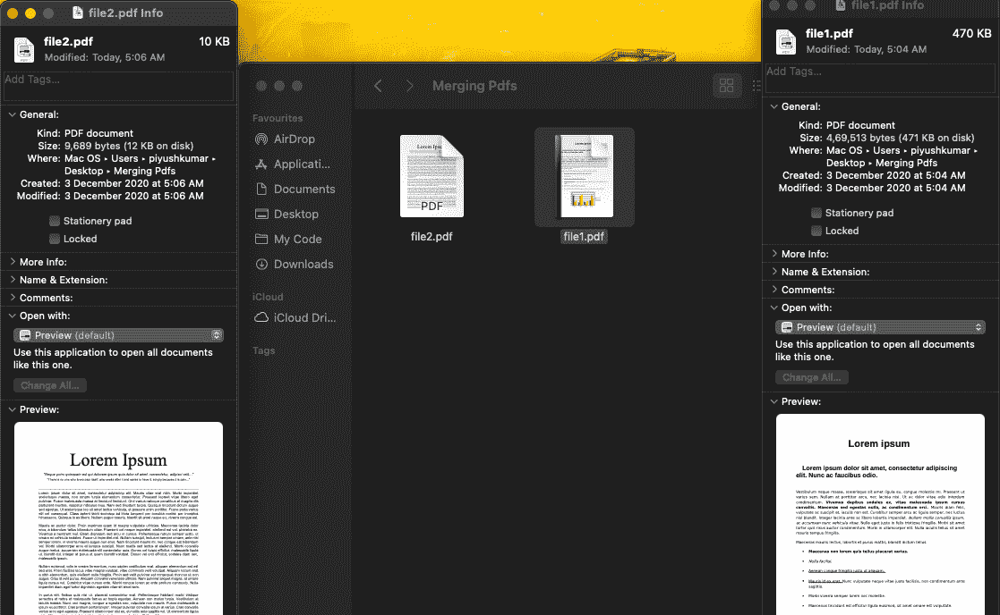
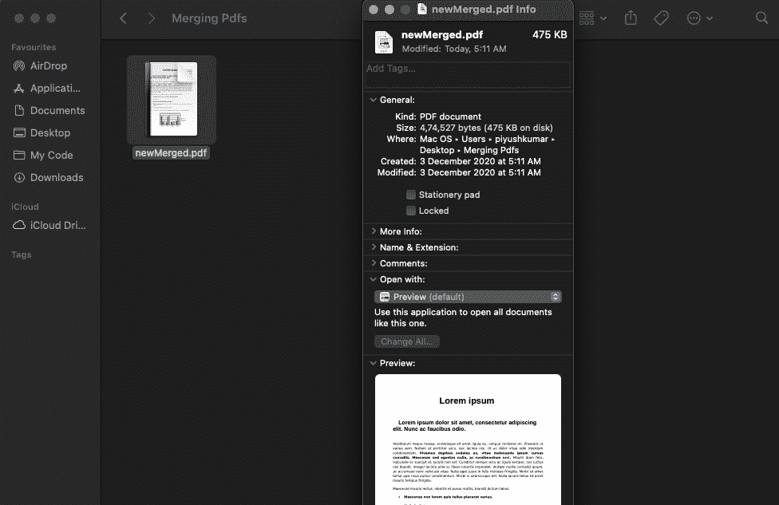

# 使用 Java 合并 PDFs】

> 原文:[https://www.geeksforgeeks.org/merging-pdfs-using-java/](https://www.geeksforgeeks.org/merging-pdfs-using-java/)

将多个 PDF 文档合并成一个 PDF 文档是使用**PDF 合并能力**类完成的。这门课将把一个 PDF 文档列表合并，结果将保存到新文档中。这个题目的前提是你已经安装了 [**阿帕奇库**](https://pdfbox.apache.org/download.cgi)

**按照** **这些步骤合并多个 PDF 文档:**

1.  首先，我们必须实例化**pdfmergroutinity**类。
2.  其次，我们必须使用 **setDestinationFileName()** 方法设置目标文件。
3.  现在我们必须使用 **addSource()** 方法设置源文件。
4.  最后一步，我们必须使用 PDFMergerUtility 类的 **mergeDocuments()** 方法合并文档。

**示例:**

```
Input : PDF1 = Alice.pdf, PDF2 = Bob.pdf
Output: newMerged.pdf // merged pdf of pdf1 and pdf2 
```

实施:

## Java 语言(一种计算机语言，尤用于创建网站)

```
// Merging multiple pdf documents here

import org.apache.pdfbox.multipdf.PDFMergerUtility;
import org.apache.pdfbox.pdmodel.PDDocument;

import java.io.File;
import java.io.IOException;

public class GFG {

    public static void main(String[] args)
        throws IOException
    {

        // loading all the pdf files we wish to merge

        File file1 = new File(
            "/Users/piyushkumar/Desktop/Merging Pdfs/file1.pdf");
        File file2 = new File(
            "/Users/piyushkumar/Desktop/Merging Pdfs/file2.pdf");

        // Instantiating PDFMergerUtility class

        PDFMergerUtility obj = new PDFMergerUtility();

        // Setting the destination file path

        obj.setDestinationFileName(
            "/Users/piyushkumar/Desktop/Merging Pdfs/newMerged.pdf");

        // Add all source files, to be merged

        obj.addSource(file1);
        obj.addSource(file2);

        // Merging documents

        obj.mergeDocuments();

        System.out.println(
            "PDF Documents merged to a single file");
    }
}
```

**代码执行前:**



**代码执行后:**



*如果你检查指定的路径，你会看到一个名为 newMerged.pdf 的 PDF 文档已经生成，其中包含了两个原始文档的页面。*