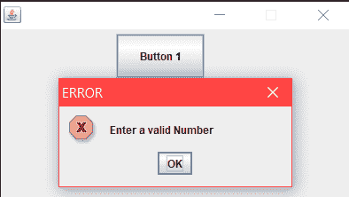
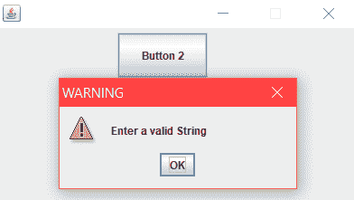
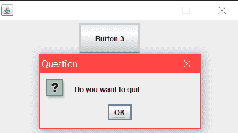
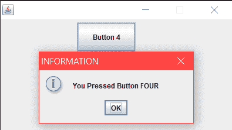

# Java(图形用户界面)中的消息对话框

> 原文:[https://www.geeksforgeeks.org/message-dialogs-java-gui/](https://www.geeksforgeeks.org/message-dialogs-java-gui/)

消息对话框向用户提供信息。消息对话框是用 JOptionPane.showMessageDialog()方法创建的。

我们调用 JOptionPane 类的**静态 showMessageDialog()** 方法来创建消息对话框。我们提供对话框的父项、消息文本、标题和消息类型。消息类型是以下常量之一:

1.  错误消息
2.  警告消息
3.  问题 _ 消息
4.  信息 _ 消息

**使用的方法:**

1.  **setLayout(…):** 方法帮助我们设置容器的布局，通常是一个 JPanel，也就是说 FlowLayout、BorderLayout、GridLayout、null 布局，或者任何我们想在容器上添加的布局。
2.  **setBounds(…):** 方法用于设置像 JButton 这样的组件的位置和大小，只有在 JFrame 中使用 null 布局时才有用。
3.  **设置可见(…):** 方法用于设置 JFrame 的可见性状态。
    1.  setVisible(true)将设置用户可见的 JFrame。
    2.  setVisible(false)将设置 JFrame 对用户不可见。
4.  **getSource():** 事件对象包含对生成事件的组件的引用。为了从事件对象中提取该引用，我们使用 getSource()方法。
5.  **add():** 用于向 JFrame 的容器中添加 JButton 等组件。

**下面是上面讨论的显示消息对话框的方法的实现:**

## Java 语言(一种计算机语言，尤用于创建网站)

```
// Java program to show ERROR_MESSAGE dialog
// in Java. Importing different Package.
import java.awt.*;
import java.awt.event.*;
import javax.swing.*;

class Demo extends JFrame implements ActionListener
{
    // Declaration of object of JButton class.
    JButton b1;

    // Constructor of Demo class
    Demo()
    {
        // Setting layout as null of JFrame.
        this.setLayout(null);

        // Initialization of object of "JButton" class.
        b1 = new JButton("Button 1");

        // Setting Bounds of a JButton.
        b1.setBounds(130, 05, 100, 50);

        //"this" keyword in java refers to current object.
        // Adding JButton on JFrame.
        this.add(b1);

        // Adding Listener toJButton.
        b1.addActionListener(this);
    }

    // Override Method
    public void actionPerformed(ActionEvent evt)
    {
        if (evt.getSource() == b1)
        {
            // Code To popup an ERROR_MESSAGE Dialog.
            JOptionPane.showMessageDialog(this, "Enter a valid Number",
                                   "ERROR", JOptionPane.ERROR_MESSAGE);
        }
    }
}

class MessageDialogs1 {

    // Driver code
    public static void main(String args[])
    {
        // Creating Object of demo class.
        Demo f = new Demo();

        // Setting Bounds of a Frame.
        f.setBounds(200, 200, 400, 300);

        // Setting Resizable status of frame as false
        f.setResizable(false);

        // Setting Visible status of frame as true.
        f.setVisible(true);
    }
}
```

**输出:**



## Java 语言(一种计算机语言，尤用于创建网站)

```
// Java program to show WARNING_MESSAGE dialog
// in Java. Importing different Package.
import java.awt.*;
import java.awt.event.*;
import javax.swing.*;

class Demo extends JFrame implements ActionListener
{
    // Declaration of object of JButton class.
    JButton b1;

    // Constructor of Demo class
    Demo()
    {
        // Setting layout as null of JFrame.
        this.setLayout(null);

        // Initialization of object of "JButton" class.
        b1 = new JButton("Button 2");

        // Setting Bounds of a JButton.
        b1.setBounds(130, 05, 100, 50);

        //"this" keyword in java refers to current object.
        // Adding JButton on JFrame.
        this.add(b1);

        // Adding Listener toJButton.
        b1.addActionListener(this);
    }

    // Override Method
    public void actionPerformed(ActionEvent evt)
    {
        if (evt.getSource() == b1) {

            // Code To popup an WARNING_MESSAGE Dialog.
            JOptionPane.showMessageDialog(this, "Enter a valid String",
                               "WARNING", JOptionPane.WARNING_MESSAGE);
        }
    }
}

class MessageDialogs2 {

    // Driver code
    public static void main(String args[])
    {
        // Creating Object of demo class.
        Demo f = new Demo();

        // Setting Bounds of a Frame.
        f.setBounds(200, 200, 400, 300);

        // Setting Resizable status of frame as false
        f.setResizable(false);

        // Setting Visible status of frame as true.
        f.setVisible(true);
    }
}
```

**输出:**



## Java 语言(一种计算机语言，尤用于创建网站)

```
// Java program to show QUESTION_MESSAGE
// dialog in Java. Importing different Package.
import java.awt.*;
import java.awt.event.*;
import javax.swing.*;

class Demo extends JFrame implements ActionListener
{
    // Declaration of object of JButton class.
    JButton b1;

    // Constructor of Demo class
    Demo()
    {
        // Setting layout as null of JFrame.
        this.setLayout(null);

        // Initialization of object of "JButton" class.
        b1 = new JButton("Button 3");

        // Setting Bounds of a JButton.
        b1.setBounds(130, 05, 100, 50);

        //"this" keyword in java refers to current object.
        // Adding JButton on JFrame.
        this.add(b1);

        // Adding Listener toJButton.
        b1.addActionListener(this);
    }

    // Override Method
    public void actionPerformed(ActionEvent evt)
    {
        if (evt.getSource() == b1)
        {
            // Code TO popup a QUESTION_MESSAGE Dialog.
            JOptionPane.showMessageDialog(this, "Do you want to quit",
                             "Question", JOptionPane.QUESTION_MESSAGE);
        }
    }
}

class MessageDialogs3 {

    // Driver code
    public static void main(String args[])
    {
        // Creating Object of demo class.
        Demo f = new Demo();

        // Setting Bounds of a Frame.
        f.setBounds(200, 200, 400, 300);

        // Setting Resizable status of frame as false
        f.setResizable(false);

        // Setting Visible status of frame as true.
        f.setVisible(true);
    }
}
```

**输出:**



## Java 语言(一种计算机语言，尤用于创建网站)

```
// Java program to show INFORMATION_MESSAGE
// dialog in Java. Importing different Package.
import java.awt.*;
import java.awt.event.*;
import javax.swing.*;

class Demo extends JFrame implements ActionListener
{
    // Declaration of object of JButton class.
    JButton b1;

    // Constructor of Demo class
    Demo()
    {
        // Setting layout as null of JFrame.
        this.setLayout(null);

        // Initialization of object of "JButton" class.
        b1 = new JButton("Button 4");

        // Setting Bounds of a JButton.
        b1.setBounds(130, 05, 100, 50);

        //"this" keyword in java refers to current object.
        // Adding JButton on JFrame.
        this.add(b1);

        // Adding Listener toJButton.
        b1.addActionListener(this);
    }

    // Override Method
    public void actionPerformed(ActionEvent evt)
    {
        if (evt.getSource() == b1)
        {
            // Code To popup an INFORMATION_MESSAGE Dialog.
            JOptionPane.showMessageDialog(this, "You Pressed Button FOUR",
                                          "INFORMATION",
                                          JOptionPane.INFORMATION_MESSAGE);
        }
    }
}

class MessageDialogs4 {

    // Driver code
    public static void main(String args[])
    {

        // Creating Object of demo class.
        Demo f = new Demo();

        // Setting Bounds of a Frame.
        f.setBounds(200, 200, 400, 300);

        // Setting Resizable status of frame as false
        f.setResizable(false);

        // Setting Visible status of frame as true.
        f.setVisible(true);
    }
}
```

**输出:**

