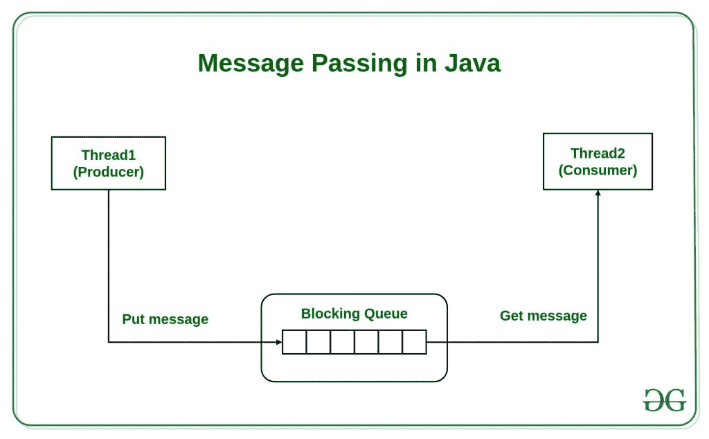

# Java 中的消息传递

> 原文:[https://www.geeksforgeeks.org/message-passing-in-java/](https://www.geeksforgeeks.org/message-passing-in-java/)

**什么是消息传递，为什么使用？**
就计算机而言，消息传递是进程之间的通信。它是面向对象编程和并行编程中使用的一种通信形式。Java 中的消息传递就像发送一个对象，即从一个线程到另一个线程的消息。当线程没有共享内存，无法共享监视器、信号量或任何其他共享变量来进行通信时，就会使用它。假设我们考虑一个生产者和消费者的例子，同样生产者会生产什么，消费者只能消费什么。我们大多使用 **[队列](https://www.geeksforgeeks.org/queue-data-structure/)** 来实现线程间的通信。

[](https://media.geeksforgeeks.org/wp-content/uploads/20190509121341/Message-Passing-in-Java.jpg)

在下面解释的例子中，我们将使用 vector(queue)来存储消息，每次 7 个，之后生产者将等待消费者，直到队列为空。

在生产者中有两个同步的方法 **putMessage()** 将调用生产者的 form **run()** 方法并在 Vector 中添加消息，而 **getMessage()** 从队列中为消费者提取消息。

使用消息传递简化了生产者-消费者问题，因为他们不需要直接相互引用，只需要通过队列进行通信。

**示例:**

```java
import java.util.Vector;

class Producer extends Thread {

    // initialization of queue size
    static final int MAX = 7;
    private Vector messages = new Vector();

    @Override
    public void run()
    {
        try {
            while (true) {

                // producing a message to send to the consumer
                putMessage();

                // producer goes to sleep when the queue is full
                sleep(1000);
            }
        }
        catch (InterruptedException e) {
        }
    }

    private synchronized void putMessage()
        throws InterruptedException
    {

        // checks whether the queue is full or not
        while (messages.size() == MAX)

            // waits for the queue to get empty
            wait();

        // then again adds element or messages
        messages.addElement(new java.util.Date().toString());
        notify();
    }

    public synchronized String getMessage()
        throws InterruptedException
    {
        notify();
        while (messages.size() == 0)
            wait();
        String message = (String)messages.firstElement();

        // extracts the message from the queue
        messages.removeElement(message);
        return message;
    }
}

class Consumer extends Thread {
    Producer producer;

    Consumer(Producer p)
    {
        producer = p;
    }

    @Override
    public void run()
    {
        try {
            while (true) {
                String message = producer.getMessage();

                // sends a reply to producer got a message
                System.out.println("Got message: " + message);
                sleep(2000);
            }
        }
        catch (InterruptedException e) {
        }
    }

    public static void main(String args[])
    {
        Producer producer = new Producer();
        producer.start();
        new Consumer(producer).start();
    }
}
```

**输出:**

```java
Got message: Thu May 09 06:57:53 UTC 2019
Got message: Thu May 09 06:57:54 UTC 2019
Got message: Thu May 09 06:57:55 UTC 2019
Got message: Thu May 09 06:57:56 UTC 2019
Got message: Thu May 09 06:57:57 UTC 2019
Got message: Thu May 09 06:57:58 UTC 2019
Got message: Thu May 09 06:57:59 UTC 2019
Got message: Thu May 09 06:58:00 UTC 2019

```