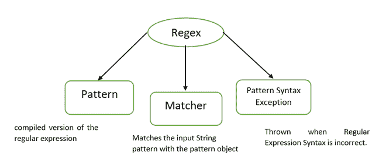

# Java Regex 中的元字符

> 原文:[https://www.geeksforgeeks.org/metacharacters-in-java-regex/](https://www.geeksforgeeks.org/metacharacters-in-java-regex/)

Regex 代表*正则表达式*，用于定义字符串的模式。它用于查找文本或编辑文本。Java Regex 类存在于 ***java.util.regex*** 包中，需要在使用 Regex 类的任何方法之前导入。

****包由 3 个类组成:****

1.  **模式**
2.  **制榫机**
3.  **PatternSyntaxException**

**

regex 包中的类** 

## **元字符**

**元字符就像普通匹配模式的短代码。**

<figure class="table"> **| 

**正则表达式**

 | 

**描述**

 |
| --- | --- |
| **\ d** | 任意数字，短码为【0-9】 |
| **\ n 简称为[\ t \ n \ x0B \ f \ r]** |
| **\ S**

 | 任何非空白字符 |
| **\ W** |  |** </figure>

### **元字符的使用**

*   **元字符前加反斜杠(\)。**

## **元字符的解释**

#### **1.数字和非数字相关元字符:(\d，\D)**

## **Java 语言(一种计算机语言，尤用于创建网站)**

```java
// Java program to demonstrate the
// Digit & Non Digit related Metacharacters

import java.io.*;
import java.util.regex.*;
class GFG {
    public static void main(String[] args)
    {
        // \d represents a digit
        // represents a number so return true
        System.out.println(Pattern.matches("\\d", "2")); //true

        // Comparing a number with character so return false
        System.out.println(Pattern.matches("\\d", "a")); //false

        // \D represents non digits
        // Comparing a non digit with character so return
        // true
        System.out.println(Pattern.matches("\\D", "a")); //true

        // comparing a non digit with a digit so return
        // false
        System.out.println(Pattern.matches("\\D", "2")); //false
    }
}
```

****Output**

```java
true
false
true
false
```** 

****解释****

*   ****d** 元字符表示从 0 到 9 的数字。所以当我们在范围内比较 ***d*** 时，它就会返回**真**。否则返回 false。**
*   ****D** 元字符代表一个非数字，**接受除数字**以外的任何东西。所以当我们将“***【D】***”与**任意数字**进行比较时，**返回 false** 。否则为真。**

#### **2.空白和非空白元字符:(\s，\S)**

## **Java 语言(一种计算机语言，尤用于创建网站)**

```java
// Java program to demonstrate the
// Whitespace and Non-Whitespace Metacharacters

import java.io.*;
import java.util.regex.*;
class GFG {
    public static void main(String[] args)
    {
        // comparing any whitespace character with a white
        // space so return true else false
        System.out.println(Pattern.matches("\\s", " ")); //true
        System.out.println(Pattern.matches("\\s", "2")); //false

        // comparing any non whitespace character with a non
        // white space character so return true else false
        System.out.println(Pattern.matches("\\S", "2")); //true
        System.out.println(Pattern.matches("\\S", " ")); //false
    }
}
```

****Output**

```java
true
false
true
false
```** 

****解释****

*   ****s** 表示空格、制表符、换行符等空白字符。因此，当我们将“**”与**空白字符****进行比较时，它会返回 true** 。否则就是假的。****
*   ******S** 代表一个非空白字符，接受除空白以外的所有内容，所以当我们将“ ***S*** ”与**空白字符****进行比较时，它会返回 false** 。否则为真****

#### ****3.单词和非单词元字符:(\w，\W)****

## ****Java 语言(一种计算机语言，尤用于创建网站)****

```java
**// Java program to demonstrate the
// Word & Non Word Metacharacters

import java.io.*;
import java.util.regex.*;

class GFG {
    public static void main(String[] args)
    {
        // comparing any word character with a word
        // character so return true else false
        System.out.println(Pattern.matches("\\w", "a")); //true
        System.out.println(Pattern.matches("\\w", "2")); //true
        System.out.println(Pattern.matches("\\w", "{content}quot;)); //false

        // comparing any non word character with special
        // symbols & whitespaces return true else false
        System.out.println(Pattern.matches("\\W", "2")); //false
        System.out.println(Pattern.matches("\\W", " ")); //true
        System.out.println(Pattern.matches("\\W", "{content}quot;)); //true
    }
}**
```

******Output**

```java
true
true
false
false
true
true
```**** 

******解释******

*   ******w** 代表接受字母(大写&小写)和数字[0-9]的单词字符。因此，当我们将“***w***”**与字母或数字进行比较时，返回 true** 。否则就是假的。****
*   ******W** 代表一个非单词字符，**除了字母和数字**之外什么都接受。所以当我们将“***W***”**与字母或数字进行比较时，返回 false** 。否则就是真的。****

#### ******4。单词&** 非单词**边界元字符:(\b，\B)******

## ****Java 语言(一种计算机语言，尤用于创建网站)****

```java
**// Java program to demonstrate the
// Word & Non Word Boundary Metacharacters

import java.io.*;
import java.util.regex.*;
class GFG {
    public static void main(String[] args)
    {
        // \b says that a string must have boundary letters
        // of word characters
        System.out.println(
            Pattern.matches("\\bGFG\\b", "GFG")); // true
        System.out.println(
            Pattern.matches("\\b@GFG\\b", "@GFG")); // false

        // \B says that a string must have non word
        // characters as boundaries
        System.out.println(Pattern.matches(
            "\\B@GFG@\\B", "@GFG@")); // true
        System.out.println(
            Pattern.matches("\\BGFG\\B", "GFG")); // false
    }
}**
```

******Output**

```java
true
false
true
false
```**** 

******说明:******

*   ******b** 表示**字符串必须具有单词字符**、*即*的边界元素，可以是数字或字母。所以在这里，***【GFG】***字符串有边界 **G、** **G、**、**，都是字符**，所以返回**真**。对于 **@GFG** 字符串，**边界元素为@，** **G** ，其中 **@不是字符**，所以返回 **false** 。****
*   ******B** 表示**字符串必须有非文字字符**、*即*的边界元素。，它可能有除数字或字母以外的任何内容。所以这里 **@GFG@** 字符串有**边界@，@是非字字符**所以返回**真**。对于 **GFG** 字符串，**边界元素为 G、** **G** 、**，为字符**，返回**假**。****

******示例:******

## ****Java 语言(一种计算机语言，尤用于创建网站)****

```java
**// Java program to demonstrate all the 
// Metacharacters in the Java Regex

import java.io.*;
import java.util.regex.*;

class GFG {
    public static void main(String[] args)
    {
        // \d-number
        // \D-Non Digit
        // \s-Any White Space
        // \S-Non White Space character
        // \w-any word character like  numbers/characters
        // \W-special symbols
        System.out.println(Pattern.matches(
            "\\d\\D\\s\\S\\w\\W", "1G FG!")); // true

        System.out.println(Pattern.matches(
            "\\d\\D\\s\\S\\w\\W", "Geeks!")); // false
    }
}**
```

******Output**

```java
true
false
```****