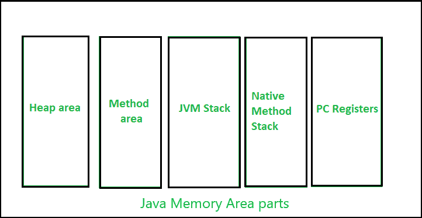
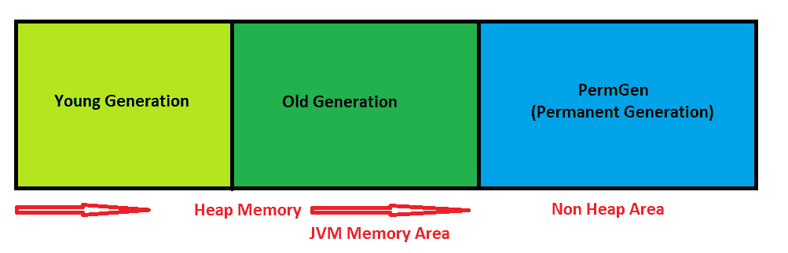

# Java 8 中的 MetaSpace，带示例

> 原文:[https://www . geesforgeks . org/metaspace-in-Java-8-with-examples/](https://www.geeksforgeeks.org/metaspace-in-java-8-with-examples/)

在每种编程语言中，内存都是一种至关重要的资源，本质上也是稀缺的。因此，彻底管理内存而不发生任何泄漏至关重要。在本文中，我们将了解什么是 metaspace，以及它与 permgen 有何不同。

在理解元空间之前，让我们先了解一下 JVM 内存结构。

[**【JVM 内存结构】**](https://www.geeksforgeeks.org/java-memory-management/) **:**
JVM 定义了程序执行过程中使用的各种运行时数据区。有些区域是由 JVM 创建的，而有些区域是由程序中使用的线程创建的。但是，只有当 JVM 退出时，JVM 创建的内存区域才会被销毁。线程的数据区在实例化期间创建，并在线程退出时销毁。 [JVM 内存结构](https://www.geeksforgeeks.org/jvm-works-jvm-architecture/)分为堆区、栈区、方法区、PC 机寄存器等多个内存区。下图说明了 Java 中不同的内存区域:

内存区域部分

这里，堆区域是 JVM 最重要的内存区域之一。这里存储了所有的 [java 对象](https://www.geeksforgeeks.org/classes-objects-java/)。堆是在 JVM 启动时创建的。堆一般分为两部分。也就是:

1.  **年轻一代(苗圃):**所有的新对象都分配在这个内存中。每当这段记忆被填满时，就会执行[垃圾收集](https://www.geeksforgeeks.org/garbage-collection-java/)。这叫做*小垃圾收集*。
2.  **老一代:**所有在多轮小垃圾收集中幸存下来的长命物件都存放在这个区域。每当内存被填满时，就会执行垃圾收集。这叫*大垃圾回收*。

除了堆内存之外，JVM 还包含另一种类型的内存，称为永久生成或“永久生成”。

**PermGen Memory:** 这是 java 堆中的一个特殊空间，与主内存分开，所有[静态内容都存储在这个部分](https://www.geeksforgeeks.org/understanding-storage-of-static-methods-and-static-variables-in-java/)中。除此之外，这个内存还存储了 JVM 所需的应用程序元数据。元数据是用来描述数据的数据。在这里，垃圾收集也像内存的任何其他部分一样发生。在 Java 7 之前，字符串池也是内存的一部分。方法区域是 PermGen 中空间的一部分，用于存储类结构以及方法和构造函数的代码。PermGen 最大的缺点是它的尺寸有限，导致内存不足或 T5。PermGen 内存的默认大小在 32 位 JVM 上是 64 MB，在 64 位版本上是 82 MB。因此，JVM 不得不通过频繁执行垃圾收集来改变内存的大小，这是一项昂贵的操作。Java 还允许手动改变 PermGen 内存的大小。但是，永久空间不能自动增加。所以，很难调出来。此外，垃圾收集器的效率不足以清理内存。

由于上述问题，PermGen 在 Java 8 中已经被完全移除。在 PermGen 的地方，引入了一个名为元空间的新特性。默认情况下，MetaSpace 会自动增长。在这里，当类元数据使用达到其最大元空间大小时，垃圾收集会自动触发。

下表描述了元空间和 PermGen 之间的区别:

<figure class="table">

| 烫发 | 元空间 |
| --- | --- |
| It was removed from java 8. | Introduced in Java 8. |
| PermGen always has a fixed maximum size. | By default, Metaspace automatically increases its size according to the underlying operating system. |
| Continuous Java heap memory of. | Native memory (provided by the underlying operating system). |
| Garbage collection efficiency is low. | Efficient garbage collection. |

</figure>