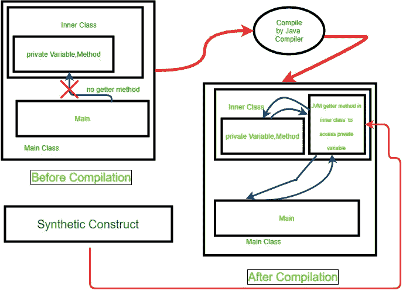

# 方法类是 Java 中的 synintellic()方法

> 原文:[https://www . geeksforgeeks . org/method-class-issynamic-method-in-Java/](https://www.geeksforgeeks.org/method-class-issynthetic-method-in-java/)

**[java.lang.reflect](https://www.geeksforgeeks.org/reflection-in-java/) 方法类**帮助我们获取类或接口上单个方法的信息。这个类还提供对类的方法的访问，并在运行时调用它们。

**方法类的 isSynthetic()方法:**此函数检查方法对象是否是合成构造。如果方法是一个合成构造，那么函数返回真，否则返回假。

**合成构造**:合成构造是 Java 编译器为了内部目的而创建的类、字段和方法。



**语法:**

```
public boolean isSynthetic()
```

**返回值:**当且仅当方法是 JVM 指定的合成构造时，该方法返回*真*。否则返回*假*。

下面的程序说明了方法类的 isSynthetic()方法:

**例 1:**

在下面的程序中当 main 方法创建一个嵌套的私有类 Demo 的对象并试图访问私有变量名“message”时。当它被编译时，它将创建一个合成方法。该合成方法的细节可以通过使用 isSynthetic()方法获得该方法的对象，如下程序所示。

```
// Java program to demonstrate isSynthetic()
// method of Method Class.

import java.lang.reflect.Method;

public class GFG {

    // create Demo class
    private static final class Demo {
        private String message = "A Computer Science"
                                 + " portal for geeks";
    }

    // create main method
    public static void main(String args[])
    {

        try {
            // create object of Demo class
            Demo obj = new Demo();

            // print message of nested demo class
            System.out.println("private Message"
                               + " variable of Demo class"
                               + obj.message);

            // get class object of demo class
            Class classobj = obj.getClass();

            // get list of declared method objects
            // of class object of Demo
            Method[] methods = classobj.getDeclaredMethods();

            // loop through method list
            for (Method method : methods) {

                // check method is Synthetic or not
                boolean isSynthetic = method.isSynthetic();

                // print result
                System.out.println(method
                                   + " method is Synthetic Method :"
                                   + isSynthetic);
            }
        }
        catch (Exception e) {

            // Print Exception if any Exception occurs
            e.printStackTrace();
        }
    }
}
```

**Output:**

```
private Message variable of Demo classA Computer Science portal for geeks
static java.lang.String GFG$Demo.access$100(GFG$Demo) method is Synthetic Method :true

```

**例 2:** 程序返回 BigInteger 类的所有合成构造方法。

说明:在这个方法中，首先创建一个大整数类对象。创建大整数类的类对象后，通过调用类对象的 getMethods()创建方法对象列表。循环访问方法列表，并通过检查方法是否是合成的来获取合成方法，方法使用的是合成的()。最后打印合成方法名称。

```
// Java program to Demonstrate isSynthetic()
// method of Method Class.

import java.lang.reflect.Method;
import java.math.BigInteger;

public class GFG {

    // create main method
    public static void main(String args[])
    {

        try {

            // create class object for class BigInteger
            Class c = BigInteger.class;

            // get list of Method object
            Method[] methods = c.getMethods();

            System.out.println("Synthetic Methods"
                               + " of BigInteger Class are");
            // Loop through Methods list
            for (Method m : methods) {

                // check whether the method is
                // Synthetic Method or not
                if (m.isSynthetic()) {
                    // Print Method name
                    System.out.println("Method: "
                                       + m.getName());
                }
            }
        }
        catch (Exception e) {
            // print Exception is any Exception occurs
            e.printStackTrace();
        }
    }
}
```

**Output:**

```
Synthetic Methods of BigInteger Class are
Method: compareTo

```

**参考:**

*   [https://docs . Oracle . com/javase/8/docs/API/Java/lang/reflect/method . html # issynamic–](https://docs.oracle.com/javase/8/docs/api/java/lang/reflect/Method.html#isSynthetic--)
*   [https://nagakishoresidde . WordPress . com/2015/10/18/synthetic-constructs-in-Java/](https://nagakishoresidde.wordpress.com/2015/10/18/synthetic-constructs-in-java/)