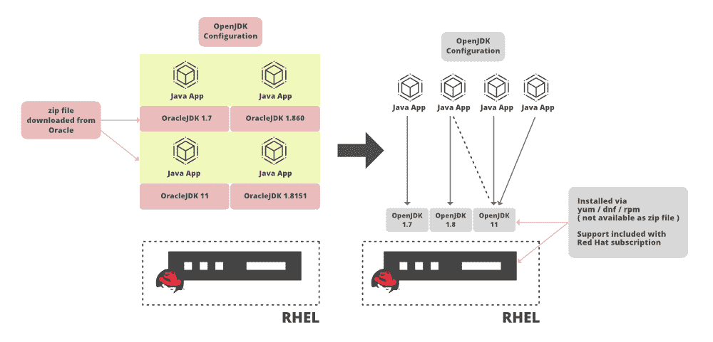

# 从甲骨文 JDK 迁移到开放 JDK

> 原文:[https://www . geesforgeks . org/migration-to-open-JDK-from-Oracle-JDK/](https://www.geeksforgeeks.org/migration-to-open-jdk-from-oracle-jdk/)

让我们首先讨论迁移的必要性。具体如下:2018 年，甲骨文宣布在 2019 年 1 月之后，企业需要购买商业许可证(即从甲骨文购买)才能接收软件更新。保留 Oracle Java 并升级到支持的补丁级别，并支付订阅费用。为了让您了解成本，服务器的每个核心都必须获得许可，每个核心每月花费 25 美元。此外，如果服务器位于虚拟化环境中，即使集群中只有一台带有 Java 的服务器，整个集群“核心”也需要支付许可费。



**1。先决条件:**在比较甲骨文 Java v/s 开放 JDK 之前，让我们先了解一下技术要求。

对于比 Oracle Java JE 8 修补程序 211 和 JDK 11 更新的任何内容，Oracle 都引入了订阅费，从安全漏洞的角度来看，将版本保持在旧的、不受支持的修补程序级别并不理想。因此，我们必须确定安装的 Oracle Java JE 或 JDK 是否真的有必要在服务器上运行任何应用程序。

对于您拥有的每台服务器，我们要求您选择适当的响应，如下所示:

*   如果不需要，卸载 Oracle Java 版本
*   如果符合您的需求，请选择再次使用开源版本

> **注**:一些需要 Oracle Java 的应用可能已经将此费用作为主要应用许可费的一部分，请与您的应用供应商确认。
> 
> 保留 Oracle Java 并升级到支持的补丁级别，并支付订阅费用。为了让您了解成本，服务器的每个核心都必须获得许可，并且每月花费 25 美元的核心。此外，如果服务器位于虚拟化环境中，即使集群中只有一台带有 Java 的服务器，整个集群“核心”也需要支付许可费。

**2** 。**甲骨文 JDK 公司的现有实施**

根据甲骨文支持，最后一个不收费的 Java 版本 Java 1.8.0.202(64 位)让我们先来看看亮点。

*   OpenJDK 和甲骨文 JDK 最大的区别是许可。OpenJDK 是一个完全开源的 Java，拥有 GNU 通用公共许可证。根据甲骨文二进制代码许可协议，甲骨文 JDK 需要商业许可。
*   自 2019 年 1 月以来，企业现在需要购买商业许可证(从甲骨文)才能接收软件更新。
*   从历史上看，甲骨文 JDK 公司的性能一直优于 OpenJDK。然而，OpenJDK 的性能正在增长。OpenJDK 社区的贡献通常超过甲骨文 JDK。
*   OpenJDK 的代码与 Oracle JDK 99%相同(取决于您从哪个提供商那里获得的代码)，所以这实际上归结为支持。

**3** 。 **OpenJDK 生命周期日期和 RHEL 版本**

RHEL 5 支持增加了 RHEL 6 支持增加了 RHEL 7 支持增加了 RHEL 8 支持增加了结束对 OpenJDK 版本的支持如下:

```java
OpenJDK  6 (1.6) 5.3 6.0 7.0 N/A December 2016
OpenJDK  7 (1.7) 5.9 6.3 7.0 N/A June 2020
OpenJDK  8 (1.8) N/A 6.6 7.1 8.0 May 2026
OpenJDK 11   N/A N/A 7.6 8.0 October 2024
```

OpenJDK 的服务级别协议和覆盖范围确定如下，对于 OpenJDK 在 RHEL 和视窗系统上的生产部署，定义了服务级别协议(红帽客户门户的生产支持覆盖范围)和服务级别协议(生产支持服务条款-红帽客户门户)。

**4** 。**发布时间表**

Oracle 将每三年发布一次，而 OpenJDK 将每六个月发布一次

**5** 。**牌照**

甲骨文 JDK 是根据甲骨文二进制代码许可协议获得许可的，而 OpenJDK 拥有 GNU 通用公共许可证(GNU GPL)版本 2，但有一个链接例外。

**6** 。**性能**

这两者之间没有真正的技术差异，因为甲骨文 JDK 的构建过程是基于 OpenJDK 的。说到性能，甲骨文在响应能力和 JVM 性能方面要好得多。由于对企业客户的重视，它更加注重稳定性。相比之下，OpenJDK 将更频繁地发布版本。因此，我们可能会遇到不稳定的问题。

**7** 。**特色**

如果我们比较特性和选项，我们会看到 Oracle 产品具有飞行记录器、Java 任务控制和应用程序类数据共享特性，而 OpenJDK 具有字体渲染器特性。此外，甲骨文有更多的垃圾收集选项和更好的渲染器。

**8** 。**发展与普及**

甲骨文 JDK 完全由甲骨文公司开发，而 OpenJDK 则由甲骨文、OpenJDK 和 Java 社区开发。然而，像红帽、阿苏系统、IBM、苹果公司、思爱普公司等顶尖公司也积极参与其发展。

**9** 。**成本效益分析**

保留 Oracle Java 并升级到支持的补丁级别，并支付订阅费用。为了让您了解成本，服务器的每个核心都必须获得许可，每个核心每月花费 25 美元。此外，如果服务器位于虚拟化环境中，即使集群中只有一台带有 Java 的服务器，整个集群“核心”也需要支付许可费。