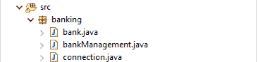

# Java 中的迷你银行应用

> 原文:[https://www . geesforgeks . org/mini-banking-application-in-Java/](https://www.geeksforgeeks.org/mini-banking-application-in-java/)

在任何银行交易中，都有几方参与处理交易，如商人、银行、收款人等。因此，事务可能会失败或被拒绝的原因有很多，所以为了用 Java 处理事务，有一个 JDBC (Java 数据库连接)，它为我们提供了一个连接、执行和从任何数据库获取数据的应用编程接口。它提供了 Java 语言数据库连接标准。它用于编写访问数据库所需的程序。

JDBC 的事务为我们提供了一个特性，它将完整的 SQL 语句视为一个单元，然后执行一次，如果任何语句失败，整个事务都会失败。要使用事务，我们必须设置**设置自动提交(false)；**手动，一旦所有语句成功执行，将需要在数据库的 **commit()** 方法中进行更改。

在这个迷你银行应用程序中，为了处理交易，我们使用 JDBC 交易使交易一致。该应用程序为用户提供菜单驱动的控制台界面，使用该界面，用户可以执行创建帐户、登录、查看余额和向其他客户转账等功能。

## 软件先决条件:

*   关系型数据库
*   黯然失色

## MySQL:

MySQL 是一个功能齐全的关系数据库管理系统(RDBMS)。MySQL 是一个免费的开源关系数据库管理系统，它使用结构化查询语言(SQL)，这是在数据库中添加、访问和处理数据的最流行的语言。MySQL 以其速度、可靠性和灵活性而闻名。

## Eclipse:

Eclipse 是一个开发和调试(主要)Java 代码的 IDE(交互式开发环境)。它包含一个基本工作空间和一个用于定制环境的可扩展插件系统。

## 数据库设置:

**步骤 1:** 创建数据库名称库

**步骤 2:** 创建表名客户

```
// Create a database 
CREATE DATABASE BANK; 

// Create table
CREATE TABLE `customer` (

 `ac_no` int NOT NULL AUTO_INCREMENT,

 `cname` varchar(45) DEFAULT NULL,

 `balance` varchar(45) DEFAULT NULL,

 `pass_code` int DEFAULT NULL,

 PRIMARY KEY (`ac_no`),

 UNIQUE KEY `cname_UNIQUE` (`cname`)

) ;
```

## Eclipse 项目设置:

*   创建新项目
*   创建包名银行

## 文件配置



文件配置

在银行包中创建一个连接类

**步骤 1:** 包含 MySQL 的 JDBC 驱动程序

```
// register jdbc Driver 
String mysqlJDBCDriver = "com.mysql.cj.jdbc.Driver";
Class.forName(mysqlJDBCDriver);
```

**步骤 2:** 使用 MySQL 用户名和密码创建连接类

```
// Create Connection
String url = "jdbc:mysql://localhost:3306/mydata";
String user = "root";
String pass = "123";
con = DriverManager.getConnection(url, user, pass);
```

### > > connection.java

## Java 语言(一种计算机语言，尤用于创建网站)

```
package banking;

import java.sql.Connection;
import java.sql.DriverManager;
// Global connection Class
public class connection {
    static Connection con; // Global Connection Object
    public static Connection getConnection()
    {
        try {

            String mysqlJDBCDriver
                = "com.mysql.cj.jdbc.Driver"; //jdbc driver
            String url
                = "jdbc:mysql://localhost:3306/mydata"; //mysql url
            String user = "root";        //mysql username
            String pass = "Pritesh4@";  //mysql passcode
             Class.forName(mysqlJDBCDriver);
            con = DriverManager.getConnection(url, user,
                                              pass);
        }
        catch (Exception e) {
            System.out.println("Connection Failed!");
        }

        return con;
    }
}
```

> **目的:**这个类使用连接对象返回一个全局数据库连接，所有的命令都将被执行。
> 
> **注意:**在银行包中创建银行管理类

### > > bankmanagment.java

## Java 语言(一种计算机语言，尤用于创建网站)

```
package banking;

import java.io.BufferedReader;
import java.io.InputStreamReader;
import java.sql.Connection;
import java.sql.PreparedStatement;
import java.sql.ResultSet;
import java.sql.SQLException;
import java.sql.SQLIntegrityConstraintViolationException;
import java.sql.Statement;

public class bankManagement { // these class provides all
                              // bank method

    private static final int NULL = 0;

    static Connection con = connection.getConnection();
    static String sql = "";
    public static boolean
    createAccount(String name,
                  int passCode) // create account function
    {
        try {
            // validation
            if (name == "" || passCode == NULL) {
                System.out.println("All Field Required!");
                return false;
            }
            // query
            Statement st = con.createStatement();
            sql = "INSERT INTO customer(cname,balance,pass_code) values('"
                  + name + "',1000," + passCode + ")";

            // Execution
            if (st.executeUpdate(sql) == 1) {
                System.out.println(name
                                   + ", Now You Login!");
                return true;
            }
            // return
        }
        catch (SQLIntegrityConstraintViolationException e) {
            System.out.println("Username Not Available!");
        }
        catch (Exception e) {
            e.printStackTrace();
        }
        return false;
    }
    public static boolean
    loginAccount(String name, int passCode) // login method
    {
        try {
            // validation
            if (name == "" || passCode == NULL) {
                System.out.println("All Field Required!");
                return false;
            }
            // query
            sql = "select * from customer where cname='"
                  + name + "' and pass_code=" + passCode;
            PreparedStatement st
                = con.prepareStatement(sql);
            ResultSet rs = st.executeQuery();
            // Execution
            BufferedReader sc = new BufferedReader(
                new InputStreamReader(System.in));

            if (rs.next()) {
                // after login menu driven interface method

                int ch = 5;
                int amt = 0;
                int senderAc = rs.getInt("ac_no");
                ;
                int receiveAc;
                while (true) {
                    try {
                        System.out.println(
                            "Hallo, "
                            + rs.getString("cname"));
                        System.out.println(
                            "1)Transfer Money");
                        System.out.println("2)View Balance");
                        System.out.println("5)LogOut");

                        System.out.print("Enter Choice:");
                        ch = Integer.parseInt(
                            sc.readLine());
                        if (ch == 1) {
                            System.out.print(
                                "Enter Receiver  A/c No:");
                            receiveAc = Integer.parseInt(
                                sc.readLine());
                            System.out.print(
                                "Enter Amount:");
                            amt = Integer.parseInt(
                                sc.readLine());

                            if (bankManagement
                                    .transferMoney(
                                        senderAc, receiveAc,
                                        amt)) {
                                System.out.println(
                                    "MSG : Money Sent Successfully!\n");
                            }
                            else {
                                System.out.println(
                                    "ERR :  Failed!\n");
                            }
                        }
                        else if (ch == 2) {

                            bankManagement.getBalance(
                                senderAc);
                        }
                        else if (ch == 5) {
                            break;
                        }
                        else {
                            System.out.println(
                                "Err : Enter Valid input!\n");
                        }
                    }
                    catch (Exception e) {
                        e.printStackTrace();
                    }
                }
            }
            else {
                return false;
            }
            // return
            return true;
        }
        catch (SQLIntegrityConstraintViolationException e) {
            System.out.println("Username Not Available!");
        }
        catch (Exception e) {
            e.printStackTrace();
        }
        return false;
    }
    public static void
    getBalance(int acNo) // fetch balance method
    {
        try {

            // query
            sql = "select * from customer where ac_no="
                  + acNo;
            PreparedStatement st
                = con.prepareStatement(sql);

            ResultSet rs = st.executeQuery(sql);
            System.out.println(
                "-----------------------------------------------------------");
            System.out.printf("%12s %10s %10s\n",
                              "Account No", "Name",
                              "Balance");

            // Execution

            while (rs.next()) {
                System.out.printf("%12d %10s %10d.00\n",
                                  rs.getInt("ac_no"),
                                  rs.getString("cname"),
                                  rs.getInt("balance"));
            }
            System.out.println(
                "-----------------------------------------------------------\n");
        }
        catch (Exception e) {
            e.printStackTrace();
        }
    }
    public static boolean transferMoney(int sender_ac,
                                        int reveiver_ac,
                                        int amount)
        throws SQLException // transfer money method
    {
        // validation
        if (reveiver_ac == NULL || amount == NULL) {
            System.out.println("All Field Required!");
            return false;
        }
        try {
            con.setAutoCommit(false);
            sql = "select * from customer where ac_no="
                  + sender_ac;
            PreparedStatement ps
                = con.prepareStatement(sql);
            ResultSet rs = ps.executeQuery();

            if (rs.next()) {
                if (rs.getInt("balance") < amount) {
                    System.out.println(
                        "Insufficient Balance!");
                    return false;
                }
            }

            Statement st = con.createStatement();

            // debit
            con.setSavepoint();

            sql = "update customer set balance=balance-"
                  + amount + " where ac_no=" + sender_ac;
            if (st.executeUpdate(sql) == 1) {
                System.out.println("Amount Debited!");
            }

            // credit
            sql = "update customer set balance=balance+"
                  + amount + " where ac_no=" + reveiver_ac;
            st.executeUpdate(sql);

            con.commit();
            return true;
        }
        catch (Exception e) {
            e.printStackTrace();
            con.rollback();
        }
        // return
        return false;
    }
}
```

> **目的:**本课程将提供银行管理的所有方法，如转账、查看余额、创建账户和登录。
> 
> **注意:**在银行套餐中创建用户菜单类(bank.java)。

### > > bank.java

## Java 语言(一种计算机语言，尤用于创建网站)

```
package banking;

import java.io.BufferedReader;
import java.io.IOException;
import java.io.InputStreamReader;

public class bank {
    public static void main(String args[]) //main class of bank
        throws IOException
    {

        BufferedReader sc = new BufferedReader(
            new InputStreamReader(System.in));
        String name = "";
        int pass_code;
        int ac_no;
        int ch;

        while (true) {
            System.out.println(
                "\n ->||    Welcome to InBank    ||<- \n");
            System.out.println("1)Create Account");
            System.out.println("2)Login Account");

            try {
                System.out.print("\n    Enter Input:"); //user input
                ch = Integer.parseInt(sc.readLine());

                switch (ch) {
                case 1:
                    try {
                        System.out.print(
                            "Enter Unique UserName:");
                        name = sc.readLine();
                        System.out.print(
                            "Enter New Password:");
                        pass_code = Integer.parseInt(
                            sc.readLine());

                        if (bankManagement.createAccount(
                                name, pass_code)) {
                            System.out.println(
                                "MSG : Account Created Successfully!\n");
                        }
                        else {
                            System.out.println(
                                "ERR : Account Creation Failed!\n");
                        }
                    }
                    catch (Exception e) {
                        System.out.println(
                            " ERR : Enter Valid Data::Insertion Failed!\n");
                    }
                    break;

                case 2:
                    try {
                        System.out.print(
                            "Enter  UserName:");
                        name = sc.readLine();
                        System.out.print(
                            "Enter  Password:");
                        pass_code = Integer.parseInt(
                            sc.readLine());

                        if (bankManagement.loginAccount(
                                name, pass_code)) {
                            System.out.println(
                                "MSG : Logout Successfully!\n");
                        }
                        else {
                            System.out.println(
                                "ERR : login Failed!\n");
                        }
                    }
                    catch (Exception e) {
                        System.out.println(
                            " ERR : Enter Valid Data::Login Failed!\n");
                    }

                    break;

                default:
                    System.out.println("Invalid Entry!\n");
                }

                if (ch == 5) {
                    System.out.println(
                        "Exited Successfully!\n\n Thank You :)");
                    break;
                }
            }
            catch (Exception e) {
                System.out.println("Enter Valid Entry!");
            }
        }
        sc.close();
    }
}
```

**输出:**该类为客户提供了菜单驱动的界面，客户可以在此创建账户、登录账户、转账等。

**登录:**

```
  ->||    Welcome to InBank    ||<- 

    1)Create Account
    2)Login Account

    Enter Input:2
Enter  UserName:pritesh
Enter  Password:123
```

**查看余额:**

```
Enter  UserName:pritesh
Enter  Password:123
Hallo, pritesh
1)Transfer Money
2)View Balance
5)LogOut
Enter Choice:2
-----------------------------------------------------------
  Account No       Name    Balance
         112    pritesh          0.00
-----------------------------------------------------------
```

**转账**:

```
Hallo, pritesh
1)Transfer Money
2)View Balance
5)LogOut
Enter Choice:1
Enter Receiver  A/c No:110
Enter Amount:5000
Insufficient Balance!
ERR :  Failed!
```

**注销:**

```
Hallo, pritesh
1)Transfer Money
2)View Balance
5)LogOut
Enter Choice:5
MSG : Logout Successfully!
```


安慰