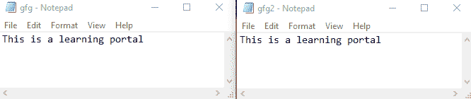
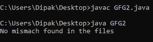
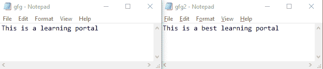
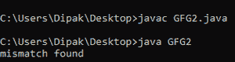

# Java . nio . file . files 实用程序类的方法不匹配()示例

> 原文:[https://www . geesforgeks . org/mismatch-of-Java-nio-file-files-utility-class-with-examples/](https://www.geeksforgeeks.org/mismatch-method-of-java-nio-file-files-utility-class-with-examples/)

**mismatch()方法**是在 **java.nio.file.Files 类**中新增的 java jdk-12。这种方法主要用于从开始比较两个文件的每个字节的数据，并返回位不同的点。如果该位在任何时候都没有不同，那么它返回“-1L”，表示文件是相同的，并且是彼此的精确副本。

该方法主要以文件的路径作为输入，并返回一个长值来指示位不匹配的位置。所以这个方法的**声明**如下所示:

```
long position = Files.mismatch(Path path1, Path path2);
```

> 这个方法要求两个被比较的文件应该有正确的路径，并且它们的大小和格式应该相同。

**例 1:**

**文件为:**



## Java 语言(一种计算机语言，尤用于创建网站)

```
// Java program to demonstrate the usage
// of mismatch() method

import java.io.IOException;
import java.nio.file.Files;
import java.nio.file.Path;
import java.util.*;

// save file as the name of GFG2
public class GFG2 {

    // main class
    public static void main(String[] args) throws Exception
    {
        // getting the file path to the respective two files
        Path filePath1 = Path.of("C:\\Users\\Dipak\\Desktop\\gfg.txt");
        Path filePath2 = Path.of("c:\\Users\\Dipak\\Desktop\\gfg2.txt");

        // calling the mismatchfunction
        long mis_match = Files.mismatch(filePath1, filePath2);

        // printing the output result.
        if (mis_match == -1)
            System.out.println("No mismatch found in the files");
        else
            System.out.println("mismatch found");
    }
}
```

**输出:**



**例 2:**

**档案分别是:**



## Java 语言(一种计算机语言，尤用于创建网站)

```
// Java program to demonstrate the
// usage of mismatch() method

import java.io.IOException;
import java.nio.file.Files;
import java.nio.file.Path;
import java.util.*;

// save file as the name of GFG2
public class GFG2 {

    // main class
    public static void main(String[] args) throws Exception
    {
        // getting the file path to the respective two files
        Path filePath1 = Path.of("C:\\Users\\Dipak\\Desktop\\gfg.txt");
        Path filePath2 = Path.of("c:\\Users\\Dipak\\Desktop\\gfg2.txt");

        // calling the mismatchfunction
        long mis_match = Files.mismatch(filePath1, filePath2);

        // printing the output result.
        if (mis_match == -1)
            System.out.println("No mismach found in the files");
        else
            System.out.println("mismatch found");
    }
}
```

**输出:**



输出