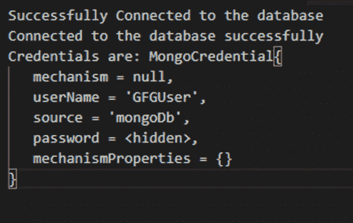
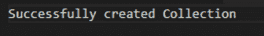
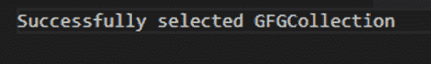
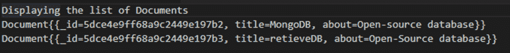
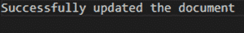
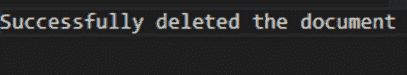
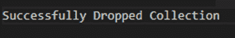
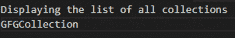

# Java MongoDB 教程

> 原文:[https://www.geeksforgeeks.org/mongodb-tutorial-in-java/](https://www.geeksforgeeks.org/mongodb-tutorial-in-java/)

[MongoDB](https://www.geeksforgeeks.org/mongodb-an-introduction/) 是一个使用 C++开发的[开源](https://www.geeksforgeeks.org/open-source-freeware-and-shareware-softwares/)跨平台**文档数据库**。MongoDB 的一些特性包括:

*   高效能
*   易于扩展
*   高可用性
*   它可以存储大量数据

它包含集合和文档形式的数据，而不是行和表。集合是一组文档。集合没有架构。它以分层模型的形式表示数据，使用这种模型可以轻松存储数组和其他数据结构。

##### MongoDB 的组件

下面列出了 MongoDB 的基本组件:

1.  **id** :该字段代表 MongoDB 中唯一的字段。默认情况下会创建此字段。
2.  **收藏**:是一套 MongoDB 文档。它存在于单个数据库中。
3.  **数据库**:这是收藏的容器。一个 mongoDB 服务器中可以存储多个数据库。
4.  **文档**:mongoDB 中的记录称为文档。它包含名称和值。
5.  **字段**:是文档中的名称-值对。

> **注意:**确保安装设置 [**MongoDB JDBC 驱动**](http://mongodb.github.io/mongo-java-driver/4.0/driver/getting-started/installation/) 和 [Java](https://www.geeksforgeeks.org/java-tutorials/) 。

```
Table of contents:
1\. Establishing connections to database
2\. Creating a MongoDb collection
3\. Getting a Collection
4\. Inserting Values into MongoDb
5\. Displaying the list of all Documents
6\. Updating documents in the MongoDB
7\. Deleting a Document
8\. Dropping of a Collection
9\. Displaying all the collections

```

为了建立连接，您必须提到数据库名称。默认情况下，如果没有提到名称，MongoDB 会创建一个数据库。

1.  首先，导入建立连接所需的库。
2.  这里，“ **MongoClient** ”用于为数据库创建客户端。
3.  “ **MongoCredential** ”用于创建凭证。
4.  最后，使用**蒙古数据库**来访问数据库。
5.  用户名为:“ **GFGUser** ”，数据库名为“ **mongoDb** ”。
6.  的功能”。 [toCharArray()](https://www.geeksforgeeks.org/java-string-tochararray-example/) ”用于将密码转换为字符数组。
7.  的功能”。getDatabase()"用于获取数据库。

以下代码建立了与 MongoDB 的连接-->

```
// Java program for establishing connections
// to MongoDb

import com.mongodb.client.MongoDatabase;
import com.mongodb.MongoClient;
import com.mongodb.MongoCredential;

public class ConnectionDB {
    public static void establishConnections()
    {

        try {
            MongoClient db
                = new MongoClient("localhost", 27017);

            MongoCredential credential;
            credential
                = MongoCredential
                      .createCredential(
                          "GFGUser", "mongoDb",
                          "password".toCharArray());
            System.out.println(
                "Successfully Connected"
                + " to the database");

            MongoDatabase database
                = db.getDatabase("mongoDb");
            System.out.println("Credentials are: "
                               + credential);
        }
        catch (Exception e) {
            System.out.println(
                "Connection establishment failed");
            System.out.println(e);
        }
    }
}
```

**输出:**
[](https://media.geeksforgeeks.org/wp-content/uploads/20200427184551/Picture139.png)

创建集合**使用 com . MongoDB . client . mongodatabase 类**和 **createCollection()方法**。这里，“database.createCollection()”创建一个名为“GFGCollection”的集合。以下是创建集合的代码:

```
// Java program to create a MongoDb collection

import com.mongodb.client.MongoDatabase;
import com.mongodb.MongoClient;
import com.mongodb.MongoCredential;

public class Collection {

    public static void createCollection(
        String collectionName)
    {

        try {
            // establishConnections() Code
            // is defined above
            establishConnections();

            // Get the database instance
            MongoDatabase database
                = db.getDatabase("mongoDb");

            // Create the collection
            database.createCollection(collectionName);
            System.out.println(
                "Collection created Successfully");
        }
        catch (Exception e) {
            System.out.println(
                "Collection creation failed");
            System.out.println(e);
        }
    }
}
```

**输出:**

[](https://media.geeksforgeeks.org/wp-content/uploads/20200427185015/Picture219-1.png)

获取集合时，使用**MongoCollection . GetCollection()**方法。下面是该方法的实现:

```
// Java program to retrieve a MongoDb collection

import com.mongodb.client.MongoDatabase;
import com.mongodb.MongoClient;
import com.mongodb.MongoCredential;

public class Collection {

    public static void getCollection(
        String collectionName)
    {

        try {
            // establishConnections() Code
            // is defined above
            establishConnections();

            // Retrieve the collection
            MongoCollection<Document>
                collection = database
                                 .getCollection(collectionName);

            System.out.println(
                "Collection retrieved Successfully");
        }
        catch (Exception e) {
            System.out.println(
                "Collection retrieval failed");
            System.out.println(e);
        }
    }
}
```

**输出**
[](https://media.geeksforgeeks.org/wp-content/uploads/20200427185608/Picture310.png)

只有文档类型的数据可以插入 MongoDB。因此，我们可以使用 **append()方法**创建一个要插入值的文档，或者使用**将文档直接传递到 MongoDB 中。插入()**方法。

在这里，首先，我们创建了一个新文档作为“标题”，然后添加“关于”部分。然后，我们给文档赋予了各自的值。的功能”。insertOne()”用于将文档插入集合中。

下面是该方法的实现:

```
// Java program to insert values into MongoDB

import com.mongodb.client.MongoDatabase;
import com.mongodb.MongoClient;
import com.mongodb.MongoCredential;

public class Collection {

    // Function to insert only one
    // document in to the MongoDB
    public static void insertADocIntoDb()
    {
        try {
            // establishConnections() Code
            // is defined above
            establishConnections();

            // Creating the document
            // to be inserted
            Document document
                = new Document("title",
                               "MongoDB")
                      .append("about",
                              "Open-Source database")

                  // Insert the document
                  collection.insertOne(document);

            System.out.println(
                "Document inserted Successfully");
        }
        catch (Exception e) {
            System.out.println(
                "Document insertion failed");
            System.out.println(e);
        }
    }

    // Function to insert multiple
    // documents in to the MongoDB
    public static void insertManyDocsIntoDb()
    {
        try {
            // establishConnections() Code
            // is defined above
            establishConnections();

            // Creating the document
            // to be inserted
            Document document
                = new Document("title", "MongoDB")
                      .append("about", "Open-Source database");
            Document document1
                = new Document("title", "retrieveDb")
                      .append("about", "Open-source database");

            // Adding the documents into a list
            List<Document> dblist
                = new ArrayList<Document>();
            dblist.add(document);
            dblist.add(document1);

            // Insert the list of documents into DB
            collection.insertMany(dblist);

            System.out.println(
                "Documents inserted Successfully");
        }
        catch (Exception e) {
            System.out.println(
                "Documents insertion failed");
            System.out.println(e);
        }
    }
}
```

**输出:**
[](https://media.geeksforgeeks.org/wp-content/uploads/20200427190003/Picture46.png)

显示收藏的所有文件，使用 **find()** 方法。

这里，数据库有两个文档，即“document”和“document1”，它们是使用 find()方法检索的。我们使用[迭代器](https://www.geeksforgeeks.org/iterators-in-java/)，因为它将遍历列表中的每个文档并向我们显示。

以下是显示所有文档的代码:

```
// Java code to display documents from DB

import com.mongodb.client.MongoDatabase;
import com.mongodb.MongoClient;
import com.mongodb.MongoCredential;

public class Collection {

    public static void displayDocuments()
    {

        try {
            // establishConnections() Code
            // is defined above
            establishConnections();

            System.out.println(
                "Displaying the list"
                + " of Documents");

            // Get the list of documents from the DB
            FindIterable<Document> iterobj
                = collection.find();

            // Print the documents using iterators
            Iterator itr = iterobj.iterator();
            while (itr.hasNext()) {
                System.out.println(itr.next());
            }
        }
        catch (Exception e) {
            System.out.println(
                "Could not find the documents "
                + "or No document exists");
            System.out.println(e);
        }
    }
}
```

**输出:**
[](https://media.geeksforgeeks.org/wp-content/uploads/20200427201137/Picture102.png)

更新文档时，使用 **updateOne()** 方法。
在这里，“Filters.eq”创建一个过滤器，匹配所有以参数形式提供名称的文档。“Updates.set()”用于将文档更新为参数中的给定值。

下面是它的代码:

```
// Java code to update the documents in DB

import com.mongodb.client.MongoDatabase;
import com.mongodb.MongoClient;
import com.mongodb.MongoCredential;

public class Collection {

    public static void updateDocuments()
    {

        try {
            // establishConnections() Code
            // is defined above
            establishConnections();

            MongoDatabase database
                = mongo.getDatabase("mongoDb");

            MongoCollection<Document> collection
                = database.getCollection(
                    "GFGCollection");

            collection.updateOne(
                Filters.eq("title", "MongoDB"),
                Updates.set("about", "Database"));

            System.out.println(
                "Successfully updated"
                + " the document");
        }
        catch (Exception e) {
            System.out.println(
                "Updation failed");
            System.out.println(e);
        }
    }
}
```

**输出:**
[](https://media.geeksforgeeks.org/wp-content/uploads/20200427211409/Picture1211.png)

删除文档时，使用 **deleteOne()** 方法。以下是删除文件的代码- >

```
// Java code to update the documents in DB

import com.mongodb.client.MongoDatabase;
import com.mongodb.MongoClient;
import com.mongodb.MongoCredential;

public class Collection {

    public static void deleteDocuments()
    {

        try {
            // establishConnections() Code
            // is defined above
            establishConnections();

            MongoDatabase database
                = mongo.getDatabase("mongoDb");

            MongoCollection<Document> collection
                = database.getCollection(
                    "GFGCollection");

            collection.deleteOne(
                Filters.eq("title",
                           "Open-Source Database"));
            System.out.println(
                "Successfully deleted"
                + " the document");
        }
        catch (Exception e) {
            System.out.println(
                "Deletion failed");
            System.out.println(e);
        }
    }
}
```

**输出:**
[](https://media.geeksforgeeks.org/wp-content/uploads/20200427211545/Picture1310.png)

“Collection.drop()”用于删除创建的集合。下面是删除集合的代码:

```
// Java code to drop a collection in MongoDb

import com.mongodb.client.MongoDatabase;
import com.mongodb.MongoClient;
import com.mongodb.MongoCredential;

public class Collection {

    public static void dropACollection()
    {

        try {
            // establishConnections() Code
            // is defined above
            establishConnections();

            // Get the collection
            MongoCollection<Document>
                collection = database
                                 .getCollection(
                                     "GFGCollection");

            // Drop the above collection
            collection.drop();

            System.out.println(
                "Successfully dropped"
                + " collection");
        }
        catch (Exception e) {
            System.out.println(
                "Drop failed");
            System.out.println(e);
        }
    }
}
```

**输出:**
[](https://media.geeksforgeeks.org/wp-content/uploads/20200427211708/Picture142.png)

为了显示所有集合的列表，使用了 **listCollectionNames()** 方法。
在这里，我们在“for()”语句的帮助下迭代创建的所有集合。Database.listCollectionNames()用于显示数据库中存在的所有集合的列表。
以下是显示所有集合的代码:

```
// Java code to display all collections

import com.mongodb.client.MongoDatabase;
import com.mongodb.MongoClient;
import com.mongodb.MongoCredential;

public class Collection {

    public static void displayCollections()
    {

        try {
            // establishConnections() Code
            // is defined above
            establishConnections();

            MongoDatabase database
                = mongo.getDatabase("mongoDb");

            System.out.println(
                "Displaying the list"
                + " of all collections");

            MongoCollection<Document> collection
                = database.getCollection(
                    "GFGCollection");

            for (String allColl : database
                                      .listCollectionNames()) {
                System.out.println(allColl);
            }
        }
        catch (Exception e) {
            System.out.println(
                "Collections display failed");
            System.out.println(e);
        }
    }
}
```

**输出:**
[](https://media.geeksforgeeks.org/wp-content/uploads/20200427203940/Picture1111.png)