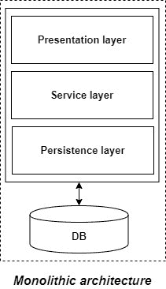
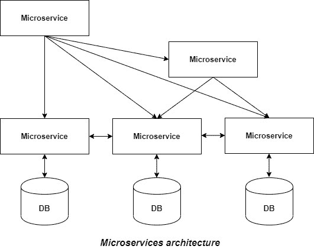

# 单片与微服务架构

> 原文:[https://www . geesforgeks . org/monolithic-vs-microservice-architecture/](https://www.geeksforgeeks.org/monolithic-vs-microservices-architecture/)

为了理解微服务，我们需要了解什么是单片应用程序，以及是什么导致我们在最近从单片应用程序转向微服务。

**单片应用**
如果一个项目的所有功能都存在于单个代码库中，那么这个应用被称为单片应用。在我们的生活中，我们一定都设计了一个单一的应用程序，在这个应用程序中，我们得到了一个问题陈述，并被要求设计一个具有各种功能的系统。我们将我们的应用程序设计在不同的层中，比如表示、服务和持久性，然后将代码库部署为单个 jar/war 文件。这只不过是一个单片应用程序，其中“mono”代表包含所有必需功能的单一代码库。

但是，如果我们已经在使用单片应用程序，那么是什么导致了微服务呢？

**单片应用的缺点:**

*   随着时间的推移，它变得太大，因此难以管理。
*   我们需要重新部署整个应用程序，即使是很小的改变。
*   随着应用程序规模的增加，其启动和部署时间也会增加。
*   对于任何加入项目的新开发人员来说，即使他的职责与单个功能相关，也很难理解大型 Monolithic 应用程序的逻辑。
*   即使应用程序的单个部分面临很大的负载/流量，我们也需要在多个服务器中部署整个应用程序的实例。效率很低，不必要占用更多资源。因此，水平缩放在单片应用中是不可行的。
*   很难采用任何非常适合特定功能的新技术，因为它会影响整个应用程序，包括时间和成本。
*   它不太可靠，因为任何模块中的一个错误都可能导致整个整体应用程序崩溃。

**单片应用的优势:**

*   相对于需要熟练开发人员来识别和开发服务的微服务，开发起来很简单。
*   更容易部署，因为只部署了一个 jar/war 文件。
*   与微服务架构相比，开发起来相对容易和简单。
*   与微服务架构相比，网络延迟和安全性问题相对较少。

**微服务**
这是一种架构开发风格，其中应用程序由更小的服务组成，这些服务使用 HTTP 等轻量级协议直接相互通信。根据萨姆·纽曼的说法，“微服务是协同工作的小服务。”

微服务架构对应用程序和数据库之间的关系有很大的影响。每个微服务都有自己的数据库，而不是与其他微服务共享一个数据库。它通常会导致一些数据的重复，但是如果您想从这种架构中获益，每个微服务都有一个数据库是必不可少的，因为它确保了松散耦合。每个微服务都有一个单独的数据库的另一个优点是，每个微服务都可以使用最适合其需求的数据库类型。

**微服务原理:**

*   **单一责任:**它是被定义为 SOLID 设计模式的一部分的原则之一。它声明一个单独的单元，或者一个类，一个方法，或者一个微服务，应该只有一个职责。每个微服务必须有一个单一的职责，并提供单一的功能。你也可以这样说:你应该开发的微服务的数量等于你需要的功能的数量。数据库也是分散的，通常每个微服务都有自己的数据库。
*   **围绕业务能力构建:**在当今世界，存在如此多的技术，总有一种技术最适合实现特定的功能。但是在单片应用程序中，这是一个主要的缺点，因为我们不能为每个功能使用不同的技术，因此需要在特定的领域进行折衷。微服务不应限制自己采用最适合解决业务目的的适当技术堆栈或后端数据库存储，即每个微服务可以根据业务需求使用不同的技术。
*   **针对故障的设计:**微服务的设计必须考虑故障情况。微服务必须利用这种体系结构的优势，一个微服务的关闭不应该影响整个系统，其他功能必须保持对用户的访问。但是在单片应用程序中却不是这样，在单片应用程序中，一个模块的故障会导致整个应用程序的崩溃。

**面向服务架构(SOA)与微服务架构:**

凯捷的 MDM 史蒂夫·琼斯曾经说过，“微服务就是 SOA，对于那些知道 SOA 是什么的人来说”。所以，那些了解 SOA 的人，大多认为他们是一样的，或者在他们的头脑中区别不太清楚。我们也不能责怪他们，如果我们谈论一个蛋糕和一个糕点，我们会发现更多的相似之处而不是不同之处。所以让我们试着理解两者之间的区别。
SOA 是为了处理单体架构中的问题而发展起来的，在 21 世纪初开始流行。在 SOA 中，大型应用程序被分成多个独立部署的较小服务。这些服务不直接相互通信。过去有一种企业服务总线(ESB，一种中间件或服务器，借助于使用不同协议或消息标准的服务可以轻松地相互通信)，这些服务在这里暴露自己，并通过它相互通信。此外，没有为每个服务建立独立数据库的指导原则。
微服务架构是 SOA 的演进。人们还认为 SOA 是微服务的超集。简单来说，微服务就是细粒度的 SOA。这里，微服务直接相互通信，不存在通信的中心依赖性，比如 SOA 中的 ESB。此外，每个微服务都有一个单独的数据库。从 SOA 演化微服务的基本思想是减少服务之间的依赖，并通过上述准则使它们松散耦合。

**微服务的优势:**

*   它很容易管理，因为它的体积相对较小。
*   如果其中一个微服务有任何更新，那么我们只需要重新部署该微服务。
*   微服务是独立的，因此可以独立部署。它们的启动和部署时间相对较少。
*   对于一个新开发人员来说，加入这个项目是非常容易的，因为他只需要理解一个特定的微服务，它提供了他将要处理的功能，而不是整个系统。
*   如果某个特定的微服务由于用户过度使用该功能而面临巨大的负载，那么我们只需要扩展该微服务。因此，微服务架构支持水平扩展。
*   每个微服务可以根据业务需求使用不同的技术。
*   如果某个特定的微服务由于某种错误而停止运行，那么它不会影响其他微服务，并且整个系统保持完整，继续向用户提供其他功能。

**微服务的缺点:**

*   作为一个分布式系统，它比单片应用程序复杂得多。它的复杂性随着微服务数量的增加而增加。
*   熟练的开发人员需要使用微服务架构，该架构可以识别微服务并管理它们之间的通信。
*   微服务的独立部署很复杂。
*   微服务在网络使用方面成本很高，因为它们需要相互交互，所有这些远程调用都会导致网络延迟。
*   由于网络上的服务间通信，微服务相对于单一应用程序不太安全。
*   调试是困难的，因为控制流过许多微服务，指出错误发生的原因和确切位置是一项困难的任务。