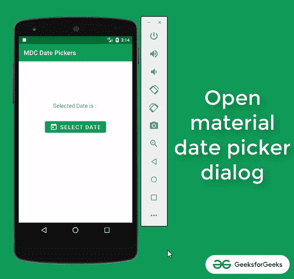
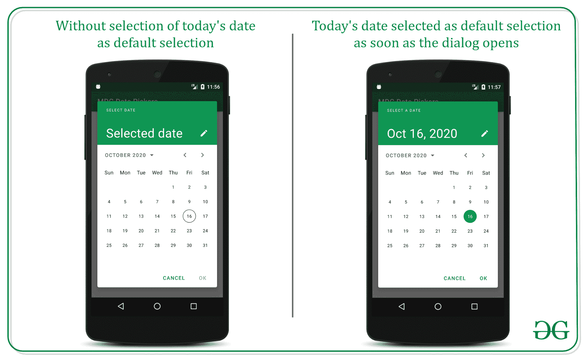
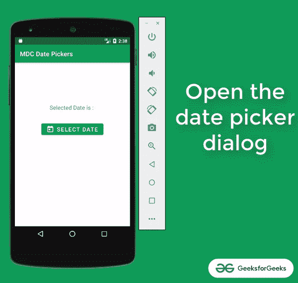
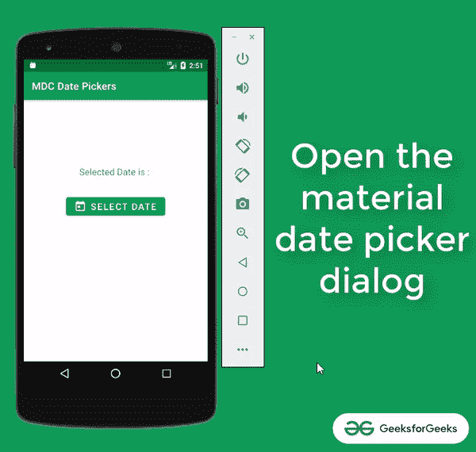

# 安卓中材料设计日期选择器的更多功能

> 原文:[https://www . geesforgeks . org/more-functions-of-material-design-date-picker-in-Android/](https://www.geeksforgeeks.org/more-functionalities-of-material-design-date-picker-in-android/)

正如在安卓中 [**材质设计日期选择器中所讨论的，它为用户提供了许多功能，并且易于开发人员实现。因此，在本文中，我们将通过示例讨论材料设计日期选择器的更多功能。请注意，用户界面部分将与**第 1 部分文章**中的相同。我们将只使用 **Java** 文件。**](https://www.geeksforgeeks.org/material-design-date-picker-in-android/)

### **功能 1:** 阻止今天日期之前的所有日期

这个特性对于开发者来说非常有用，可以避免  的用户选择  的错误日期。下面给出了一个示例 GIF，以了解我们将在这个功能中做什么。



转到**MainActivity.java**文件，参考以下代码。以下是**MainActivity.java**文件的代码。代码中添加了注释，以更详细地理解代码。

## Java 语言(一种计算机语言，尤用于创建网站)

```java
import android.annotation.SuppressLint;
import android.os.Bundle;
import android.view.View;
import android.widget.Button;
import android.widget.TextView;
import androidx.appcompat.app.AppCompatActivity;
import com.google.android.material.datepicker.CalendarConstraints;
import com.google.android.material.datepicker.DateValidatorPointForward;
import com.google.android.material.datepicker.MaterialDatePicker;
import com.google.android.material.datepicker.MaterialPickerOnPositiveButtonClickListener;

public class MainActivity extends AppCompatActivity {

    // button to open the material date picker dialog
    private Button mPickDateButton;

    // textview to preview the selected date
    private TextView mShowSelectedDateText;

    @Override
    protected void onCreate(Bundle savedInstanceState) {
        super.onCreate(savedInstanceState);
        setContentView(R.layout.activity_main);

        // register all the UI widgets with their
        // appropriate IDs
        mPickDateButton = findViewById(R.id.pick_date_button);
        mShowSelectedDateText = findViewById(R.id.show_selected_date);

        // create the calendar constraint builder
        CalendarConstraints.Builder calendarConstraintBuilder = new CalendarConstraints.Builder();

        // set the validator point forward from june
        // this mean the all the dates before the June month
        // are blocked
        calendarConstraintBuilder.setValidator(DateValidatorPointForward.now());

        // instantiate the Material date picker dialog
        // builder
        final MaterialDatePicker.Builder materialDatePickerBuilder = MaterialDatePicker.Builder.datePicker();
        materialDatePickerBuilder.setTitleText("SELECT A DATE");

        // now pass the constrained calendar builder to
        // material date picker Calendar constraints
        materialDatePickerBuilder.setCalendarConstraints(calendarConstraintBuilder.build());

        // now build the material date picker dialog
        final MaterialDatePicker materialDatePicker = materialDatePickerBuilder.build();

        // handle the Select date button to open the
        // material date picker
        mPickDateButton.setOnClickListener(
                new View.OnClickListener() {
                    @Override
                    public void onClick(View v) {
                        // show the material date picker with
                        // supportable fragment manager to
                        // interact with dialog material date
                        // picker dialog fragments
                        materialDatePicker.show(getSupportFragmentManager(), "MATERIAL_DATE_PICKER");
                    }
                });

        materialDatePicker.addOnPositiveButtonClickListener(
                new MaterialPickerOnPositiveButtonClickListener() {
                    @SuppressLint("SetTextI18n")
                    @Override
                    public void onPositiveButtonClick(Object selection) {
                        // now update the selected date preview
                        mShowSelectedDateText.setText("Selected Date is : " + materialDatePicker.getHeaderText());
                    }
                });
    }
}
```

**输出:在仿真器上运行**

<video class="wp-video-shortcode" id="video-500687-1" width="640" height="360" preload="metadata" controls=""><source type="video/mp4" src="https://media.geeksforgeeks.org/wp-content/uploads/20201016151813/Untitled-Project1237c395.autosave.mp4?_=1">[https://media.geeksforgeeks.org/wp-content/uploads/20201016151813/Untitled-Project1237c395.autosave.mp4](https://media.geeksforgeeks.org/wp-content/uploads/20201016151813/Untitled-Project1237c395.autosave.mp4)</video>

### **功能 2:** 一旦材料日期选择器对话框打开，选择今天的日期作为默认选择

请看下图。



转到**MainActivity.java**文件，参考以下代码。以下是**MainActivity.java**文件的代码。代码中添加了注释，以更详细地理解代码。

## Java 语言(一种计算机语言，尤用于创建网站)

```java
import android.annotation.SuppressLint;
import android.os.Bundle;
import android.view.View;
import android.widget.Button;
import android.widget.TextView;
import androidx.appcompat.app.AppCompatActivity;
import com.google.android.material.datepicker.MaterialDatePicker;
import com.google.android.material.datepicker.MaterialPickerOnPositiveButtonClickListener;

public class MainActivity extends AppCompatActivity {

    // button to open the material date picker dialog
    private Button mPickDateButton;

    // textview to preview the selected date
    private TextView mShowSelectedDateText;

    @Override
    protected void onCreate(Bundle savedInstanceState) {
        super.onCreate(savedInstanceState);
        setContentView(R.layout.activity_main);

        // register all the UI widgets with their
        // appropriate IDs
        mPickDateButton = findViewById(R.id.pick_date_button);
        mShowSelectedDateText = findViewById(R.id.show_selected_date);

        // now create the instance of the regular material
        // date picker
        MaterialDatePicker.Builder materialDateBuilder = MaterialDatePicker.Builder.datePicker();

        // get the today's date from the method
        // todayInUtcMilliseconds()
        long today = MaterialDatePicker.todayInUtcMilliseconds();

        // now define the properties of the
        // materialDateBuilder
        materialDateBuilder.setTitleText("SELECT A DATE");

        // now make today's date selected by default as soon
        // as the dialog opens
        materialDateBuilder.setSelection(today);

        // now create the instance of the material date
        // picker and build the dialog
        final MaterialDatePicker materialDatePicker = materialDateBuilder.build();

        // handle select date button which opens the
        // material design date picker
        mPickDateButton.setOnClickListener(
                new View.OnClickListener() {
                    @Override
                    public void onClick(View v) {
                        // now show the material date picker
                        // dialog by passing
                        // getSupportFragmentmanager()
                        materialDatePicker.show(getSupportFragmentManager(), "MATERIAL_DATE_PICKER");
                    }
                });

        // now handle the positive button click from the
        // material design date picker
        materialDatePicker.addOnPositiveButtonClickListener(
                new MaterialPickerOnPositiveButtonClickListener() {
                    @SuppressLint("SetTextI18n")
                    @Override
                    public void onPositiveButtonClick(Object selection) {
                        // now update selected date preview text
                        mShowSelectedDateText.setText("Selected Date is : " + materialDatePicker.getHeaderText());
                    }
                });
    }
}
```

**输出:在仿真器上运行**

<video class="wp-video-shortcode" id="video-500687-2" width="640" height="360" preload="metadata" controls=""><source type="video/mp4" src="https://media.geeksforgeeks.org/wp-content/uploads/20201016121841/Untitled-Project1237c395.autosave.mp4?_=2">[https://media.geeksforgeeks.org/wp-content/uploads/20201016121841/Untitled-Project1237c395.autosave.mp4](https://media.geeksforgeeks.org/wp-content/uploads/20201016121841/Untitled-Project1237c395.autosave.mp4)</video>

### **功能 3:** 让用户选择一个界限内的日期

例如，选择 2020 年 3 月至 2020 年 12 月的日期。下面给出了一个 GIF 示例，来了解一下在这个功能中将会做什么。



转到**MainActivity.java**文件，参考以下代码。以下是**MainActivity.java**文件的代码。代码中添加了注释，以更详细地理解代码。

## Java 语言(一种计算机语言，尤用于创建网站)

```java
import android.annotation.SuppressLint;
import android.os.Bundle;
import android.view.View;
import android.widget.Button;
import android.widget.TextView;
import androidx.appcompat.app.AppCompatActivity;
import com.google.android.material.datepicker.CalendarConstraints;
import com.google.android.material.datepicker.MaterialDatePicker;
import com.google.android.material.datepicker.MaterialPickerOnPositiveButtonClickListener;
import java.util.Calendar;
import java.util.TimeZone;

public class MainActivity extends AppCompatActivity {

    // button to open the material date picker dialog
    private Button mPickDateButton;

    // textview to preview the selected date
    private TextView mShowSelectedDateText;

    @Override
    protected void onCreate(Bundle savedInstanceState) {
        super.onCreate(savedInstanceState);
        setContentView(R.layout.activity_main);

        // register all the UI widgets with their
        // appropriate IDs
        mPickDateButton = findViewById(R.id.pick_date_button);
        mShowSelectedDateText = findViewById(R.id.show_selected_date);

        // create the instance of the calendar to set the
        // bounds
        Calendar calendar = Calendar.getInstance(TimeZone.getTimeZone("UTC"));

        // now set the starting bound from current month to
        // previous MARCH
        calendar.set(Calendar.MONTH, Calendar.MARCH);
        long march = calendar.getTimeInMillis();

        // now set the ending bound from current month to
        // DECEMBER
        calendar.set(Calendar.MONTH, Calendar.DECEMBER);
        long december = calendar.getTimeInMillis();

        // create the instance of the CalendarConstraints
        // Builder
        CalendarConstraints.Builder calendarConstraintBuilder = new CalendarConstraints.Builder();

        // and set the start and end constraints (bounds)
        calendarConstraintBuilder.setStart(march);
        calendarConstraintBuilder.setEnd(december);

        // instantiate the Material date picker dialog
        // builder
        final MaterialDatePicker.Builder materialDatePickerBuilder = MaterialDatePicker.Builder.datePicker();
        materialDatePickerBuilder.setTitleText("SELECT A DATE");

        // now pass the constrained calendar builder to
        // material date picker Calendar constraints
        materialDatePickerBuilder.setCalendarConstraints(calendarConstraintBuilder.build());

        // now build the material date picker dialog
        final MaterialDatePicker materialDatePicker = materialDatePickerBuilder.build();

        // handle the Select date button to open the
        // material date picker
        mPickDateButton.setOnClickListener(
                new View.OnClickListener() {
                    @Override
                    public void onClick(View v) {
                        // show the material date picker with
                        // supportable fragment manager to
                        // interact with dialog material date
                        // picker dialog fragments
                        materialDatePicker.show(getSupportFragmentManager(), "MATERIAL_DATE_PICKER");
                    }
                });

        materialDatePicker.addOnPositiveButtonClickListener(
                new MaterialPickerOnPositiveButtonClickListener() {
                    @SuppressLint("SetTextI18n")
                    @Override
                    public void onPositiveButtonClick(Object selection) {
                        // now update the selected date preview
                        mShowSelectedDateText.setText("Selected Date is : " + materialDatePicker.getHeaderText());
                    }
                });
    }
}
```

**输出:在仿真器上运行**

<video class="wp-video-shortcode" id="video-500687-3" width="640" height="360" preload="metadata" controls=""><source type="video/mp4" src="https://media.geeksforgeeks.org/wp-content/uploads/20201016144355/Untitled-Project1237c395.autosave.mp4?_=3">[https://media.geeksforgeeks.org/wp-content/uploads/20201016144355/Untitled-Project1237c395.autosave.mp4](https://media.geeksforgeeks.org/wp-content/uploads/20201016144355/Untitled-Project1237c395.autosave.mp4)</video>

### **功能 4:** 在特定月份打开物料日期选择器对话框

例如，在 8 月份打开物料日期选择器对话框。下面给出了一个 GIF 示例，来了解一下在这个功能中将会做什么。



转到**MainActivity.java**文件，参考以下代码。以下是**MainActivity.java**文件的代码。代码中添加了注释，以更详细地理解代码。

## Java 语言(一种计算机语言，尤用于创建网站)

```java
import android.annotation.SuppressLint;
import android.os.Bundle;
import android.view.View;
import android.widget.Button;
import android.widget.TextView;
import androidx.appcompat.app.AppCompatActivity;
import com.google.android.material.datepicker.CalendarConstraints;
import com.google.android.material.datepicker.MaterialDatePicker;
import com.google.android.material.datepicker.MaterialPickerOnPositiveButtonClickListener;
import java.util.Calendar;
import java.util.TimeZone;

public class MainActivity extends AppCompatActivity {

    // button to open the material date picker dialog
    private Button mPickDateButton;

    // textview to preview the selected date
    private TextView mShowSelectedDateText;

    @Override
    protected void onCreate(Bundle savedInstanceState) {
        super.onCreate(savedInstanceState);
        setContentView(R.layout.activity_main);

        // register all the UI widgets with their
        // appropriate IDs
        mPickDateButton = findViewById(R.id.pick_date_button);
        mShowSelectedDateText = findViewById(R.id.show_selected_date);

        // create the instance of the calendar to set the
        // bounds
        Calendar calendar = Calendar.getInstance(TimeZone.getTimeZone("UTC"));

        // from calendar object get the AUGUST month
        calendar.set(Calendar.MONTH, Calendar.AUGUST);
        long august = calendar.getTimeInMillis();

        // create the instance of the CalendarConstraints
        // Builder
        CalendarConstraints.Builder calendarConstraintBuilder = new CalendarConstraints.Builder();
        calendarConstraintBuilder.setOpenAt(august);

        // instantiate the Material date picker dialog
        // builder
        final MaterialDatePicker.Builder materialDatePickerBuilder = MaterialDatePicker.Builder.datePicker();
        materialDatePickerBuilder.setTitleText("SELECT A DATE");

        // now pass the constrained calendar builder to
        // material date picker Calendar constraints
        materialDatePickerBuilder.setCalendarConstraints(calendarConstraintBuilder.build());

        // now build the material date picker dialog
        final MaterialDatePicker materialDatePicker = materialDatePickerBuilder.build();

        // handle the Select date button to open the
        // material date picker
        mPickDateButton.setOnClickListener(
                new View.OnClickListener() {
                    @Override
                    public void onClick(View v) {
                        // show the material date picker with
                        // supportable fragment manager to
                        // interact with dialog material date
                        // picker dialog fragments
                        materialDatePicker.show(getSupportFragmentManager(), "MATERIAL_DATE_PICKER");
                    }
                });

        materialDatePicker.addOnPositiveButtonClickListener(
                new MaterialPickerOnPositiveButtonClickListener() {
                    @SuppressLint("SetTextI18n")
                    @Override
                    public void onPositiveButtonClick(Object selection) {
                        // now update the selected date preview
                        mShowSelectedDateText.setText("Selected Date is : " + materialDatePicker.getHeaderText());
                    }
                });
    }
}
```

**输出:在仿真器上运行**

<video class="wp-video-shortcode" id="video-500687-4" width="640" height="360" preload="metadata" controls=""><source type="video/mp4" src="https://media.geeksforgeeks.org/wp-content/uploads/20201016145508/Untitled-Project1237c395.autosave.mp4?_=4">[https://media.geeksforgeeks.org/wp-content/uploads/20201016145508/Untitled-Project1237c395.autosave.mp4](https://media.geeksforgeeks.org/wp-content/uploads/20201016145508/Untitled-Project1237c395.autosave.mp4)</video>