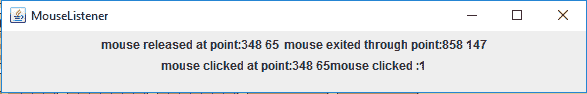
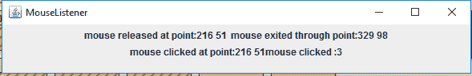

# Java 中的 MouseListener 和 MouseMotionListener

> 哎哎哎:# t0]https://www . geeksforgeeks . org/mouelistener-mouemotionlistener-Java/

MouseListener 和 MouseMotionListener 是 java.awt.event 包中的一个接口。鼠标事件
有两种类型。当鼠标不运动时，鼠标监听器处理事件。而鼠标运动监听器
处理鼠标运动时的事件。【MouseListener 可以生成五种类型的事件。有五个抽象函数表示这五个事件。**抽象功能有:**

1.  **void Mouse released(Mouse event e)**:鼠标键释放
2.  **void Mouse clicked(Mouse event e)**:鼠标键被按下/释放
3.  **无效鼠标退出(MouseEvent e)** :鼠标退出组件
4.  **无效鼠标进入(MouseEvent e)** :鼠标进入组件
5.  **void Mouse pressed(Mouse event e)**:鼠标键被按下

MouseMotionListener 可以生成两种类型的事件。有两个抽象函数表示这五个事件。**抽象函数有:**

1.  **void MouseDrawed(MouseEvent e)**:在组件中按下鼠标按钮并拖动时调用。事件被传递，直到用户释放鼠标按钮。
2.  **void mouse moved(mouse event e)**:当鼠标光标在组件内从一个点移动到另一个点时调用，无需按任何鼠标按钮。

下面的程序演示了鼠标监听器和鼠标移动监听器。
**1。处理鼠标监听器事件的程序**

## Java 语言(一种计算机语言，尤用于创建网站)

```
// Java program to handle MouseListener events
import java.awt.*;
import java.awt.event.*;
import javax.swing.*;
class Mouse extends Frame implements MouseListener {

    // Jlabels to display the actions of events of mouseListener
    // static JLabel label1, label2, label3;

    // default constructor
    Mouse()
    {
    }

    // main class
    public static void main(String[] args)
    {
        // create a frame
        JFrame f = new JFrame("MouseListener");

        // set the size of the frame
        f.setSize(600, 100);

        // close the frame when close button is pressed
        f.setDefaultCloseOperation(JFrame.EXIT_ON_CLOSE);

        // create anew panel
        JPanel p = new JPanel();

        // set the layout of the panel
        p.setLayout(new FlowLayout());

        // initialize the labels
        label1 = new JLabel("no event  ");

        label2 = new JLabel("no event  ");

        label3 = new JLabel("no event  ");

        // create an object of mouse class
        Mouse m = new Mouse();

        // add mouseListener to the frame
        f.addMouseListener(m);

        // add labels to the panel
        p.add(label1);
        p.add(label2);
        p.add(label3);

        // add panel to the frame
        f.add(p);

        f.show();
    }

    // getX() and getY() functions return the
    // x and y coordinates of the current
    // mouse position
    // getClickCount() returns the number of
    // quick consecutive clicks made by the user

    // this function is invoked when the mouse is pressed
    public void mousePressed(MouseEvent e)
    {

        // show the point where the user pressed the mouse
        label1.setText("mouse pressed at point:"
                       + e.getX() + " " + e.getY());
    }

    // this function is invoked when the mouse is released
    public void mouseReleased(MouseEvent e)
    {

        // show the point where the user released the mouse click
        label1.setText("mouse released at point:"
                       + e.getX() + " " + e.getY());
    }

    // this function is invoked when the mouse exits the component
    public void mouseExited(MouseEvent e)
    {

        // show the point through which the mouse exited the frame
        label2.setText("mouse exited through point:"
                       + e.getX() + " " + e.getY());
    }

    // this function is invoked when the mouse enters the component
    public void mouseEntered(MouseEvent e)
    {

        // show the point through which the mouse entered the frame
        label2.setText("mouse entered at point:"
                       + e.getX() + " " + e.getY());
    }

    // this function is invoked when the mouse is pressed or released
    public void mouseClicked(MouseEvent e)
    {

        // getClickCount gives the number of quick,
        // consecutive clicks made by the user
        // show the point where the mouse is i.e
        // the x and y coordinates
        label3.setText("mouse clicked at point:"
                       + e.getX() + " "
                       + e.getY() + "mouse clicked :" + e.getClickCount());
    }
}
```

**输出:**





**注意:以下程序可能无法在在线编译器中运行请使用离线 IDE**
**让我们在 MouseListener** 上再举一个例子，问题是:
**Q.** 编写一个小程序，每当用户在小程序窗口中的任何地方单击时，它都会在其状态栏中显示 x 和 y 坐标。
Ans。
注意:此代码是关于 Netbeans IDE 的。

## Java 语言(一种计算机语言，尤用于创建网站)

```
//Program of an applet which
//displays x and y co-ordinate
//in it's status bar,whenever
//the user click anywhere in
//the applet window.

import java.awt.*;
import java.awt.event.*;
import java.applet.*;
public class GFG extends Applet implements MouseListener
{
public void init()
{
this.addMouseListener (this);
//first "this" represent source
//(in this case it is applet which
//is current calling object) and
//second "this" represent
//listener(in this case it is GFG) 
}
public void mouseClicked(MouseEvent m)
{
 int x = m.getX();
 int y = m.getY();
 String str = "x =" +x+",y = "+y;
 showStatus(str);
}

    @Override
    public void mousePressed(MouseEvent e) {

}

    @Override
    public void mouseReleased(MouseEvent e) {

    }

    @Override
    public void mouseEntered(MouseEvent e) {

    }

    @Override
    public void mouseExited(MouseEvent e) {

    }
}
```

**输出:**


状态栏中显示(x，y)的输出

**修改:**现在我们的目标是改进上述程序，以便坐标只显示在点击的地方
注意:该代码与 Netbeans IDE 相关。

## Java 语言(一种计算机语言，尤用于创建网站)

```
//Co-ordinates should display
//at that point only wherever
//their is click on canvas

import java.awt.*;
import java.awt.event.*;
import java.applet.*;
public class GFG extends Applet implements MouseListener
{
private int x,y;
private String str = " ";
public void init()
{
this.addMouseListener (this);
//first "this" represent source
//(in this case it is applet which
// is current calling object) and
// second "this" represent listener
//(in this case it is GFG) 
}
public void paint(Graphics g)
{
g.drawString(str,x,y);
}
public void mouseClicked(MouseEvent m)
{
  x = m.getX();
  y = m.getY();
  str = "x =" +x+",y = "+y;
repaint(); // we have made this
//call because repaint() will
//call paint() method for us.
//If we comment out this line,
//then we will see output
//only when focus is on the applet
//i.e on maximising the applet window
//because paint() method is called
//when applet screen gets the focus.
//repaint() is a method of Component
//class and prototype for this method is:
//public void repaint()

}

 public void mouseEntered(MouseEvent m)
//over-riding all the methods given by
// MouseListener
{
}
 public void mouseExited(MouseEvent m)
{
}
 public void mousePressed(MouseEvent m)
{
}
 public void mouseReleased(MouseEvent m)
{
}
}
```