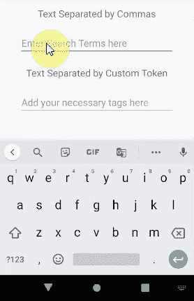
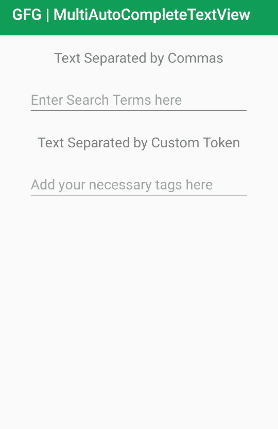

# 安卓多自动完成文本视图，示例

> 原文:[https://www . geeksforgeeks . org/mulatiautocompletextview-in-Android-with-example/](https://www.geeksforgeeks.org/multiautocompletetextview-in-android-with-example/)

多自动完成文本视图是一个可编辑的[文本视图](https://www.geeksforgeeks.org/textview-widget-in-android-using-java-with-examples/)，扩展了自动完成文本视图。在文本视图中，当用户开始键入文本时，多自动完成文本视图会显示文本子字符串的完成建议，用户选择该选项而不是键入是有用的。这一功能在各种应用中非常有用，如教育/商业/娱乐应用等。，该功能是允许用户选择正确术语的一种方式，并且由于允许多种建议，它使用户的生活变得非常简单。下面给出了一个 GIF 示例，来了解一下我们将在本文中做什么。注意，我们将使用 **Java** 语言来实现这个项目。



### 自动完成文本视图和多自动完成文本视图的区别

> 一个[自动完成文本视图](https://www.geeksforgeeks.org/autocompletetextview-in-kotlin/)只提供关于整个文本的建议。但是多自动完成文本视图为文本的子字符串提供了多种建议。

### **重要方法**

**1 .settoknizer():# t1]**

标记器设置在方法 **setTokenizer()** 中。默认情况下，我们有 CommaTokenizer。在本例中，我们使用了两个多自动完成文本视图实例。一个(多自动完成文本视图默认)，带有默认命令生成器。

> multiautocompletetextview default . settoknizer(新的 multiautocomputextview)。commatokenizer()；

这里，当用户完成键入或选择一个子字符串时，会在该子字符串的末尾添加一个逗号。对于第二个实例(多自动完成文本视图自定义)，我们使用的是空间标记器。它只不过是一个 Java 类，因为我们需要在 **3 个方法中编写代码，即 findTokenStart、findTokenEnd** 、**和 terminateToken。**

> multiautocomplete xtview customer . settoknizer(new space token izer())；

这里，当用户完成键入或选择一个子字符串时，会在子字符串的末尾添加一个空格。

**2。setThreshold():**

**setThreshold()** 用于指定字符数，之后将显示带有自动完成建议列表的下拉列表。可以是 1 个或 2 个，也可以根据您的要求而定。对于这个例子，

> //对于多自动完成文本视图默认值，在用户键入字符后，
> 
> //显示下拉列表
> 
> multipautocompletettextviewdefault . setthreshold(1)；
> 
> //对于多自动完成文本视图自定义，在用户键入 2 个字符后，
> 
> //显示下拉列表
> 
> multipautocompletettextviewcount . setthreshold(2)；

**3 .箭头适配器():# t1]**

为了在下拉列表中显示子字符串项，我们需要在**“**ArrayAdapter”中填充字符串数组。

> //一审
> 
> ArrayAdapter<string>randomArrayAdapter = new ArrayAdapter<>(这个，安卓。R.layout.simple_list_item_1，fexrandom 建议文本)；</string>
> 
> multiautocomplete xtviewdefault . setadapter(randomayadadapter)；
> 
> //二审
> 
> ArrayAdapter<string>tagArrayAdapter =新 ArrayAdapter <>(这个，安卓。R.layout.simple_list_item_1，few tags)；</string>
> 
> multiautocomplete xtview customer . setadapter(taggaryadapter)；

### 例子

**第一步:创建新项目**

要在安卓工作室创建新项目，请参考[如何在安卓工作室创建/启动新项目](https://www.geeksforgeeks.org/android-how-to-create-start-a-new-project-in-android-studio/)。注意选择 **Java** 作为编程语言。

**步骤 2:使用 activity_main.xml 文件**

例如在 **activity_main.xml** 文件中添加两个文本视图和两个多自动完成文本视图。下面是 **activity_main.xml** 文件的完整代码。代码中添加了注释，以更详细地理解代码。

## 可扩展标记语言

```java
<?xml version="1.0" encoding="utf-8"?>
<!--In linearlayout, screen is rendered and hence all the below
    components come line by line and provide neat layout -->
<LinearLayout 
    xmlns:android="http://schemas.android.com/apk/res/android"
    xmlns:tools="http://schemas.android.com/tools"
    android:layout_width="match_parent"
    android:layout_height="match_parent"
    android:layout_gravity="center"
    android:layout_margin="16dp"
    android:orientation="vertical"
    tools:context=".MainActivity">

    <!-- To indicate the user that first MultiAutoCompleteTextView 
         is supported with comma seperated this textview is introduced.
         It just displays Text Separated by Commas at the top -->
    <TextView
        android:id="@+id/textView"
        android:layout_width="match_parent"
        android:layout_height="wrap_content"
        android:gravity="center"
        android:text="Text Separated by Commas"
        android:textSize="18sp" />

    <!-- 1st MultiAutoCompleteTextView instance identified with 
         multiAutoCompleteTextViewDefault and here when user starts
         to type, it will show relevant substrings and after user chooses it,
         the text is ended with "," as comma is the default tokenizer -->
    <MultiAutoCompleteTextView
        android:id="@+id/multiAutoCompleteTextViewDefault"
        android:layout_width="match_parent"
        android:layout_height="wrap_content"
        android:layout_margin="20dp"
        android:ems="10"
        android:hint="Enter Search Terms here" />

    <TextView
        android:layout_width="match_parent"
        android:layout_height="wrap_content"
        android:gravity="center"
        android:text="Text Separated by Custom Token"
        android:textSize="18sp" />

    <!-- 2nd MultiAutoCompleteTextView instance identified with 
         multiAutoCompleteTextViewCustom and here when user starts
         to type, it will show relevant substrings and after user 
         chooses it, the text is ended with " " as code is done to 
         have space as separator -->
    <MultiAutoCompleteTextView
        android:id="@+id/multiAutoCompleteTextViewCustom"
        android:layout_width="match_parent"
        android:layout_height="wrap_content"
        android:layout_margin="20dp"
        android:ems="10"
        android:hint="Add your necessary tags here" />

</LinearLayout>
```

**UI 看起来如下:**



**步骤 3:使用 Java 文件**

*   以下是**MainActivity.java**文件的完整代码。代码中添加了注释，以更详细地理解代码。

## Java 语言(一种计算机语言，尤用于创建网站)

```java
import android.os.Bundle;
import android.widget.ArrayAdapter;
import android.widget.MultiAutoCompleteTextView;
import androidx.appcompat.app.AppCompatActivity;

public class MainActivity extends AppCompatActivity {

    // Defining two MultiAutoCompleteTextView
    // This is to recognize comma separated.
    MultiAutoCompleteTextView multiAutoCompleteTextViewDefault;

    // This is the second one and required for custom features
    MultiAutoCompleteTextView multiAutoCompleteTextViewCustom;

    // As a sample, few text are given below which can be populated in dropdown, when user starts typing
    // For example, when user types "a", text whichever starting with "a" will be displayed in dropdown
    // As we are using two MultiAutoCompleteTextView components, using two string array separately
    String[] fewRandomSuggestedText = {"a", "ant", "apple", "asp", "android", "animation", "adobe",
            "chrome", "chromium", "firefox", "freeware", "fedora"};
    String[] fewTags = {"Java", "JavaScript", "Spring", "Java EE", "Java 8", "Java 9", "Java 10",
            "MongoDB", "MarshMallow", "NoSQL", "NativeApp", "SQL", "SQLite"};

    @Override
    protected void onCreate(Bundle savedInstanceState) {
        super.onCreate(savedInstanceState);
        setContentView(R.layout.activity_main);

        multiAutoCompleteTextViewDefault = findViewById(R.id.multiAutoCompleteTextViewDefault);
        multiAutoCompleteTextViewCustom = findViewById(R.id.multiAutoCompleteTextViewCustom);

        // In order to show the substring options in a dropdown, we need ArrayAdapter 
        // and here it is using simple_list_item_1
        ArrayAdapter<String> randomArrayAdapter = new ArrayAdapter<>(this, android.R.layout.simple_list_item_1, fewRandomSuggestedText);
        multiAutoCompleteTextViewDefault.setAdapter(randomArrayAdapter);

        // setThreshold() is used to specify the number of characters after which 
        // the dropdown with the autocomplete suggestions list would be displayed.
        // For multiAutoCompleteTextViewDefault, after 1 character, the dropdown shows substring
        multiAutoCompleteTextViewDefault.setThreshold(1);

        // Default CommaTokenizer is used here
        multiAutoCompleteTextViewDefault.setTokenizer(new MultiAutoCompleteTextView.CommaTokenizer());
        ArrayAdapter<String> tagArrayAdapter = new ArrayAdapter<>(this, android.R.layout.simple_list_item_1, fewTags);
        multiAutoCompleteTextViewCustom.setAdapter(tagArrayAdapter);

        // For multiAutoCompleteTextViewCustom, after 2 characters, the dropdown shows substring
        multiAutoCompleteTextViewCustom.setThreshold(2);

        // As multiAutoCompleteTextViewCustom is customized , we are using SpaceTokenizer
        // which is written as a separate java class to handle space
        // SpaceTokenizer can be customized as per our needs, here for this example, 
        // after user types 2 character
        // the substring of the text is shown in the dropdown and once selected, 
        // a space is appended at the
        // end of the substring. So for customized MultiAutoCompleteTextView, 
        // we need to write code like SpaceTokenizer
        // It has 3 methods namely findTokenStart,findTokenEnd and terminateToken
        multiAutoCompleteTextViewCustom.setTokenizer(new SpaceTokenizer());
    }
}
```

*   对于 multipautocomplettextviewcactivity 的第二个实例，这里使用了空格标记器，默认情况下只有逗号标记器，如果我们使用其他标记器，需要用 java 编写代码，它应该实现 3 个方法，即 findTokenStart、findTokenEnd 和 terminateToken。
*   现在创建另一个 Java 文件( **app > java >您的包名> New > Java Class)** 并将其命名为 **SpaceTokenizer** 。以下是**SpaceTokenizer.java**文件的完整代码。代码中添加了注释，以更详细地理解代码。

## Java 语言(一种计算机语言，尤用于创建网站)

```java
import android.text.SpannableString;
import android.text.Spanned;
import android.text.TextUtils;
import android.widget.MultiAutoCompleteTextView;

// As this java class implements MultiAutoCompleteTextView.Tokenizer,
// we should write 3 methods i.e. findTokenStart,findTokenEnd and terminateToken
public class SpaceTokenizer implements MultiAutoCompleteTextView.Tokenizer {
    private int i;

    // Returns the start of the token that ends at offset cursor within text.
    public int findTokenStart(CharSequence inputText, int cursor) {
        int idx = cursor;

        while (idx > 0 && inputText.charAt(idx - 1) != ' ') {
            idx--;
        }
        while (idx < cursor && inputText.charAt(idx) == ' ') {
            idx++;
        }
        return idx;
    }

    // Returns the end of the token (minus trailing punctuation) that 
    // begins at offset cursor within text.
    public int findTokenEnd(CharSequence inputText, int cursor) {
        int idx = cursor;
        int length = inputText.length();

        while (idx < length) {
            if (inputText.charAt(i) == ' ') {
                return idx;
            } else {
                idx++;
            }
        }
        return length;
    }

    // Returns text, modified, if necessary, to ensure that it ends with a token terminator
    // (for example a space or comma).
    public CharSequence terminateToken(CharSequence inputText) {
        int idx = inputText.length();

        while (idx > 0 && inputText.charAt(idx - 1) == ' ') {
            idx--;
        }

        if (idx > 0 && inputText.charAt(idx - 1) == ' ') {
            return inputText;
        } else {
            if (inputText instanceof Spanned) {
                SpannableString sp = new SpannableString(inputText + " ");
                TextUtils.copySpansFrom((Spanned) inputText, 0, inputText.length(),
                        Object.class, sp, 0);
                return sp;
            } else {
                return inputText + " ";
            }
        }
    }
}
```

### **在仿真器上运行**

<video class="wp-video-shortcode" id="video-492045-1" width="640" height="360" preload="metadata" controls=""><source type="video/mp4" src="https://media.geeksforgeeks.org/wp-content/uploads/20200923154638/Sample-Emulator-Output.mp4?_=1">[https://media.geeksforgeeks.org/wp-content/uploads/20200923154638/Sample-Emulator-Output.mp4](https://media.geeksforgeeks.org/wp-content/uploads/20200923154638/Sample-Emulator-Output.mp4)</video>

### **结论**

在许多应用程序中，有必要拥有多自动完成文本视图，这将有助于提供有价值的信息，并使用户的生活更容易避免选择不相关的信息。收集需求时，用户必须键入 java 文件中所有必要的文本，以便在下拉列表中显示必要的建议文本。