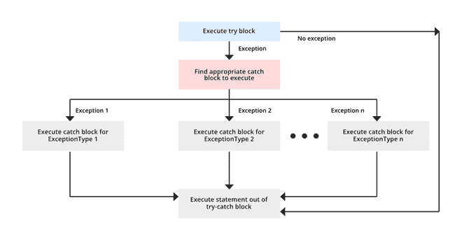

# Java 多重捕捉块

> 原文:[https://www.geeksforgeeks.org/multicatch-in-java/](https://www.geeksforgeeks.org/multicatch-in-java/)

在 Java 7 之前，我们必须在每个 catch 块中只捕获一种异常类型。因此，每当我们需要处理一个以上的特定异常，但对所有异常采取一些措施时，我们必须有多个包含相同代码的 catch 块。

在下面的代码中，我们必须处理两个不同的异常，但对两者采取相同的操作。因此，从 Java 6.0 开始，我们需要有两个不同的 catch 块。

## Java 语言(一种计算机语言，尤用于创建网站)

```
// A Java program to demonstrate that we needed
// multiple catch blocks for multiple exceptions
// prior to Java 7

import java.util.Scanner;
public class Test
{
    public static void main(String args[])
    {
        Scanner scn = new Scanner(System.in);
        try
        {
            int n = Integer.parseInt(scn.nextLine());

            if (99%n == 0)
                System.out.println(n + " is a factor of 99");
        }
        catch (ArithmeticException ex)
        {
            System.out.println("Arithmetic " + ex);
        }
        catch (NumberFormatException ex)
        {
            System.out.println("Number Format Exception " + ex);
        }
    }
}
```

**输入 1:**

```
GeeksforGeeks
```

**输出 1:**

```
Exception encountered java.lang.NumberFormatException: 

For input string: "GeeksforGeeks"
```

**输入 2:**

```
0
```

**输出 2:**

```
Arithmetic Exception encountered java.lang.ArithmeticException: / by zero
```

### Java 中的多重捕获块

从 Java 7.0 开始，单个 catch 块可以通过在 catch 块中用|(管道符号)分隔每个异常来捕获多个异常。

在单个 catch 块中捕获多个异常减少了代码重复并提高了效率。编译该程序时生成的字节码将小于具有多个捕获块的程序，因为没有代码冗余。

> **注意:**如果 catch 块处理多个异常，catch 参数隐式为 final。这意味着我们不能给 catch 参数赋值。

**语法:**

```
try {  
    // code
} 
catch (ExceptionType1 | Exceptiontype2 ex){   
    // catch block
}
```

### Java 多捕获块流程图



## Java 语言(一种计算机语言，尤用于创建网站)

```
// A Java program to demonstrate
// multicatch feature

import java.util.Scanner;

public class Test
{
    public static void main(String args[])
    {
        Scanner scn = new Scanner(System.in);
        try
        {
            int n = Integer.parseInt(scn.nextLine());
            if (99%n == 0)
                System.out.println(n + " is a factor of 99");
        }
        catch (NumberFormatException | ArithmeticException ex)
        {
            System.out.println("Exception encountered " + ex);
        }
    }
}
```