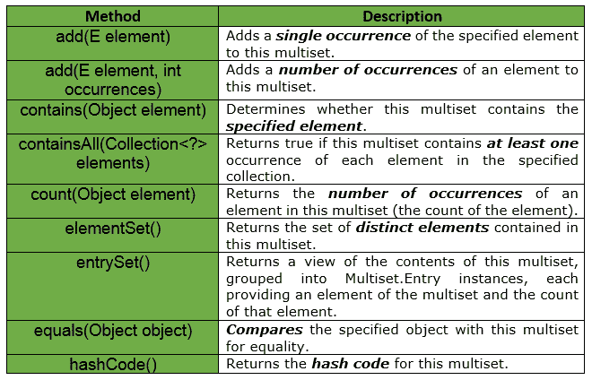
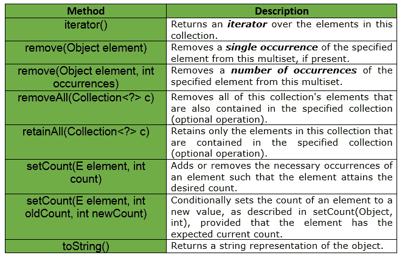
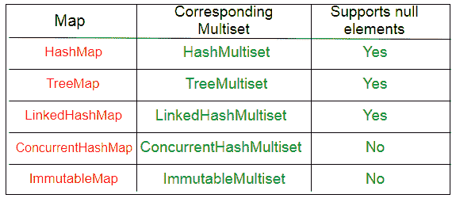

# 多集界面|番石榴| Java

> 原文:[https://www . geesforgeks . org/multist-interface-guava-Java/](https://www.geeksforgeeks.org/multiset-interface-guava-java/)

**简介:** Multiset 是一个支持 ***顺序无关平等*** 的集合，和 set 一样，但是可能有重复的元素。我们可能认为多集是一个列表，但事实并非如此。

*   列表可以保存同一对象的副本，并且列表始终是有序的。
*   器械包不能重复，器械包界面不能保证顺序。

因此，多集占据了列表和集合之间的灰色区域。允许重复，但没有保证顺序。 ***多集有时也叫包*** 。在多集合中，如同在集合中一样，与元组相反，元素的顺序在多集合中是不相关的。例如:多集{a，a，b}和{a，b，a}相等。

有两种看待多集的主要方式:

*   这就像一个**数组列表< **E** >** 没有排序约束，即排序无关紧要。
*   这就像一张**地图< **E，整数** >** ，有元素，有计数。

**要点:**

*   Multiset 是一个支持顺序无关的等式的集合，就像 set 一样，但是可能有重复的元素。
*   多集合中彼此相等的元素被称为同一单个元素出现的**。**
*   **多集合中某个元素出现的总次数称为该元素的 ***计数*** 。**
*   **由于一个元素的计数被表示为一个整数，一个多集可能永远不会包含超过**个整数。任何一个元素的最大值**。**
*   **多集使用 Object.equals(java.lang.Object)来确定两个实例是否应该被视为“相同”，除非实现另有规定。**
*   **A **多集<T1【E**T5 只有正计数的元素。任何元素都不能有负计数，计数为 0 的值被认为不在多集中。它们不会出现在 elementSet()或 entrySet()视图中。**
*   **multiset.size()返回集合的大小，该大小等于所有元素的计数之和。对于不同元素的数量，请使用 elementSet()。大小()。例如，add(E)将多集大小()增加一。**
*   **multiset.iterator()迭代每个元素的每次出现，因此迭代的长度等于 multiset.size()。**
*   **Multiset 支持添加元素、移除元素或直接设置元素的数量。setCount(元素，0)相当于移除元素的所有出现。**
*   **不在 multiset 中的元素的 multiset.count(元素)总是返回 0。**

****声明:**com . Google . common . collect . multiset 界面的声明如下:**

```java
@GwtCompatible
public interface Multiset
   extends Collection 
```

****

****示例:**我们知道，如果将两个相等的元素添加到 java.util.Set 中，那么第二个元素将被丢弃。**

```java
// Java implementation to show if 2
// equal elements are added to
// java.util.Set, then the 2nd element
// will be discarded

import java.util.Set;
import java.util.HashSet;

// Set of Strings
Set<String> set = new HashSet();

// Adding elements to the set
set.add("Geeks");
set.add("Geeks");

System.out.println(set);

// The output will be [Geeks]
```

**但是，如果我们使用番石榴的多集，那么重复的元素不会被丢弃。有关实现，请参见下面的代码:**

```java
// Java implementation to show if 2
// equal elements are added to
// Multiset, then the 2nd element
// will not be discarded

import com.google.common.collect.HashMultiset;
import com.google.common.collect.Multiset;

// Multiset of String
Multiset<String> multiset = HashMultiset.create();

// Adding elements to the set
multiset.add("Geeks");
multiset.add("Geeks");

System.out.println(multiset);

// The output will be [Geeks X 2]
```

**下面给出了番石榴多集接口提供的一些其他方法:**

****

****实现:**
番石榴提供了 Multiset 的多种实现，大致对应 JDK 地图的实现。
**

****集合示例:****

```java
// Java code to show implementation
// of a Set
import java.util.*;

import com.google.common.collect.HashMultiset;
import com.google.common.collect.Multiset;

class GuavaTester {

    // Driver code
    public static void main(String args[])
    {

        // Creating a Set of Strings
        Set<String> set = new HashSet();

        // Adding elements to set
        set.add("Geeks");
        set.add("for");
        set.add("Geeks");
        set.add("for");
        set.add("GeeksforGeeks");
        set.add("Geeks");
        set.add("GeeksforGeeks");
        set.add("Geeks");

        // printing the total size of the set
        System.out.println("Total Size is : " + set.size());

        // print the occurrence of each element
        System.out.println("Occurrences of Geeks are : " + Collections.frequency(set, "Geeks"));

        System.out.println("Occurrences of for are : " + Collections.frequency(set, "for"));

        System.out.println("Occurrences of GeeksforGeeks are : " + Collections.frequency(set, "GeeksforGeeks"));
    }
}
```

**输出:**

```java
Total Size is : 3
Occurrences of Geeks are : 1
Occurrences of for are : 1
Occurrences of GeeksforGeeks are : 1 
```

****多集示例:****

```java
// Java code to show implementation
// of a Multiset
import java.util.*;

import com.google.common.collect.HashMultiset;
import com.google.common.collect.Multiset;

class GuavaTester {

    // Driver code
    public static void main(String args[])
    {

        // Creating a Multiset of Strings
        Multiset<String> multiset = HashMultiset.create();

        // Adding elements to multiset
        multiset.add("Geeks");
        multiset.add("for");
        multiset.add("Geeks");
        multiset.add("for");
        multiset.add("GeeksforGeeks");
        multiset.add("Geeks");
        multiset.add("GeeksforGeeks");
        multiset.add("Geeks");

        // printing the total size of the multiset
        System.out.println("Total Size is : " + multiset.size());

        // print the occurrence of each element
        System.out.println("Occurrences of Geeks are : " + multiset.count("Geeks"));

        System.out.println("Occurrences of for are : " + multiset.count("for"));

        System.out.println("Occurrences of GeeksforGeeks are : " + multiset.count("GeeksforGeeks"));
    }
}
```

**输出:**

```java
Total Size is : 8
Occurrences of Geeks are : 4
Occurrences of for are : 2
Occurrences of GeeksforGeeks are : 2 
```

****参考:**T2】谷歌番石榴**