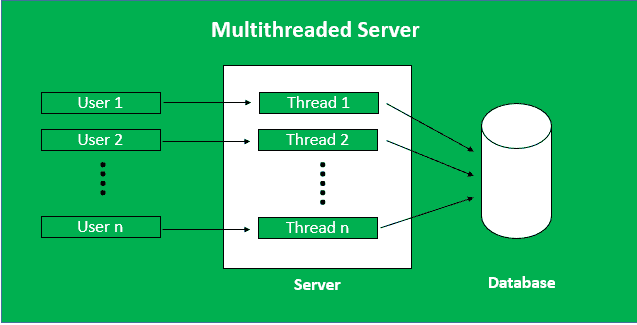
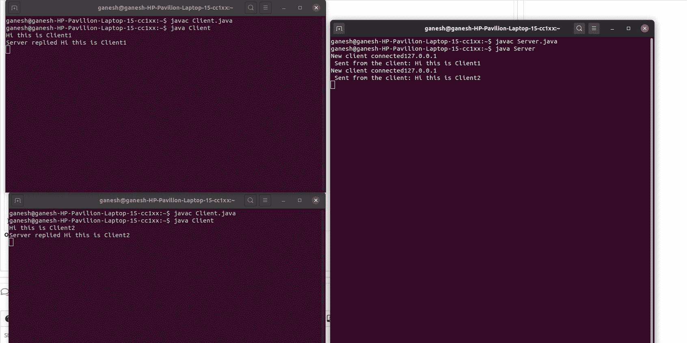

# Java 多线程服务器

> 原文:[https://www . geesforgeks . org/多线程-java 中的服务器/](https://www.geeksforgeeks.org/multithreaded-servers-in-java/)

**先决条件:**[Java 中的 Socket 编程](https://www.geeksforgeeks.org/socket-programming-in-java/)

**多线程服务器:**拥有多个线程的服务器称为多线程服务器。当客户端发送请求时，会生成一个线程，用户可以通过该线程与服务器通信。我们需要生成多个线程来同时接受来自多个客户端的多个请求。



**多线程服务器的优势:**

*   **快速高效:**多线程服务器可以快速高效地响应不断增加的客户端查询。
*   **用户等待时间减少:**在单线程服务器中，其他用户必须等到正在运行的进程完成，但是在多线程服务器中，所有用户都可以在单个时间获得响应，因此没有用户需要等待其他进程完成。
*   **线程相互独立:**任意两个线程之间没有关系。当客户端连接时，每次都会生成一个新线程。
*   **一个线程的问题不影响其他线程:**如果任何一个线程出现错误，那么没有其他线程被干扰，所有其他进程保持正常运行。在单线程服务器中，如果线程中出现任何问题，其他所有客户端都必须等待。

**多线程服务器的缺点:**

*   **复杂代码:**多线程服务器的代码很难写。这些程序不容易创建
*   **调试困难:**分析错误的主要原因和来源比较困难。

**快速概览**

我们创建了两个 java 文件，**Client.java**和**Server.java**。客户端文件只包含一个类 **客户端** (用于创建客户端)。服务器文件有两个类，**服务器**(创建服务器)和**客户端处理程序**(使用多线程处理客户端)。


**客户端程序:**客户端可以使用该代码与服务器通信。这包括

1.  **建立插座连接**
2.  **沟通**

## Java 语言(一种计算机语言，尤用于创建网站)

```java
import java.io.*;
import java.net.*;
import java.util.*;

// Client class
class Client {

    // driver code
    public static void main(String[] args)
    {
        // establish a connection by providing host and port
        // number
        try (Socket socket = new Socket("localhost", 1234)) {

            // writing to server
            PrintWriter out = new PrintWriter(
                socket.getOutputStream(), true);

            // reading from server
            BufferedReader in
                = new BufferedReader(new InputStreamReader(
                    socket.getInputStream()));

            // object of scanner class
            Scanner sc = new Scanner(System.in);
            String line = null;

            while (!"exit".equalsIgnoreCase(line)) {

                // reading from user
                line = sc.nextLine();

                // sending the user input to server
                out.println(line);
                out.flush();

                // displaying server reply
                System.out.println("Server replied "
                                   + in.readLine());
            }

            // closing the scanner object
            sc.close();
        }
        catch (IOException e) {
            e.printStackTrace();
        }
    }
}
```

**服务器端程序:**当连接了一个新的客户端，他将消息发送给服务器。

**1。服务器类:**服务器端涉及的步骤与文章[Java 中的 Socket 编程](https://www.geeksforgeeks.org/socket-programming-in-java/)类似，只是在获取流和端口号后创建线程对象略有变化。

*   **建立连接:**服务器套接字对象被初始化，在 while 循环中，套接字对象持续接受传入的连接。
*   **获取流:**[输入流](https://www.geeksforgeeks.org/java-io-inputstream-class-in-java/)对象和[输出流](https://www.geeksforgeeks.org/java-io-outputstream-class-java/)对象是从当前请求的套接字对象中提取的。
*   **创建处理程序对象:**获取流和端口号后，使用这些参数创建一个新的 clientHandler 对象(上面的类)。
*   **调用** [**start()**](https://www.geeksforgeeks.org/start-function-multithreading-java/) **方法:**在这个新创建的线程对象上调用 start()方法。

**2。ClientHandler 类:**由于我们将为每个请求使用单独的线程，让我们理解实现 Runnable 的 **ClientHandler** 类的工作和实现。此类的对象充当新线程的可运行目标。

*   首先，这个类实现了 Runnable 接口，这样在创建新的[线程](https://www.geeksforgeeks.org/java-lang-thread-class-java/)时，它可以作为 [Runnable](https://www.geeksforgeeks.org/runnable-interface-in-java/#:~:text=java.-,lang.,run()%20method%20of%20Runnable%20.) 目标传递。
*   其次，这个类的构造函数取一个参数，这个参数可以唯一标识任何传入的请求，即 **Socket** 。
*   在这个类的 **run()** 方法里面，它读取客户端的消息并回复。

## Java 语言(一种计算机语言，尤用于创建网站)

```java
import java.io.*;
import java.net.*;

// Server class
class Server {
    public static void main(String[] args)
    {
        ServerSocket server = null;

        try {

            // server is listening on port 1234
            server = new ServerSocket(1234);
            server.setReuseAddress(true);

            // running infinite loop for getting
            // client request
            while (true) {

                // socket object to receive incoming client
                // requests
                Socket client = server.accept();

                // Displaying that new client is connected
                // to server
                System.out.println("New client connected"
                                   + client.getInetAddress()
                                         .getHostAddress());

                // create a new thread object
                ClientHandler clientSock
                    = new ClientHandler(client);

                // This thread will handle the client
                // separately
                new Thread(clientSock).start();
            }
        }
        catch (IOException e) {
            e.printStackTrace();
        }
        finally {
            if (server != null) {
                try {
                    server.close();
                }
                catch (IOException e) {
                    e.printStackTrace();
                }
            }
        }
    }

    // ClientHandler class
    private static class ClientHandler implements Runnable {
        private final Socket clientSocket;

        // Constructor
        public ClientHandler(Socket socket)
        {
            this.clientSocket = socket;
        }

        public void run()
        {
            PrintWriter out = null;
            BufferedReader in = null;
            try {

                  // get the outputstream of client
                out = new PrintWriter(
                    clientSocket.getOutputStream(), true);

                  // get the inputstream of client
                in = new BufferedReader(
                    new InputStreamReader(
                        clientSocket.getInputStream()));

                String line;
                while ((line = in.readLine()) != null) {

                    // writing the received message from
                    // client
                    System.out.printf(
                        " Sent from the client: %s\n",
                        line);
                    out.println(line);
                }
            }
            catch (IOException e) {
                e.printStackTrace();
            }
            finally {
                try {
                    if (out != null) {
                        out.close();
                    }
                    if (in != null) {
                        in.close();
                        clientSocket.close();
                    }
                }
                catch (IOException e) {
                    e.printStackTrace();
                }
            }
        }
    }
}
```

**步骤:**

*   编译客户端和服务器程序。
*   首先运行服务器，然后运行客户端。

**输出**

