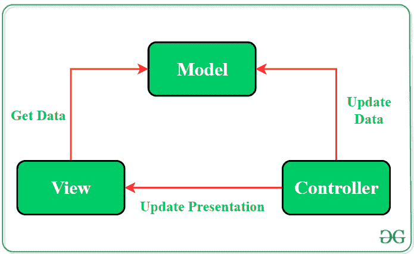

# 安卓中的 MVC(模型视图控制器)架构模式，示例

> 原文:[https://www . geesforgeks . org/MVC-model-view-controller-architecture-pattern-in-Android-with-example/](https://www.geeksforgeeks.org/mvc-model-view-controller-architecture-pattern-in-android-with-example/)

通过应用软件架构模式开发 [android](https://www.geeksforgeeks.org/kotlin-android-tutorial/) 应用程序一直是开发者的首选。一个[架构模式](https://www.geeksforgeeks.org/android-architecture-patterns/)赋予项目文件模块化，并确保所有代码都包含在单元测试中。这使得开发人员在将来维护软件和扩展应用程序的功能变得容易。有一些架构在开发人员中非常流行，其中之一是**模型-视图-控制器(MVC)模式。**MVC 模式建议将代码分成 3 个组件。创建应用程序的类/文件时，开发人员必须将其分为以下三层:

*   **模型:**该组件存储应用数据。它不知道接口。该模型负责处理领域逻辑(现实世界的业务规则)以及与数据库和网络层的通信。
*   **视图:**它是UI(用户界面)层，保存屏幕上可见的组件。此外，它提供了存储在模型中的数据的可视化，并为用户提供了交互。
*   **控制器:**该组件建立**视图**和**模型之间的关系。**包含核心应用逻辑，获知用户行为，根据需要更新模型。



尽管应用 MVC 模式为应用程序提供了模块化设计，但代码层确实是相互依赖的。在这种模式下，**视图**和**控制器**都依赖于**模型。**在项目中应用 MVC 模式有多种方法:

*   **方法 1:** 活动和片段可以执行控制器的角色，负责更新视图。
*   **方法 2:** 使用活动或片段作为视图和控制器，而 Model 将是一个单独的类，不扩展任何 Android 类。

在 **MVC 架构**中，应用数据由控制器更新，View 获取数据。由于**模型**组件是分离的，因此可以独立于用户界面进行测试。此外，如果**视图**层尊重**单一责任原则**，那么他们的角色只是为每个用户事件更新控制器，并且只是显示来自模型的数据，而不实现任何业务逻辑。在这种情况下，用户界面测试应该足以涵盖视图的功能。

### MVC 架构示例

为了更清楚地理解 MVC 架构模式的实现，这里有一个 android 应用程序的简单例子。这个应用程序将有 3 个按钮，每个按钮显示用户点击特定按钮的次数。为了开发这个应用程序，代码按照以下方式进行了分离:

*   **控制器和视图**将由活动处理。每当用户单击按钮时，活动都会指示模型处理进一步的操作。该活动将作为**观察员**。
*   **模型**将是一个单独的类，包含要显示的数据。对数据的操作将由该类的函数执行，在更新数据的值后，该**可观测类**将变化通知给**观测者(活动)**。

下面是这个 android 应用程序使用 MVC 架构模式的完整分步实现:

> **注意:**在 Android Studio 版本上执行以下步骤

**第一步:创建新项目**

1.  单击文件，然后单击新建= >新建项目。
2.  选择空活动
3.  选择语言为 Java/Kotlin
4.  根据您的需要选择最小的软件开发工具包。

**第二步:修改 String.xml 文件**

活动中使用的所有字符串都列在该文件中。

## 可扩展标记语言

```
<resources>
    <string name="app_name">GfG | MVC Architecture</string>
    <string name="Heading">MVC Architecture Pattern</string>
    <string name="Text1">Button_1</string>
    <string name="count">Count:0</string>
</resources>
```

**步骤 3:使用 activity_main.xml 文件**

打开 activity_main.xml 文件，并向其中添加 3 个按钮，这些按钮将根据用户单击它的次数显示计数值。以下是设计适当活动布局的代码。

## 可扩展标记语言

```
<?xml version="1.0" encoding="utf-8"?>
<androidx.constraintlayout.widget.ConstraintLayout 
    xmlns:android="http://schemas.android.com/apk/res/android"
    xmlns:app="http://schemas.android.com/apk/res-auto"
    xmlns:tools="http://schemas.android.com/tools"
    android:layout_width="match_parent"
    android:layout_height="match_parent"
    android:background="#168BC34A"
    tools:context=".MainActivity" >

    <!-- Provided Linear layout for the activity. -->
    <LinearLayout
        android:layout_width="match_parent"
        android:layout_height="match_parent"
        android:orientation="vertical"
        app:layout_constraintBottom_toBottomOf="parent"
        app:layout_constraintEnd_toEndOf="parent"
        app:layout_constraintStart_toStartOf="parent"
        app:layout_constraintTop_toTopOf="parent">

        <!-- TextView to display heading of the activity. -->
        <TextView
            android:id="@+id/textView"
            android:layout_width="match_parent"
            android:layout_height="wrap_content"
            android:layout_marginTop="40dp"
            android:layout_marginBottom="60dp"
            android:fontFamily="@font/roboto"
            android:text="@string/Heading"
            android:textAlignment="center"
            android:textColor="@android:color/holo_green_dark"
            android:textSize="30sp"
            android:textStyle="bold" />

        <!-- First Button of the activity. -->
        <Button
            android:id="@+id/button"
            android:layout_width="match_parent"
            android:layout_height="wrap_content"
            android:layout_marginStart="20dp"
            android:layout_marginTop="30dp"
            android:layout_marginEnd="20dp"
            android:layout_marginBottom="20dp"
            android:background="#4CAF50"
            android:fontFamily="@font/roboto"
            android:text="@string/count"
            android:textColor="@android:color/background_light"
            android:textSize="24sp"
            android:textStyle="bold" />

        <!-- Second Button of the activity. -->
        <Button
            android:id="@+id/button2"
            android:layout_width="match_parent"
            android:layout_height="wrap_content"
            android:layout_marginStart="20dp"
            android:layout_marginTop="50dp"
            android:layout_marginEnd="20dp"
            android:layout_marginBottom="20dp"
            android:background="#4CAF50"
            android:fontFamily="@font/roboto"
            android:text="@string/count"
            android:textColor="@android:color/background_light"
            android:textSize="24sp"
            android:textStyle="bold" />

        <!-- Third Button of the activity. -->
        <Button
            android:id="@+id/button3"
            android:layout_width="match_parent"
            android:layout_height="wrap_content"
            android:layout_marginStart="20dp"
            android:layout_marginTop="50dp"
            android:layout_marginEnd="20dp"
            android:layout_marginBottom="20dp"
            android:background="#4CAF50"
            android:fontFamily="@font/roboto"
            android:text="@string/count"
            android:textColor="@android:color/background_light"
            android:textSize="24sp"
            android:textStyle="bold" />

        <ImageView
            android:id="@+id/imageView"
            android:layout_width="match_parent"
            android:layout_height="wrap_content"
            android:layout_marginTop="30dp"
            app:srcCompat="@drawable/banner" />

    </LinearLayout>
</androidx.constraintlayout.widget.ConstraintLayout>
```

**步骤 4:创建模型类**

创建一个名为“模型”的新类来分离所有数据及其操作。这个类不会知道视图类的存在。

## Java 语言(一种计算机语言，尤用于创建网站)

```
import java.util.*;

public class Model extends Observable {

    // declaring a list of integer
    private List<Integer> List;

    // constructor to initialize the list
    public Model(){
        // reserving the space for list elements
        List = new ArrayList<Integer>(3);

        // adding elements into the list
        List.add(0);
        List.add(0);
        List.add(0);
    }

    // defining getter and setter functions

    // function to return appropriate count
    // value at correct index
    public int getValueAtIndex(final int the_index) throws IndexOutOfBoundsException{
        return List.get(the_index);
    }

    // function to make changes in the activity button's
    // count value when user touch it
    public void setValueAtIndex(final int the_index) throws IndexOutOfBoundsException{
       List.set(the_index,List.get(the_index) + 1);
       setChanged();
       notifyObservers();
    }

}
```

## 我的锅

```
import java.util.*
import kotlin.collections.ArrayList

class Model : Observable() {
    // declaring a list of integer
    val List: MutableList<Int>

    // constructor to initialize the list
    init {
        // reserving the space for list elements
        List = ArrayList(3)

        // adding elements into the list
        List.add(0)
        List.add(0)
        List.add(0)
    }

    // defining getter and setter functions
    // function to return appropriate count
    // value at correct index
    @Throws(IndexOutOfBoundsException::class)
    fun getValueAtIndex(the_index: Int): Int {
        return List[the_index]
    }

    // function to make changes in the activity button's
    // count value when user touch it
    @Throws(IndexOutOfBoundsException::class)
    fun setValueAtIndex(the_index: Int) {
        List[the_index] = List[the_index] + 1
        setChanged()
        notifyObservers()
    }
}
```

**第五步:在主活动文件**中定义视图和控制器的功能

本课程将建立视图和模型之间的关系。视图将使用模型提供的数据，并在活动中进行适当的更改。

## Java 语言(一种计算机语言，尤用于创建网站)

```
import androidx.appcompat.app.AppCompatActivity;
import android.os.Bundle;
import android.view.View;
import android.widget.Button;
import java.util.Observable;
import java.util.Observer;

public class MainActivity extends AppCompatActivity implements Observer, View.OnClickListener {

    // creating object of Model class
    private Model myModel;

    // creating object of Button class
    private Button Button1;
    private Button Button2;
    private Button Button3;

    @Override
    protected void onCreate(Bundle savedInstanceState) {
        super.onCreate(savedInstanceState);
        setContentView(R.layout.activity_main);

        // creating relationship between the
        // observable Model and the
        // observer Activity
        myModel = new Model();
        myModel.addObserver(this);

        // assigning button IDs to the objects
        Button1 = findViewById(R.id.button);
        Button2 = findViewById(R.id.button2);
        Button3 = findViewById(R.id.button3);

        // transfer the control to Onclick() method
        // when a button is clicked by passing
        // argument "this"
        Button1.setOnClickListener(this);
        Button2.setOnClickListener(this);
        Button3.setOnClickListener(this);

    }

    @Override
     // calling setValueAtIndex() method
     // by passing appropriate arguments
     // for different buttons
    public void onClick(View v) {
        switch(v.getId()){

            case R.id.button:
                myModel.setValueAtIndex(0);
                break;

            case R.id.button2:
                myModel.setValueAtIndex(1);
                break;

            case R.id.button3:
                myModel.setValueAtIndex(2);
                break;
        }
    }

    @Override
     // function to update the view after
     // the values are modified by the model
    public void update(Observable arg0, Object arg1) {

        // changing text of the buttons
        // according to updated values
        Button1.setText("Count: "+myModel.getValueAtIndex(0));
        Button2.setText("Count: "+myModel.getValueAtIndex(1));
        Button3.setText("Count: "+myModel.getValueAtIndex(2));

    }
}
```

## 我的锅

```
import android.os.Bundle
import android.view.View
import android.widget.Button
import androidx.appcompat.app.AppCompatActivity
import java.util.*

class MainActivity : AppCompatActivity(), Observer, View.OnClickListener {

    // creating object of Model class
    var myModel: Model? = null

    // creating object of Button class
    var Button1: Button? = null
    var Button2: Button? = null
    var Button3: Button? = null

    override fun onCreate(savedInstanceState: Bundle?) {
        super.onCreate(savedInstanceState)
        setContentView(R.layout.activity_main)

        // creating relationship between the
        // observable Model and the
        // observer Activity
        myModel = Model()
        myModel!!.addObserver(this)

        // assigning button IDs to the objects
        Button1 = findViewById(R.id.button)
        Button2 = findViewById(R.id.button2)
        Button3 = findViewById(R.id.button3)

        // transfer the control to Onclick() method
        // when a button is clicked by passing
        // argument "this"
        Button1?.setOnClickListener(this)
        Button2?.setOnClickListener(this)
        Button3?.setOnClickListener(this)
    }

    // calling setValueAtIndex() method
    // by passing appropriate arguments
    // for different buttons
    override fun onClick(v: View) {
        when (v.id) {
            R.id.button ->  myModel?.setValueAtIndex(0)
            R.id.button2 -> myModel?.setValueAtIndex(1)
            R.id.button3 -> myModel?.setValueAtIndex(2)
        }
    }

    // function to update the view after
    // the values are modified by the model
    override fun update(arg0: Observable, arg1: Any?) {

        // changing text of the buttons
        // according to updated values
        Button1!!.text = "Count: " + myModel!!.getValueAtIndex(0)
        Button2!!.text = "Count: " + myModel!!.getValueAtIndex(1)
        Button3!!.text = "Count: " + myModel!!.getValueAtIndex(2)
    }
}
```

### 输出

<video class="wp-video-shortcode" id="video-503715-1" width="640" height="360" preload="metadata" controls=""><source type="video/mp4" src="https://media.geeksforgeeks.org/wp-content/uploads/20201023013240/MVC-Output-Recording.mp4?_=1">[https://media.geeksforgeeks.org/wp-content/uploads/20201023013240/MVC-Output-Recording.mp4](https://media.geeksforgeeks.org/wp-content/uploads/20201023013240/MVC-Output-Recording.mp4)</video>

### MVC 架构模式的优势

*   MVC 模式增加了代码的可测试性，并且更容易实现新的特性，因为它高度支持关注点的分离。
*   模型和控制器的单元测试是可能的，因为它们不扩展或使用任何安卓类。
*   如果视图遵守单一责任原则(更新控制器并显示模型中的数据，而不实现域逻辑)，则可以通过用户界面测试来检查视图的功能

### MVC 架构模式的缺点

*   即使正确应用了 MVC，代码层也是相互依赖的。
*   没有参数来处理用户界面逻辑，即如何显示数据。