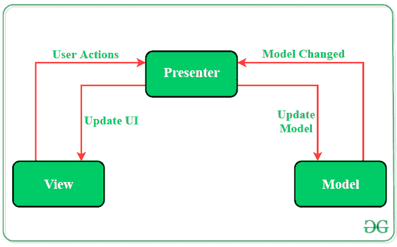

# 安卓系统 MVP(模型视图展示者)架构模式示例

> 原文:[https://www . geesforgeks . org/MVP-model-view-presenter-architecture-pattern-in-Android-with-example/](https://www.geeksforgeeks.org/mvp-model-view-presenter-architecture-pattern-in-android-with-example/)

在[安卓开发](https://www.geeksforgeeks.org/kotlin-android-tutorial/)的初始阶段，学习者确实以这样一种方式编写代码，最终创建一个 **MainActivity** 类，该类包含应用程序的所有实现逻辑(现实世界的业务逻辑)。这种应用程序开发方法导致[安卓活动](https://www.geeksforgeeks.org/activity-lifecycle-in-android-with-demo-app/)与用户界面和应用程序数据处理机制紧密耦合。此外，它在这种移动应用的维护和扩展中造成困难。为了避免在应用程序的可维护性、可读性、可伸缩性和重构方面出现这样的问题，开发人员更喜欢定义分离良好的代码层。通过应用软件[架构模式](https://www.geeksforgeeks.org/android-architecture-patterns/)，可以组织应用程序的代码来分离关注点。 **MVP(模型-视图-演示者)**架构是最流行的架构模式之一，在组织项目时是有效的。

**MVP(模型-视图-演示者)**作为传统 **MVC(模型-视图-控制器)**架构模式的替代方案出现在画面中。使用 MVC 作为软件架构，开发人员最终会遇到以下困难:

*   大多数核心业务逻辑位于控制器中。在应用程序的生命周期中，这个文件变得越来越大，维护代码变得越来越困难。
*   由于紧密耦合的用户界面和数据访问机制，**控制器**和**视图**层属于同一活动或片段。这导致在应用程序的特性中进行更改时出现问题。
*   由于大部分被测部分需要安卓软件开发工具包组件，因此很难进行不同层的单元测试。

**MVP 模式**克服了 **MVC** 的这些挑战，并提供了一种构建项目代码的简单方法。 **MVP** 之所以被广泛接受，是因为它提供了模块化、可测试性以及更干净和可维护的代码库。它由以下三个部分组成:

*   **模型:**存储数据的层。它负责处理领域逻辑(现实世界的业务规则)以及与数据库和网络层的通信。
*   **视图:** UI(用户界面)层。它提供数据的可视化，并跟踪用户的动作，以便通知演示者。
*   **演示者:**从模型中获取数据，并应用 UI 逻辑来决定显示什么。它管理视图的状态，并根据视图中用户的输入通知采取行动。



### MVP 架构的关键点

1.  视图-演示者和演示者-模型之间的通信通过**界面(也称为合同)**进行。
2.  一个演示者类一次管理一个视图，即演示者和视图之间存在一对一的关系。
3.  模型和视图类不知道彼此的存在。

### MVP 架构示例

为了展示 MVP 架构模式在项目上的实现，这里有一个单活动安卓应用程序的例子。通过从**模型中随机选择，应用程序将在**视图(活动)**上显示一些字符串。**T4 演示者类的作用是使应用程序的业务逻辑远离活动。下面是这个 android 应用程序的完整分步实现。请注意，我们将使用 **Java** 和 **Kotlin** 语言来实现该项目。

> **注意:**在 Android Studio 版本上执行以下步骤

**第一步:创建新项目**

1.  单击文件，然后单击新建= >新建项目。
2.  选择空活动
3.  选择语言为 Java/Kotlin
4.  根据您的需要选择最小的软件开发工具包。

**第二步:修改 String.xml 文件**

活动中使用的所有字符串都列在该文件中。

## 可扩展标记语言

```
<resources>
    <string name="app_name">GfG | MVP Architecture</string>
    <string name="buttonText">Display Next Course</string>
    <string name="heading">MVP Architecture Pattern</string>
    <string name="subHeading">GeeksforGeeks Computer Science Online Courses</string>
    <string name="description">Course Description</string>
</resources>
```

**步骤 3:使用 activity_main.xml 文件**

打开 activity_main.xml 文件，添加一个按钮、一个显示字符串的文本视图和一个进度条，给应用程序一种动态的感觉。以下是设计适当活动布局的代码。

## 可扩展标记语言

```
<?xml version="1.0" encoding="utf-8"?>
<androidx.constraintlayout.widget.ConstraintLayout 
    xmlns:android="http://schemas.android.com/apk/res/android"
    xmlns:app="http://schemas.android.com/apk/res-auto"
    xmlns:tools="http://schemas.android.com/tools"
    android:layout_width="match_parent"
    android:layout_height="match_parent"
    android:background="#168BC34A"
    tools:context=".MainActivity">

    <!-- TextView to display heading of the activity -->
    <TextView
        android:id="@+id/textView3"
        android:layout_width="wrap_content"
        android:layout_height="wrap_content"
        android:fontFamily="@font/roboto"
        android:text="@string/heading"
        android:textAlignment="center"
        android:textColor="@android:color/holo_green_dark"
        android:textSize="30sp"
        android:textStyle="bold"
        app:layout_constraintBottom_toBottomOf="parent"
        app:layout_constraintEnd_toEndOf="parent"
        app:layout_constraintHorizontal_bias="0.498"
        app:layout_constraintStart_toStartOf="parent"
        app:layout_constraintTop_toTopOf="parent"
        app:layout_constraintVertical_bias="0.060000002" />

    <!-- TextView to display sub heading of the activity -->
    <TextView
        android:id="@+id/textView2"
        android:layout_width="wrap_content"
        android:layout_height="wrap_content"
        android:fontFamily="@font/roboto"
        android:text="@string/subHeading"
        android:textAlignment="center"
        android:textColor="@android:color/holo_green_dark"
        android:textSize="24sp"
        android:textStyle="bold"
        app:layout_constraintBottom_toTopOf="@+id/button"
        app:layout_constraintEnd_toEndOf="parent"
        app:layout_constraintHorizontal_bias="1.0"
        app:layout_constraintStart_toStartOf="parent"
        app:layout_constraintTop_toTopOf="parent"
        app:layout_constraintVertical_bias="0.356" />

    <!-- TextView to display the random string -->
    <TextView
        android:id="@+id/textView"
        android:layout_width="411dp"
        android:layout_height="wrap_content"
        android:fontFamily="@font/roboto"
        android:gravity="center"
        android:padding="8dp"
        android:text="@string/description"
        android:textAlignment="center"
        android:textAppearance="?android:attr/textAppearanceSearchResultTitle"
        app:layout_constraintBottom_toTopOf="@+id/button"
        app:layout_constraintEnd_toEndOf="parent"
        app:layout_constraintStart_toStartOf="parent"
        app:layout_constraintTop_toBottomOf="@+id/textView2"
        app:layout_constraintVertical_bias="0.508" />

    <!-- Button to display next random string -->
    <Button
        android:id="@+id/button"
        android:layout_width="0dp"
        android:layout_height="wrap_content"
        android:layout_margin="@android:dimen/notification_large_icon_height"
        android:background="#4CAF50"
        android:text="@string/buttonText"
        android:textAllCaps="true"
        android:textColor="@android:color/background_light"
        android:textSize="20sp"
        android:textStyle="bold"
        app:layout_constraintBottom_toBottomOf="parent"
        app:layout_constraintLeft_toLeftOf="parent"
        app:layout_constraintRight_toRightOf="parent"
        app:layout_constraintTop_toTopOf="parent"
        app:layout_constraintVertical_bias="0.79" />

    <!-- Progress Bar to be displayed before displaying next string -->
    <ProgressBar
        android:id="@+id/progressBar"
        style="?android:attr/progressBarStyleLarge"
        android:layout_width="wrap_content"
        android:layout_height="wrap_content"
        android:visibility="gone"
        app:layout_constraintBottom_toBottomOf="parent"
        app:layout_constraintLeft_toLeftOf="parent"
        app:layout_constraintRight_toRightOf="parent"
        app:layout_constraintTop_toTopOf="parent" />

    <ImageView
        android:id="@+id/imageView"
        android:layout_width="wrap_content"
        android:layout_height="wrap_content"
        app:layout_constraintBottom_toBottomOf="parent"
        app:layout_constraintEnd_toEndOf="parent"
        app:layout_constraintStart_toStartOf="parent"
        app:layout_constraintTop_toBottomOf="@+id/button"
        app:layout_constraintVertical_bias="1.0"
        app:srcCompat="@drawable/banner" />

</androidx.constraintlayout.widget.ConstraintLayout>
```

**步骤 4:为模型、视图和演示者定义合同接口文件**

要在视图-演示者和演示者-模型之间建立通信，需要一个接口。这个接口类将包含所有抽象方法，这些方法将在后面的视图、模型和演示者类中定义。

## Java 语言(一种计算机语言，尤用于创建网站)

```
public interface Contract {
    interface View {
        // method to display progress bar
        // when next random course details
        // is being fetched
        void showProgress();

        // method to hide progress bar
        // when next random course details
        // is being fetched
        void hideProgress();

        // method to set random
        // text on the TextView
        void setString(String string);
    }

    interface Model {

        // nested interface to be
        interface OnFinishedListener {
            // function to be called
            // once the Handler of Model class
            // completes its execution
            void onFinished(String string);
        }

        void getNextCourse(Contract.Model.OnFinishedListener onFinishedListener);
    }

    interface Presenter {

        // method to be called when
        // the button is clicked
        void onButtonClick();

        // method to destroy
        // lifecycle of MainActivity
        void onDestroy();
    }
}
```

## 我的锅

```
interface Contract {
    interface View {
        // method to display progress bar
        // when next random course details
        // is being fetched
        fun showProgress()

        // method to hide progress bar
        // when next random course details
        // is being fetched
        fun hideProgress()

        // method to set random
        // text on the TextView
        fun setString(string: String?)
    }

    interface Model {
        // nested interface to be
        interface OnFinishedListener {
            // function to be called
            // once the Handler of Model class
            // completes its execution
            fun onFinished(string: String?)
        }

        fun getNextCourse(onFinishedListener: OnFinishedListener?)
    }

    interface Presenter {
        // method to be called when
        // the button is clicked
        fun onButtonClick()

        // method to destroy
        // lifecycle of MainActivity
        fun onDestroy()
    }
}
```

**步骤 5:创建模型类**

创建一个名为“模型”的新类来分隔所有字符串数据和获取这些数据的方法。这个类不会知道视图类的存在。

## Java 语言(一种计算机语言，尤用于创建网站)

```
import android.os.Handler;

import java.util.Arrays;
import java.util.List;
import java.util.Random;

public class Model implements Contract.Model {

    // array list of strings from which
    // random strings will be selected
    // to display in the activity
    private List<String> arrayList = Arrays.asList(
            "DSA Self Paced: Master the basics of Data Structures and Algorithms to solve complex problems efficiently. ",
            "Placement 100: This course will guide you for placement with theory,lecture videos, weekly assignments " +
                    "contests and doubt assistance.",
            "Amazon SDE Test Series: Test your skill & give the final touch to your preparation before applying for " +
                    "product based against like Amazon, Microsoft, etc.",
            "Complete Interview Preparation: Cover all the important concepts and topics required for the interviews. " +
                    "Get placement ready before the interviews begin",
            "Low Level Design for SDE 1 Interview: Learn Object-oriented Analysis and Design to prepare for " +
                    "SDE 1 Interviews in top companies"
    );

    @Override
    // this method will invoke when
    // user clicks on the button
    // and it will take a delay of
    // 1200 milliseconds to display next course detail
    public void getNextCourse(final OnFinishedListener listener) {
        new Handler().postDelayed(new Runnable() {
            @Override
            public void run() {
                listener.onFinished(getRandomString());
            }
        }, 1200);
    }

    // method to select random
    // string from the list of strings
    private String getRandomString() {
        Random random = new Random();
        int index = random.nextInt(arrayList.size());
        return arrayList.get(index);
    }
}
```

## 我的锅

```
import android.os.Handler
import java.util.*

class Model : Contract.Model {
    // array list of strings from which
    // random strings will be selected
    // to display in the activity
    private val arrayList =
        Arrays.asList(
            "DSA Self Paced: Master the basics of Data Structures and Algorithms to solve complex problems efficiently. ",
            "Placement 100: This course will guide you for placement with theory,lecture videos, weekly assignments " +
                    "contests and doubt assistance.",
            "Amazon SDE Test Series: Test your skill & give the final touch to your preparation before applying for " +
                    "product based against like Amazon, Microsoft, etc.",
            "Complete Interview Preparation: Cover all the important concepts and topics required for the interviews. " +
                    "Get placement ready before the interviews begin",
            "Low Level Design for SDE 1 Interview: Learn Object-oriented Analysis and Design to prepare for " +
                    "SDE 1 Interviews in top companies"
        )

    // this method will invoke when
    // user clicks on the button
    // and it will take a delay of
    // 1200 milliseconds to display next course detail
    override fun getNextCourse(onFinishedListener: Contract.Model.OnFinishedListener?) {
        Handler().postDelayed({ onFinishedListener!!.onFinished(getRandomString) }, 1200)
    }

    // method to select random
    // string from the list of strings
    private val getRandomString: String
        private get() {
            val random = Random()
            val index = random.nextInt(arrayList.size)
            return arrayList[index]
        }
}
```

**第 6 步:创建演示者类**

这个类的方法包含核心业务逻辑，它将决定显示什么以及如何显示。它触发视图类对用户界面进行必要的更改。

## Java 语言(一种计算机语言，尤用于创建网站)

```
public class Presenter implements Contract.Presenter, Contract.Model.OnFinishedListener {

    // creating object of View Interface
    private Contract.View mainView;

    // creating object of Model Interface
    private Contract.Model model;

    // instantiating the objects of View and Model Interface
    public Presenter(Contract.View mainView, Contract.Model model) {
        this.mainView = mainView;
        this.model = model;
    }

    @Override
    // operations to be performed
    // on button click
    public void onButtonClick() {
        if (mainView != null) {
            mainView.showProgress();
        }
        model.getNextCourse(this);
    }

    @Override
    public void onDestroy() {
        mainView = null;
    }

    @Override
    // method to return the string
    // which will be displayed in the
    // Course Detail TextView
    public void onFinished(String string) {
        if (mainView != null) {
            mainView.setString(string);
            mainView.hideProgress();
        }
    }
}
```

## 我的锅

```
// instantiating the objects of View and Model Interface
// creating object of View Interface
// creating object of Model Interface
class Presenter(
    private var mainView: Contract.View?,
    private val model: Contract.Model) : Contract.Presenter,
    Contract.Model.OnFinishedListener {

    // operations to be performed
    // on button click
    override fun onButtonClick() {
        if (mainView != null) {
            mainView!!.showProgress()
        }
        model.getNextCourse(this)
    }

    override fun onDestroy() {
        mainView = null
    }

    // method to return the string
    // which will be displayed in the
    // Course Detail TextView
    override fun onFinished(string: String?) {
        if (mainView != null) {
            mainView!!.setString(string)
            mainView!!.hideProgress()
        }
    }

}
```

**步骤 7:在主活动文件**中定义视图的功能

视图类负责根据演示者层触发的更改更新用户界面。视图将使用模型提供的数据，并在活动中进行适当的更改。

## Java 语言(一种计算机语言，尤用于创建网站)

```
import androidx.appcompat.app.AppCompatActivity;
import android.os.Bundle;
import android.view.View;
import android.widget.Button;
import android.widget.ProgressBar;
import android.widget.TextView;

import static android.view.View.GONE;

public class MainActivity extends AppCompatActivity implements Contract.View {

    // creating object of TextView class
    private TextView textView;

    // creating object of Button class
    private Button button;

    // creating object of ProgressBar class
    private ProgressBar progressBar;

    // creating object of Presenter interface in Contract
    Contract.Presenter presenter;

    @Override
    protected void onCreate(Bundle savedInstanceState) {
        super.onCreate(savedInstanceState);
        setContentView(R.layout.activity_main);

        // assigning ID of the TextView
        textView = findViewById(R.id.textView);

        // assigning ID of the Button
        button = findViewById(R.id.button);

        // assigning ID of the ProgressBar
        progressBar = findViewById(R.id.progressBar);

        // instantiating object of Presenter Interface
        presenter = new Presenter(this, new Model());

        // operations to be performed when
        // user clicks the button
        button.setOnClickListener(new View.OnClickListener() {
            @Override
            public void onClick(View v) {
                presenter.onButtonClick();
            }
        });
    }

    @Override
    protected void onResume() {
        super.onResume();
    }

    @Override
    protected void onDestroy() {
        super.onDestroy();
        presenter.onDestroy();
    }

    @Override
    // method to display the Course Detail TextView
    public void showProgress() {
        progressBar.setVisibility(View.VISIBLE);
        textView.setVisibility(View.INVISIBLE);
    }

    @Override
    // method to hide the Course Detail TextView
    public void hideProgress() {
        progressBar.setVisibility(GONE);
        textView.setVisibility(View.VISIBLE);
    }

    @Override
    // method to set random string
    // in the Course Detail TextView
    public void setString(String string) {
        textView.setText(string);
    }
}
```

## 我的锅

```
import android.os.Bundle
import android.view.View
import android.widget.Button
import android.widget.ProgressBar
import android.widget.TextView
import androidx.appcompat.app.AppCompatActivity

class MainActivity : AppCompatActivity(), Contract.View {
    // creating object of TextView class
    private var textView: TextView? = null

    // creating object of Button class
    private var button: Button? = null

    // creating object of ProgressBar class
    private var progressBar: ProgressBar? = null

    // creating object of Presenter interface in Contract
    var presenter: Presenter? = null
    override fun onCreate(savedInstanceState: Bundle?) {
        super.onCreate(savedInstanceState)
        setContentView(R.layout.activity_main)

        // assigning ID of the TextView
        textView = findViewById(R.id.textView)

        // assigning ID of the Button
        button = findViewById(R.id.button)

        // assigning ID of the ProgressBar
        progressBar = findViewById(R.id.progressBar)

        // instantiating object of Presenter Interface
        presenter = Presenter(this, Model())

        // operations to be performed when
        // user clicks the button
        this.button!!.setOnClickListener(View.OnClickListener { presenter!!.onButtonClick() })
    }

    override fun onResume() {
        super.onResume()
    }

    override fun onDestroy() {
        super.onDestroy()
        presenter!!.onDestroy()
    }

    // method to display the Course Detail TextView
    override fun showProgress() {
        progressBar!!.visibility = View.VISIBLE
        textView!!.visibility = View.INVISIBLE
    }

    // method to hide the Course Detail TextView
    override fun hideProgress() {
        progressBar!!.visibility = View.GONE
        textView!!.visibility = View.VISIBLE
    }

    // method to set random string
    // in the Course Detail TextView
    override fun setString(string: String?) {
        textView!!.text = string
    }
}
```

### 输出

<video class="wp-video-shortcode" id="video-505110-1" width="640" height="360" preload="metadata" controls=""><source type="video/mp4" src="https://media.geeksforgeeks.org/wp-content/uploads/20201025195251/MVP-Output-Recording.mp4?_=1">[https://media.geeksforgeeks.org/wp-content/uploads/20201025195251/MVP-Output-Recording.mp4](https://media.geeksforgeeks.org/wp-content/uploads/20201025195251/MVP-Output-Recording.mp4)</video>

### **MVP 架构的优势**

*   **安卓组件中没有概念关系**
*   **易于代码维护和测试，因为应用程序的模型、视图和演示者层是分离的。**

### **MVP 架构的缺点**

*   **如果开发人员不遵循单一责任原则来打破代码，那么演示者层往往会扩展到一个巨大的全知类。**