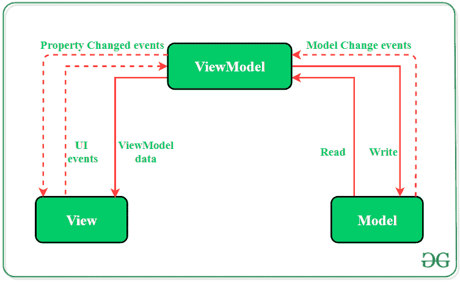

# 安卓系统中的 MVVM(模型视图视图模型)架构模式

> 原文:[https://www . geesforgeks . org/mvvm-model-view-view model-architecture-pattern-in-Android/](https://www.geeksforgeeks.org/mvvm-model-view-viewmodel-architecture-pattern-in-android/)

开发人员总是更喜欢项目的干净和结构化的代码。根据设计模式组织代码有助于软件的维护。通过了解[安卓](https://www.geeksforgeeks.org/kotlin-android-tutorial/)应用的所有关键逻辑部分，添加和删除应用功能变得更加容易。此外，设计模式还确保所有代码都包含在单元测试中，而不受其他类的干扰。**Model—View—View Model(MVVM)**是业界公认的软件[架构模式](https://www.geeksforgeeks.org/android-architecture-patterns/)克服了 MVP 和 [MVC](https://www.geeksforgeeks.org/mvc-model-view-controller-architecture-pattern-in-android-with-example/) 设计模式的所有缺点。MVVM 建议将数据呈现逻辑(视图或用户界面)与应用程序的核心业务逻辑部分分开。

#### **MVVM 的独立代码层为:**

*   **模型:**这个层负责数据源的抽象。模型和视图模型一起工作来获取和保存数据。
*   **视图:**该层的目的是告知 ViewModel 用户的动作。该层观察视图模型，不包含任何类型的应用程序逻辑。
*   **视图模型:**它公开了那些与视图相关的数据流。此外，它充当模型和视图之间的链接。



MVVM 模式与 MVP(模型-视图-演示者)设计模式有一些相似之处，因为演示者角色由视图模型扮演。然而，MVVM 通过以下方式解决了 MVP 模式的缺点:

1.  视图模型不包含对视图的任何类型的引用。
2.  视图和视图模型之间存在多对一的关系。
3.  没有更新视图的触发方法。

### 如何在项目中实施 MVVM

在安卓项目中实现 MVVM 设计模式有两种方式:

1.  使用谷歌发布的数据绑定库
2.  使用任何像 RxJava 这样的工具进行数据绑定。

**数据绑定:**

谷歌为安卓发布了数据绑定库，允许开发人员将 XML 布局中的用户界面组件与应用程序的数据存储库绑定。这有助于最小化与视图绑定的核心应用程序逻辑的代码。此外，双向数据绑定用于将对象绑定到 XML 布局，以便对象和布局都可以相互发送数据。这一点可以通过本教程的示例来可视化。

> 双向数据绑定的语法是**@ = {变量}**

### MVVM 建筑模式范例

这是一个单一活动用户登录安卓应用程序的例子，展示了 MVVM 架构模式在项目中的实现。应用程序将要求用户输入电子邮件标识和密码。基于接收到的输入，视图模型通知视图显示什么作为[**敬酒信息**](https://www.geeksforgeeks.org/android-what-is-toast-and-how-to-use-it-with-examples/) **。**视图模型不会引用**视图**。

> 要在 android 应用程序中启用数据绑定，需要在应用程序的 build.gradle(build.gradle (:app))文件中添加以下代码:
> 
> **启用数据绑定:**
> 
> 安卓{
> 
> 数据绑定{
> 
> 使能=真
> 
> }
> 
> }
> 
> **添加生命周期依赖关系:**
> 
> 实现‘Android . arch . life cycle:extensions:1 . 1 . 1’

下面是带有 MVVM 模式的用户登录安卓应用程序的完整分步实现。

### 逐步实施

> **注意:**在 Android Studio 版本上执行以下步骤

**第一步:创建新项目**

*   单击文件，然后单击新建= >新建项目。
*   选择空活动
*   选择语言为 Java/Kotlin
*   根据您的需要选择最小的软件开发工具包。

**第二步:修改 String.xml 文件**

活动中使用的所有字符串都列在该文件中。

## 可扩展标记语言

```java
<resources>
    <string name="app_name">GfG | MVVM Architecture</string>
    <string name="heading">MVVM Architecture Pattern</string>
    <string name="email_hint">Enter your Email ID</string>
    <string name="password_hint">Enter your password</string>
    <string name="button_text">Login</string>
</resources>
```

**步骤 3:创建模型类**

创建一个名为模型的新类，该类将保存用户输入的电子邮件标识和密码。下面是实现适当的模型类的代码。

## Java 语言(一种计算机语言，尤用于创建网站)

```java
import androidx.annotation.Nullable;

public class Model {

    @Nullable
    String email,password;

    // constructor to initialize
    // the variables
    public Model(String email, String password){
        this.email = email;
        this.password = password;
    }

    // getter and setter methods
    // for email variable
    @Nullable
    public String getEmail() {
        return email;
    }

    public void setEmail(@Nullable String email) {
        this.email = email;
    }

    // getter and setter methods
    // for password variable
    @Nullable
    public String getPassword() {
        return password;
    }

    public void setPassword(@Nullable String password) {
        this.password = password;
    }

}
```

**第 4 步:使用 activity_main.xml 文件**

打开 activity_main.xml 文件，添加 2 [EditText](https://www.geeksforgeeks.org/edittext-widget-in-android-using-java-with-examples/) 获取电子邮件和密码的输入。还需要一个登录按钮来验证用户的输入并显示适当的吐司消息。以下是设计适当活动布局的代码。

> **注意:**为了数据绑定库的正常运行，需要在顶部设置布局标签。在这种情况下，XML 的**约束布局**标签将不起作用。

## 可扩展标记语言

```java
<?xml version="1.0" encoding="utf-8"?>
<layout xmlns:android="http://schemas.android.com/apk/res/android"
    xmlns:app="http://schemas.android.com/apk/res-auto"
    xmlns:bind="http://schemas.android.com/tools">

    <!-- binding object of ViewModel to the XML layout -->
    <data>
        <variable
            name="viewModel"
            type="com.example.mvvmarchitecture.AppViewModel" />
    </data>

    <!-- Provided Linear layout for the activity components -->
    <LinearLayout
        android:layout_width="match_parent"
        android:layout_height="match_parent"
        android:layout_gravity="center"
        android:layout_margin="8dp"
        android:background="#168BC34A"
        android:orientation="vertical">

        <!-- TextView for the heading of the activity -->
        <TextView
            android:id="@+id/textView"
            android:layout_width="match_parent"
            android:layout_height="wrap_content"
            android:text="@string/heading"
            android:textAlignment="center"
            android:textColor="@android:color/holo_green_dark"
            android:textSize="36sp"
            android:textStyle="bold" />

        <!-- EditText field for the Email -->
        <EditText
            android:id="@+id/inEmail"
            android:layout_width="match_parent"
            android:layout_height="wrap_content"
            android:layout_marginStart="10dp"
            android:layout_marginTop="60dp"
            android:layout_marginEnd="10dp"
            android:layout_marginBottom="20dp"
            android:hint="@string/email_hint"
            android:inputType="textEmailAddress"
            android:padding="8dp"
            android:text="@={viewModel.userEmail}" />

        <!-- EditText field for the password -->
        <EditText
            android:id="@+id/inPassword"
            android:layout_width="match_parent"
            android:layout_height="wrap_content"
            android:layout_marginStart="10dp"
            android:layout_marginEnd="10dp"
            android:hint="@string/password_hint"
            android:inputType="textPassword"
            android:padding="8dp"
            android:text="@={viewModel.userPassword}" />

        <!-- Login Button of the activity -->
        <Button
            android:layout_width="match_parent"
            android:layout_height="wrap_content"
            android:layout_marginStart="20dp"
            android:layout_marginTop="60dp"
            android:layout_marginEnd="20dp"
            android:background="#4CAF50"
            android:fontFamily="@font/roboto"
            android:onClick="@{()-> viewModel.onButtonClicked()}"
            android:text="@string/button_text"
            android:textColor="@android:color/background_light"
            android:textSize="30sp"
            android:textStyle="bold"
            bind:toastMessage="@{viewModel.toastMessage}" />

        <ImageView
            android:id="@+id/imageView"
            android:layout_width="match_parent"
            android:layout_height="wrap_content"
            android:layout_marginTop="135dp"
            app:srcCompat="@drawable/banner" />

    </LinearLayout>
</layout>
```

**第 5 步:创建视图模型类**

这个类将包含应用程序布局中需要调用的所有方法。视图模型类将扩展**基本可观察的**，因为它将数据转换成流，并在吐司消息属性发生变化时通知**视图**。

## Java 语言(一种计算机语言，尤用于创建网站)

```java
import android.text.TextUtils;
import android.util.Patterns;
import androidx.databinding.BaseObservable;
import androidx.databinding.Bindable;

public class AppViewModel extends BaseObservable {

    // creating object of Model class
    private Model model;

    // string variables for
    // toast messages
    private String successMessage = "Login successful";
    private String errorMessage = "Email or Password is not valid";

    @Bindable
    // string variable for
    // toast message
    private String toastMessage = null;

    // getter and setter methods
    // for toast message
    public String getToastMessage() {
        return toastMessage;
    }

    private void setToastMessage(String toastMessage) {
        this.toastMessage = toastMessage;
        notifyPropertyChanged(BR.toastMessage);
    }

    // getter and setter methods
    // for email variable
    @Bindable
    public String getUserEmail() {
        return model.getEmail();
    }

    public void setUserEmail(String email) {
        model.setEmail(email);
        notifyPropertyChanged(BR.userEmail);
    }

    // getter and setter methods
    // for password variable
    @Bindable
    public String getUserPassword() {
        return model.getPassword();
    }

    public void setUserPassword(String password) {
        model.setPassword(password);
        notifyPropertyChanged(BR.userPassword);
    }

    // constructor of ViewModel class
    public AppViewModel() {

        // instantiating object of
        // model class
        model = new Model("","");
    }

    // actions to be performed
    // when user clicks
    // the LOGIN button
    public void onButtonClicked() {
        if (isValid())
            setToastMessage(successMessage);
        else
            setToastMessage(errorMessage);
    }

    // method to keep a check
    // that variable fields must
    // not be kept empty by user
    public boolean isValid() {
        return !TextUtils.isEmpty(getUserEmail()) && Patterns.EMAIL_ADDRESS.matcher(getUserEmail()).matches()
                && getUserPassword().length() > 5;
    }
}
```

**步骤 6:在主活动文件**中定义视图的功能

视图类负责更新应用程序的用户界面。根据视图模型提供的 toast 消息中的变化，绑定适配器将触发视图层。Toast 消息的设置者将通知观察者(视图)数据的变化。之后，视图将采取适当的操作。

## Java 语言(一种计算机语言，尤用于创建网站)

```java
import android.os.Bundle;
import android.view.View;
import android.widget.Toast;

import androidx.appcompat.app.AppCompatActivity;
import androidx.databinding.BindingAdapter;
import androidx.databinding.DataBindingUtil;

import com.example.mvvmarchitecture.databinding.ActivityMainBinding;

public class MainActivity extends AppCompatActivity {

    @Override
    protected void onCreate(Bundle savedInstanceState) {
        super.onCreate(savedInstanceState);

        // ViewModel updates the Model
        // after observing changes in the View

        // model will also update the view
        // via the ViewModel
        ActivityMainBinding activityMainBinding = DataBindingUtil.setContentView(this, R.layout.activity_main);
        activityMainBinding.setViewModel(new AppViewModel());
        activityMainBinding.executePendingBindings();

    }

    // any change in toastMessage attribute
    // defined on the Button with bind prefix
    // invokes this method
    @BindingAdapter({"toastMessage"})
    public static void runMe( View view, String message) {
        if (message != null)
            Toast.makeText(view.getContext(), message, Toast.LENGTH_SHORT).show();
    }
}
```

### 输出

<video class="wp-video-shortcode" id="video-506876-1" width="640" height="360" preload="metadata" controls=""><source type="video/mp4" src="https://media.geeksforgeeks.org/wp-content/uploads/20201028015557/MVVMOutputRecording.mp4?_=1">[https://media.geeksforgeeks.org/wp-content/uploads/20201028015557/MVVMOutputRecording.mp4](https://media.geeksforgeeks.org/wp-content/uploads/20201028015557/MVVMOutputRecording.mp4)</video>

### MVVM 建筑的优势

*   增强代码的可重用性。
*   所有模块都是独立的，这提高了每一层的可测试性。
*   使项目文件易于维护和更改。

### MVVM 建筑的缺点

*   这种设计模式对于小项目来说并不理想。
*   如果数据绑定逻辑太复杂，应用程序调试会稍微困难一些。