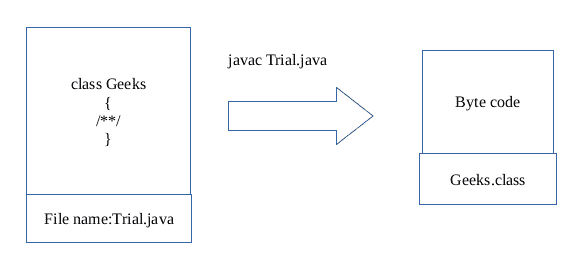

# 关于 Java 中文件名和类名的误区

> 原文:[https://www . geesforgeks . org/mission-file-name-class-name-Java/](https://www.geeksforgeeks.org/myth-file-name-class-name-java/)

在 java 课上给出的第一个课堂笔记是“在 java 中文件名和类名应该相同”。当违反上述法律时，将出现如下编译器错误消息

## Java 语言(一种计算机语言，尤用于创建网站)

```java
/***** File name: Trial.java ******/
public class Geeks {
    public static void main(String[] args)
    {
        System.out.println("Hello world");
    }
}
```

**输出:**

```java
javac Trial.java
Trial.java:9: error: class Geeks is public, should be
                    declared in a file named Geeks.java
public class Geeks
^
1 error 

```

但是神话可以通过这样的方式被打破来编译上面的文件。

## Java 语言(一种计算机语言，尤用于创建网站)

```java
/***** File name: Trial.java ******/
class Geeks {
    public static void main(String[] args)
    {
        System.out.println("Hello world");
    }
}
```

**第一步:**

```java
javac Trial.java

```

步骤 1 将创建一个 Geeks.class(字节码)，没有任何错误消息，因为这个类不是公共的。
**第二步:**

```java
java Geeks

```

现在输出将是 **Hello world**
关于文件名和类名的神话应该只有在 **public** 中声明该类时才相同。
以上程序工作如下:



现在，这个*。类*文件即可执行。通过以上特征，可以创造更多的奇迹。java 文件中可能有许多类。出于调试目的，可以使用这种方法。每个类都可以单独执行来测试它们的功能(只有一个条件:不应该使用继承概念)。
但总的来说，遵循神话是好的。
**例 1:**

## Java 语言(一种计算机语言，尤用于创建网站)

```java
/*** File name: Trial.java ***/
class ForGeeks {
    public static void main(String[] args)
    {
        System.out.println("For Geeks class");
    }
}

class GeeksTest {
    public static void main(String[] args)
    {
        System.out.println("Geeks Test class");
    }
}
```

当上述文件被编译为**javac Trial.java**时，这将创建 2。类文件为**伪造类和极客类**。
因为每个类都有单独的 main()存根，所以它们可以单独测试。

*   当执行**Java forgeks**时，输出是【极客类的 T2】。
*   当执行 **java 极客测试**时，输出是**极客测试类**。

**例 2:**

## Java 语言(一种计算机语言，尤用于创建网站)

```java
// Program to find area of triangle
class Triangle {
    int x, y;
    void printArea()
    {
        System.out.println("Area of triangle is: " + x * y / 2);
    }
}

class Demo {
    public static void main(String args[])
    {
        // Object creation
        Triangle t = new Triangle();
        t.x = 10;
        t.y = 13;
        t.printArea();
    }
}
```

**注:**这里有两个班，**三角**和**演示**。那么文件名必须考虑哪个类名呢？
类名 Demo 必须作为文件名。以 Demo 为文件名背后的原因是它有主方法，执行从主方法开始。

```java
Filename: Demo.java
Compilation: javac Demo.java
Run: java Demo
Output: Area of triangle:65

```

本文由**索姆雅供稿。左后**。如果你喜欢极客博客并想投稿，你也可以写一篇文章并把你的文章邮寄到 contribute@geeksforgeeks.org。看到你的文章出现在极客博客主页上，帮助其他极客。
如发现任何不正确的地方，请写评论，或者您想分享更多关于上述话题的信息