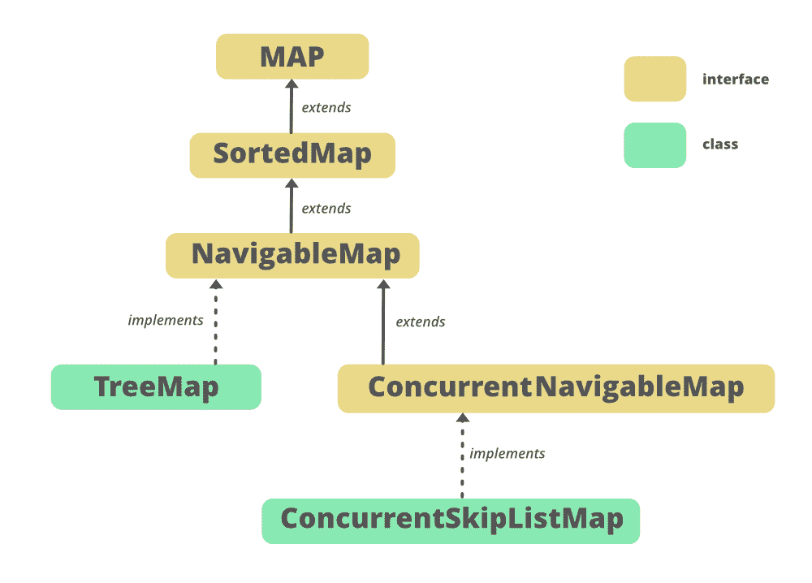

# 用示例在 Java 中导航地图界面

> 原文:[https://www . geesforgeks . org/naviglambap-interface-in-Java-with-example/](https://www.geeksforgeeks.org/navigablemap-interface-in-java-with-example/)

**导航地图**界面是 [Java 收集框架](https://www.geeksforgeeks.org/collections-in-java-2/)的成员。它属于 **java.util** 包，是 [SortedMap](https://write.geeksforgeeks.org/sortedmap-in-java-with-examples/) 的扩展，提供了 lowerKey、floorKey、ceilingKey、higherKey 等便捷的导航方式，与这种流行的导航方式一起。它还提供了从 Java 中的现有映射创建子映射的方法，例如键小于指定键的头映射，键大于指定键的尾映射，以及严格包含介于 toKey 和 fromKey 之间的键的子映射。
实现导航地图的一个示例类是[树形图](https://write.geeksforgeeks.org/hashmap-treemap-java/)。

**申报:**

```
public interface NavigableMap<K,V> extends SortedMap<K,V>
```

这里 **K** 为关键对象类型， **V** 为值对象类型。

**导航层次图**



实现[映射< K，V>T1，](https://www.geeksforgeeks.org/map-interface-java-examples/) [SortedMap < K，V>T3】接口。](https://www.geeksforgeeks.org/sortedmap-java-examples/)[ConcurrentNavigableMap<K，V >](https://www.geeksforgeeks.org/concurrentnavigablemap-interface-in-java/) 扩展 NavigableMap。**ConcurrentSkipListMap**[树形图](https://www.geeksforgeeks.org/treemap-in-java/)实现导航地图。

**示例:**

## Java 语言(一种计算机语言，尤用于创建网站)

```
// Java program to demonstrate
// the NavigableMap interface
import java.util.NavigableMap;
import java.util.TreeMap;

public class NavigableMapExample {

    public static void main(String[] args)
    {
        // Instantiate an object
        // Since NavigableMap
        // is an interface so we
        // use TreeMap
        NavigableMap<String, Integer> nm
            = new TreeMap<String, Integer>();

        // Add elements using put() method
        nm.put("C", 888);
        nm.put("Y", 999);
        nm.put("A", 444);
        nm.put("T", 555);
        nm.put("B", 666);
        nm.put("A", 555);

        // Print the contents on the console
        System.out.println("Mappings of NavigableMap : "
                           + nm);

        System.out.printf("Descending Set  : %s%n",
                          nm.descendingKeySet());
        System.out.printf("Floor Entry  : %s%n",
                          nm.floorEntry("L"));
        System.out.printf("First Entry  : %s%n",
                          nm.firstEntry());
        System.out.printf("Last Key : %s%n", nm.lastKey());
        System.out.printf("First Key : %s%n",
                          nm.firstKey());
        System.out.printf("Original Map : %s%n", nm);
        System.out.printf("Reverse Map : %s%n",
                          nm.descendingMap());
    }
}
```

**输出:**

```
Mappings of NavigableMap : {A=555, B=666, C=888, T=555, Y=999}
Descending Set  : [Y, T, C, B, A]
Floor Entry  : C=888
First Entry  : A=555
Last Key : Y
First Key : A
Original Map : {A=555, B=666, C=888, T=555, Y=999}
Reverse Map : {Y=999, T=555, C=888, B=666, A=555}
```

### 实现类

导航地图有两个实现类，分别是 **ConcurrentSkipListMap** 和 **TreeMap** 。[树状图](https://www.geeksforgeeks.org/treemap-in-java/)是一个基于红黑树的导航地图实现，它根据其键的自然顺序进行排序，或者通过地图创建时提供的[比较器](https://www.geeksforgeeks.org/comparator-interface-java/)进行排序，具体取决于使用的构造函数。TreeMap 具有用于插入、删除和访问操作的**日志(n)** 的预期时间成本。TreeMap 不同步，必须在外部完成。

**语法:**

```
NavigableMap<K, V> objectName = new TreeMap<K, V>();
```

### 导航地图的基本操作

**1。添加元素**

要向导航地图添加元素，我们可以使用地图界面的任何方法。下面的代码展示了如何使用它们。您可以在代码中观察到插入顺序没有被保留。如果在构建时没有提供比较器，则遵循自然顺序。

## Java 语言(一种计算机语言，尤用于创建网站)

```
// Java program for adding elements
// to a NavigableMap
import java.util.*;

class AddingElementsExample {
    public static void main(String args[])
    {

        // Instantiate an object
        // Since NavigableMap is an interface
        // We use TreeMap
        NavigableMap<Integer, String> nmap
            = new TreeMap<Integer, String>();

        // Add elements using put()
        nmap.put(3, "Geeks");
        nmap.put(2, "For");
        nmap.put(1, "Geeks");

        // Print the contents on the console
        System.out.println("Mappings of NavigableMap : "
                           + nmap);
    }
}
```

**输出:**

```
Mappings of NavigableMap : {1=Geeks, 2=For, 3=Geeks}
```

**2。拆卸元件**

为了移除元素，我们也使用地图接口的方法，因为导航地图是地图的后代。我们可以使用 [remove()](https://www.geeksforgeeks.org/map-remove-method-in-java-with-examples/) 方法，该方法获取键值，并从该树图中移除键值的映射(如果该映射存在于地图上的话)。我们可以使用[清除()](https://www.geeksforgeeks.org/navigablemap-clear-method-in-java/)来移除地图的所有元素。

## Java 语言(一种计算机语言，尤用于创建网站)

```
// Java Program for deleting
// elements from NavigableMap
import java.util.*;

class RemovingElementsExample {

    public static void main(String args[])
    {
        // Instantiate an object
        // Since NavigableMap
        // is an interface
        // We use TreeMap
        NavigableMap<Integer, String> nmap
            = new TreeMap<Integer, String>();

        // Add elements using put()
        nmap.put(3, "Geeks");
        nmap.put(2, "Geeks");
        nmap.put(1, "Geeks");
        nmap.put(4, "For");

        // Print the contents on the console
        System.out.println("Mappings of NavigableMap : "
                           + nmap);

        // Remove elements using remove()
        nmap.remove(4);

        // Print the contents on the console
        System.out.println(
            "\nNavigableMap, after remove operation : "
            + nmap);

        // Clear the entire map using clear()
        nmap.clear();
        System.out.println(
            "\nNavigableMap, after clear operation : "
            + nmap);
    }
}
```

**输出:**

```
Mappings of NavigableMap : {1=Geeks, 2=Geeks, 3=Geeks, 4=For}

NavigableMap, after remove operation : {1=Geeks, 2=Geeks, 3=Geeks}

NavigableMap, after clear operation : {}
```

**3。访问元素**

我们可以使用 get()方法来访问一个 NavigableMap 的元素，下面给出了这个例子。

## Java 语言(一种计算机语言，尤用于创建网站)

```
// Java Program for accessing
// elements in a NavigableMap

import java.util.*;

public class AccessingElementsExample {

    public static void main(String[] args)
    {
        // Instantiate an object
        // Since NavigableMap is an interface
        // We use TreeMap
        NavigableMap<Integer, String> nmap
            = new TreeMap<Integer, String>();

        // Add elements using put()
        nmap.put(8, "Third");
        nmap.put(6, "Second");
        nmap.put(3, "First");
        nmap.put(11, "Fourth");

        // Accessing the elements using get()
        // with key as a parameter
        System.out.println(nmap.get(3));
        System.out.println(nmap.get(6));
        System.out.println(nmap.get(8));
        System.out.println(nmap.get(11));

        // Display the set of keys using keySet()
        System.out.println("\nThe NavigableMap key set: "
                           + nmap.keySet());
    }
}
```

**输出:**

```
First
Second
Third
Fourth

The NavigableMap key set: [3, 6, 8, 11]
```

**4。穿越**

我们可以使用[迭代器接口](https://www.geeksforgeeks.org/iterators-in-java/)遍历集合框架的任何结构。因为迭代器处理一种类型的数据，所以我们使用条目<？, ?>将两个独立的类型解析为兼容的格式。然后使用 next()方法打印导航地图的元素。另一个著名的方法是对每个循环使用一个[并获得钥匙。使用 getValue()方法可以找到该键的值。](https://www.geeksforgeeks.org/for-each-loop-in-java/)

## Java 语言(一种计算机语言，尤用于创建网站)

```
// Java Program for traversing
// a NavigableMap
import java.util.*;

class TraversalExample {

    public static void main(String args[])
    {
        // Instantiate an object
        // Since NavigableMap is an interface
        // We use TreeMap
        NavigableMap<Integer, String> nmap
            = new TreeMap<Integer, String>();

        // Add elements using put()
        nmap.put(3, "Geeks");
        nmap.put(2, "For");
        nmap.put(1, "Geeks");

        // Create an Iterator over the
        // NavigableMap
        Iterator<NavigableMap.Entry<Integer, String> > itr
            = nmap.entrySet().iterator();

        System.out.println("Traversing using Iterator: ");
        // The hasNext() method is used to check if there is
        // a next element The next() method is used to
        // retrieve the next element
        while (itr.hasNext()) {
            NavigableMap.Entry<Integer, String> entry
                = itr.next();
            System.out.println("Key = " + entry.getKey()
                               + ", Value = "
                               + entry.getValue());
        }

        System.out.println("Traversing using for-each: ");
        // Iterate using for-each loop
        for (Map.Entry mapElement : nmap.entrySet()) {
            // get the key using getKey()
            int key = (int)mapElement.getKey();

            // Finding the value
            String value = (String)mapElement.getValue();

            System.out.println("Key = " + key
                               + ", Value = " + value);
        }
    }
}
```

**输出:**

```
Traversing using Iterator:  
Key = 1, Value = Geeks
Key = 2, Value = For
Key = 3, Value = Geeks
Traversing using for-each:  
Key = 1, Value = Geeks
Key = 2, Value = For
Key = 3, Value = Geeks
```

**注意:**每次我们说‘naviglamblemap 的元素’的时候，必须注意的是，元素实际上是存储在 naviglamblemap 的实现类的对象中的，在本例中是 TreeMap。

### 导航方法地图

导航地图继承了[地图](https://www.geeksforgeeks.org/map-interface-java-examples/)界面、[排序地图](https://www.geeksforgeeks.org/sortedmap-java-examples/)界面的方法。父接口给出了添加元素、移除元素和遍历的基本方法。下表给出了导航地图的方法。在这里，

*   **K**–地图中按键的类型。
*   **V**–映射图中映射的值的类型。

<figure class="table">

| 

方法

 | 

描述

 |
| --- | --- |
| [ceilingEntry(K 键)](https://www.geeksforgeeks.org/navigablemap-ceilingentry-method-in-java/) | 返回与大于或等于给定键的最小键相关联的键值映射，如果没有这样的键，则返回 null。 |
| [ceilingKey(K 键)](https://www.geeksforgeeks.org/navigablemap-ceilingkey-method-in-java/) | 返回大于或等于给定键的最小键，如果没有这样的键，则返回 null。 |
| 下行键集() | 返回此映射中包含的键的反向导航集合视图。 |
| 下行映射() | 返回此映射中包含的映射的逆序视图。 |
| [firstEntry()](https://www.geeksforgeeks.org/navigablemap-firstentry-method-in-java/) | 返回与此映射中最小键相关联的键值映射，如果映射为空，则返回 null。 |
| [洪水(k 键)](https://www.geeksforgeeks.org/navigablemap-floorentry-method-in-java/) | 返回与小于或等于给定键的最大键相关联的键值映射，如果没有这样的键，则返回 null。 |
| [地板键(K 键)](https://www.geeksforgeeks.org/navigablemap-floorkey-method-in-java/#:~:text=The%20floorKey()%20method%20of,there%20is%20no%20such%20key.) | 返回小于或等于给定键的最大键，如果没有这样的键，则返回 null。 |
| [头帽(K toKey)](https://www.geeksforgeeks.org/navigablemap-headmap-in-java/) | 返回该地图关键点严格小于 toKey 的部分的视图。 |
| [头标(K toKey，含布尔型)](https://www.geeksforgeeks.org/navigablemap-headmap-in-java/) | 返回此地图中键小于(或等于，如果包含为真)toKey 的部分的视图。 |
| [【k 键】](https://www.geeksforgeeks.org/navigablemap-higherentry-method-in-java/#:~:text=The%20higherEntry()%20method%20of,is%20no%20such%20key%20existed.&text=Where%2C%20K%20is%20the%20type,values%20mapped%20to%20the%20keys.) | 返回与严格大于给定键的最小键相关联的键值映射，如果没有这样的键，则返回 null。 |
| [高电平(K 键)](https://www.geeksforgeeks.org/navigablemap-higherkey-method-in-java/) | 返回严格大于给定键的最小键，如果没有这样的键，则返回 null。 |
| 负荷试验() | 返回与此映射中最大键相关联的键值映射，如果映射为空，则返回 null。 |
| [低租金(k 键)](https://www.geeksforgeeks.org/navigablemap-lowerentry-method-in-java/) | 返回与严格小于给定键的最大键相关联的键值映射，如果没有这样的键，则返回 null。 |
| [降下钥匙(K 键)](https://www.geeksforgeeks.org/navigablemap-lowerkey-method-in-java/) | 返回严格小于给定键的最大键，如果没有这样的键，则返回 null。 |
| navigableKeySet() | 返回此地图中包含的键的导航集合视图。 |
| [pollFirstEntry()](https://www.geeksforgeeks.org/navigablemap-pollfirstentry-method-in-java/) | 移除并返回与此映射中最小键关联的键值映射，如果映射为空，则返回 null。 |
| [花粉试验()](https://www.geeksforgeeks.org/navigablemap-polllastentry-method-in-java/) | 移除并返回与此映射中最大键关联的键值映射，如果映射为空，则返回 null。 |
| subMap(K fromKey，布尔值frominclusive，K toKey，boolean toximative) | 返回此地图的一部分的视图，其关键点的范围从“从关键点”到“到关键点”。 |
| 子密钥 | 返回此地图的一部分的视图，其键的范围从“从键(包含)”到“到键(不包含)”。 |
| 大小映射(K fromKey) | 返回该映射中键大于或等于 fromKey 的部分的视图。 |
| 大小映射(K fromKey，包括布尔型) | 返回该映射中键大于(或等于，如果包含为真)fromKey 的部分的视图。 |

</figure>

### 从接口 java.util.SortedMap 继承的方法

<figure class="table">

| 

方法

 | 

描述

 |
| --- | --- |
| [比较器()](https://www.geeksforgeeks.org/sortedmap-comparator-method-in-java-with-examples/) | 返回用于对该映射中的键进行排序的比较器，如果该映射使用其键的自然排序，则返回 null。 |
| [输入 ySet()](https://www.geeksforgeeks.org/sortedmap-entryset-method-in-java-with-examples/) | 返回此映射中包含的映射的集合视图。 |
| [firstKey()](https://www.geeksforgeeks.org/sortedmap-firstkey-method-in-java/) | 返回当前地图中的第一个(最低的)键。 |
| [键集()](https://www.geeksforgeeks.org/sortedmap-keyset-method-in-java-with-examples/) | 返回此地图中包含的键的集合视图。 |
| [负载力()](https://www.geeksforgeeks.org/sortedmap-lastkey-method-in-java/) | 返回当前地图中的最后一个(最高的)键。 |
| [值()](https://www.geeksforgeeks.org/sortedmap-values-method-in-java-with-examples/#:~:text=The%20values()%20method%20of,the%20values%20in%20the%20Map.&text=Parameters%3A%20The%20method%20does%20not%20accept%20any%20parameters.) | 返回此地图中包含的值的集合视图。 |

</figure>

### 从接口 java.util.Map 继承的方法

<figure class="table">

| 

方法

 | 

描述

 |
| --- | --- |
| [晴()](https://www.geeksforgeeks.org/map-clear-method-in-java-with-example/) | 从此映射中移除所有映射(可选操作)。 |
| 计算(K 键，双功能v，？扩展 V > remappingFunction) | 尝试计算指定键及其当前映射值的映射(如果没有当前映射，则为空)。 |
| 计算不存在(K 键，函数扩展 V >映射函数) | 如果指定的键尚未与值相关联(或映射为 null)，会尝试使用给定的映射函数计算其值，并将其输入到此映射中，除非为 null。 |
| 计算当前(K 键，双功能 super K,? super V,? extends V>恢复功能) | 如果指定键的值存在且不为空，将尝试计算给定键及其当前映射值的新映射。 |
| [包含键(对象键)](https://www.geeksforgeeks.org/map-containskey-method-in-java-with-examples/) | 如果此映射包含指定键的映射，则返回 true。 |
| [包含值(对象值)](https://www.geeksforgeeks.org/map-containsvalue-method-in-java-with-examples/) | 如果此映射将一个或多个键映射到指定值，则返回 true。 |
| [等于(对象 o)](https://www.geeksforgeeks.org/map-equals-method-in-java-with-examples/#:~:text=Map.,of%20this%20map%20or%20not.) | 将指定的对象与此映射进行比较，看是否相等。 |
| forEach(双消费者〔t0〕行动) | 对此映射中的每个条目执行给定的操作，直到所有条目都已处理完毕或该操作引发异常。 |
| [获取(对象键)](https://www.geeksforgeeks.org/map-get-method-in-java-with-examples/) | 返回指定键映射到的值，如果此映射不包含键映射，则返回 null。 |
| getOrDefault（Object key， V defaultValue） | 返回指定键映射到的值，如果此映射不包含键映射，则返回默认值。 |
| [hashCode()](https://www.geeksforgeeks.org/map-hashcode-method-in-java-with-examples/) | 返回此映射的哈希代码值。 |
| [【isempty()](https://www.geeksforgeeks.org/map-isempty-method-in-java-with-examples/) | 如果此映射不包含键值映射，则返回 true。 |
| 合并(K 键，V 值，双功能 super V,? super V,? extends V>重映射功能) | 如果指定的键尚未与值相关联或与 null 相关联，则将其与给定的非 null 值相关联。 |
| [放(K 键，V 值)](https://www.geeksforgeeks.org/map-put-method-in-java-with-examples/) | 将指定值与此映射中的指定键相关联(可选操作)。 |
| [普塔尔(地图<？延伸 K，？延伸 V > m)](https://www.geeksforgeeks.org/map-putall-method-in-java-with-examples/) | 将所有映射从指定映射复制到此映射(可选操作)。 |
| 莆田(K key，V value) | 如果指定的键还没有与值相关联(或者被映射为 null)，则将它与给定值相关联并返回 null，否则返回当前值。 |
| [移除(对象键)](https://www.geeksforgeeks.org/map-remove-method-in-java-with-examples/) | 从该映射中删除键的映射(如果存在)(可选操作)。 |
| 移除(对象键，对象值) | 仅当指定项当前映射到指定值时，才移除该项。 |
| 更换(K 键，V 值) | 仅当指定键当前映射到某个值时，才替换该项。 |
| 更换(K 键、旧值、新值) | 仅当当前映射到指定值时，替换指定键的条目。 |
| 替换全部(双功能 super K,? super V,? extends V>功能) | 将每个条目的值替换为对该条目调用给定函数的结果，直到所有条目都已处理完毕或函数引发异常。 |
| 大小() | 返回此映射中键值映射的数量。 |

</figure>

**参考:**[https://docs . Oracle . com/javase/8/docs/API/Java/util/naviglamblamp . html](https://docs.oracle.com/javase/8/docs/api/java/util/NavigableMap.html)
本文由 [**Pratik Agarwal**](https://www.facebook.com/Pratik.Agarwal01) 供稿。如果你喜欢 GeeksforGeeks 并想投稿，你也可以使用[write.geeksforgeeks.org](https://write.geeksforgeeks.org)写一篇文章或者把你的文章邮寄到 review-team@geeksforgeeks.org。看到你的文章出现在极客博客主页上，帮助其他极客。
如果发现有不正确的地方，或者想分享更多关于上述话题的信息，请写评论。